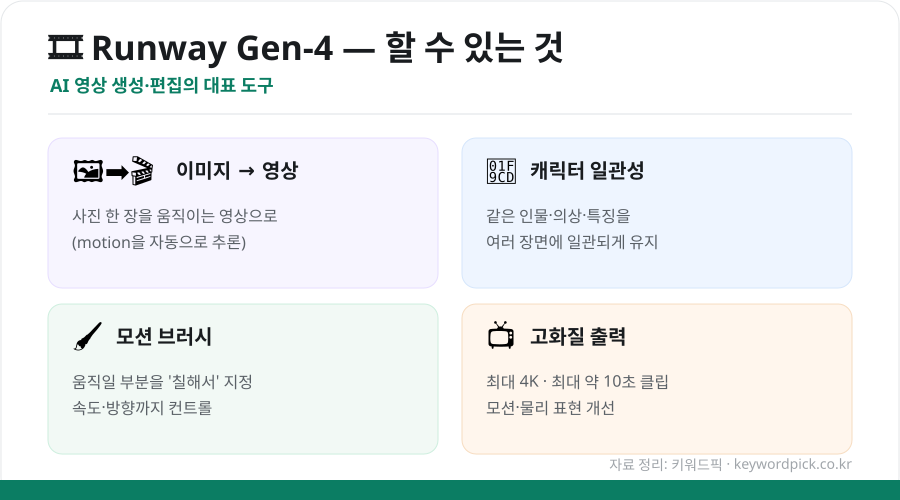
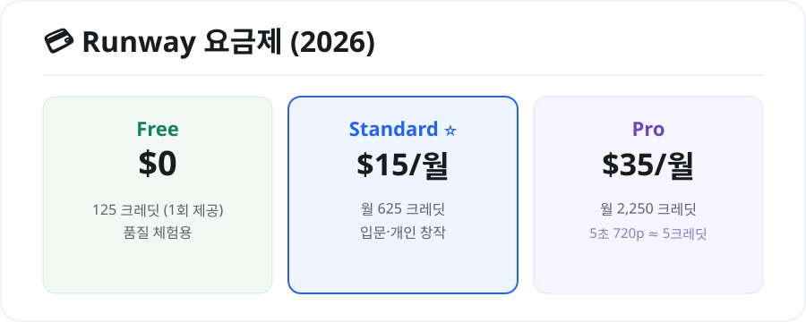

사진 한 장을 **움직이는 영상**으로 바꾸고, 영화 같은 장면을 만드는 AI 영상 도구 **런웨이(Runway)** 입니다. 최신 **Gen-4** 모델로 품질이 크게 좋아졌는데요. 무엇을 할 수 있고 어떻게 쓰는지 정리했습니다.

## 런웨이 Gen-4로 할 수 있는 것

<figure class="large"><figcaption>런웨이 Gen-4 주요 기능 (자료 정리: 키워드픽)</figcaption></figure>

- **이미지 → 영상(Image-to-Video)**: 정지 사진 한 장을 넣으면, AI가 움직임을 추론해 **영상으로** 만들어줍니다.
- **캐릭터 일관성**: 참조 이미지로 **같은 인물·의상·특징**을 여러 장면에 유지 (Gen-4.5는 장면 간 일관성 강화).
- **모션 브러시(Motion Brush)**: 움직이고 싶은 부분을 **'칠해서'** 지정하고, 속도·방향까지 조절.
- **고화질 출력**: 최대 **4K**, 최대 약 **10초** 클립.

## 어떻게 쓰나

1. **[runwayml.com](https://runwayml.com)** 가입·로그인
2. **Gen-4** 등 모델 선택 → **이미지 업로드**(또는 텍스트 입력)
3. 원하는 움직임·카메라 설정 → **생성**(크레딧 소모)
4. 결과를 다듬거나 **모션 브러시**로 세부 조정

## 요금제와 크레딧

런웨이는 **크레딧 기반**입니다. 무료로 체험 크레딧을 주지만, 꾸준히 만들려면 유료가 필요합니다.

<figure class="large"><figcaption>런웨이 요금제 (2026년 기준, 자료 정리: 키워드픽)</figcaption></figure>

| 플랜 | 비용 | 크레딧 |
|---|---|---|
| **Free** | $0 | 125 크레딧 (1회 제공, 체험용) |
| **Standard** | $15/월 | 월 625 크레딧 |
| **Pro** | $35/월 | 월 2,250 크레딧 |

> 💡 **5초 720p 영상이 약 5크레딧**, 4K는 훨씬 많이 듭니다. **저해상도로 테스트** 후 마음에 들 때 고화질로 뽑으면 크레딧을 아낄 수 있어요.

## 이렇게 활용해요

- **SNS 숏폼·인트로**: 사진을 살아 움직이는 영상으로
- **광고·제품컷**: 무드 있는 배경 영상
- **콘텐츠 제작**: 썸네일 배경, 컨셉 영상

## ⚠️ 주의점

- **초상권·딥페이크**: 실존 인물 얼굴을 무단 합성·생성하면 법적 문제가 될 수 있습니다.
- **저작권**: 상업적 사용 범위는 런웨이 약관을 확인하세요.
- **크레딧 관리**: 고해상도·긴 영상은 크레딧을 빠르게 소모합니다.

## 정리

런웨이는 ① **사진을 영상으로** 만드는 대표 AI 도구이고, ② **캐릭터 일관성·모션 브러시·4K**까지 지원하며, ③ **무료는 체험 수준**, 본격 사용은 Standard($15)부터입니다. 저해상도 테스트로 크레딧을 아끼고, 초상권·저작권에 유의해 활용하세요.

---

### 참고
- [Runway Gen-4 가이드 2026 — AI Tools](https://devstarsj.github.io/ai-tools/2026-04-30-Runway-Gen-4-AI-Video-Complete-Guide-2026/)
- [Runway AI 요금제 2026 — Somake](https://www.somake.ai/blog/runway-ai-pricing)
