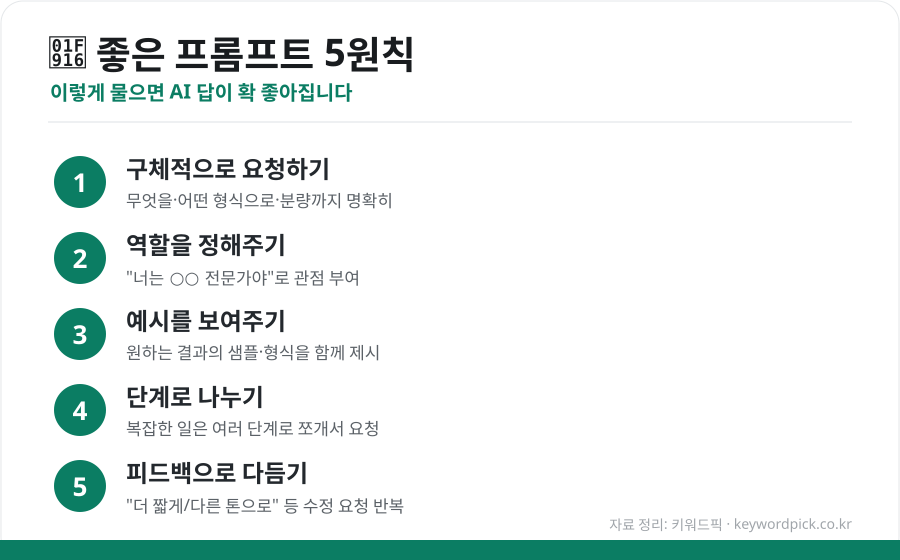

이제 **AI 챗봇은 무료로도 충분히 쓸 만합니다.** 업체 간 경쟁이 치열해지면서 무료 버전에도 강력한 기능이 대거 풀렸기 때문인데요. 문제는 "어떤 걸, 어떻게 써야 잘 쓰는 걸까?"입니다. 용도별 선택법과 답변 품질을 끌어올리는 실전 팁을 정리했습니다.

## 주요 무료 AI 챗봇 한눈에 비교

대표적인 서비스들의 강점과 추천 용도를 정리하면 다음과 같습니다. (무료 사용량·모델은 수시로 바뀌므로 각 서비스에서 최신 정책을 확인하세요.)

| 서비스 | 개발사 | 강점 | 이런 일에 추천 |
|---|---|---|---|
| **ChatGPT** | OpenAI | 범용성·이미지 생성·폭넓은 활용 | 만능형 — 이것저것 다양한 작업 |
| **Claude** | Anthropic | 긴 글·문서 분석·자연스러운 글쓰기 | 요약·글쓰기·코드 정리 |
| **Gemini** | Google | 빠른 속도·구글 검색 연동 | 검색·정보 정리·빠른 답 |
| **Copilot** | Microsoft | 오피스(워드·엑셀) 연동 | 문서·업무 자동화 |

> 💡 대부분 **무료로 하루 일정량**을 쓸 수 있고, 한도를 넘으면 잠시 후 다시 이용할 수 있습니다. 여러 개를 상황에 맞게 번갈아 쓰는 것도 방법입니다.

## 용도별 추천 — 뭘 쓸까?

- **긴 문서 요약·글쓰기** → **Claude** (긴 텍스트 처리와 자연스러운 문장에 강함)
- **빠른 검색·최신 정보 정리** → **Gemini** (속도와 구글 연동)
- **이미지 생성·다양한 작업** → **ChatGPT** (범용성)
- **워드·엑셀 등 업무 문서** → **Copilot** (오피스 연동)

'정답'은 없습니다. **같은 질문을 두세 곳에 던져 비교**해보고, 본인 작업에 맞는 걸 고르는 게 가장 좋습니다.

## 답변이 확 좋아지는 '프롬프트 5원칙'

AI의 답은 **어떻게 묻느냐**에 따라 크게 달라집니다. 아래 5가지만 지켜도 결과가 눈에 띄게 좋아집니다.

<figure class="large"><figcaption>좋은 프롬프트 5원칙 (자료 정리: 키워드픽)</figcaption></figure>

1. **구체적으로 요청하기** — "글 써줘"보다 "초등학생도 이해할 수 있게 3문단, 예시 포함해서 써줘"
2. **역할을 정해주기** — "너는 10년 차 마케터야. 이 관점에서…"
3. **예시를 보여주기** — 원하는 형식·톤의 샘플을 함께 주면 결과가 정확해짐
4. **단계로 나누기** — 복잡한 일은 "① 먼저 개요, ② 그다음 본문" 식으로 쪼개기
5. **피드백으로 다듬기** — "더 짧게", "좀 더 캐주얼하게" 등 수정 요청을 반복

## 이것만은 주의하세요

편리하지만 **맹신은 금물**입니다.

- **사실 확인 필수**: AI는 그럴듯하게 틀린 답(환각)을 낼 수 있습니다. 중요한 정보·수치·인용은 반드시 원출처로 확인하세요.
- **개인정보·기밀 입력 주의**: 민감한 개인정보나 회사 기밀은 입력하지 않는 게 안전합니다.
- **저작권**: AI가 만든 이미지·글을 상업적으로 쓸 때는 각 서비스의 이용약관을 확인하세요.

## 정리

무료 AI 챗봇은 ① **용도에 맞게 골라 쓰고**(요약·글쓰기=Claude, 검색·속도=Gemini, 범용=ChatGPT, 업무=Copilot), ② **프롬프트 5원칙**(구체적·역할·예시·단계·피드백)으로 물으면 훨씬 유용합니다. 단, **사실 확인과 개인정보 주의**는 잊지 마세요. 잘만 활용하면 공부·업무·일상의 든든한 도구가 됩니다.

---

### 참고
- 2026년 무료 AI 챗봇 비교·시장 점유율 관련 해외 리뷰 종합
- 각 서비스(ChatGPT·Claude·Gemini·Copilot) 공식 무료 이용 안내
