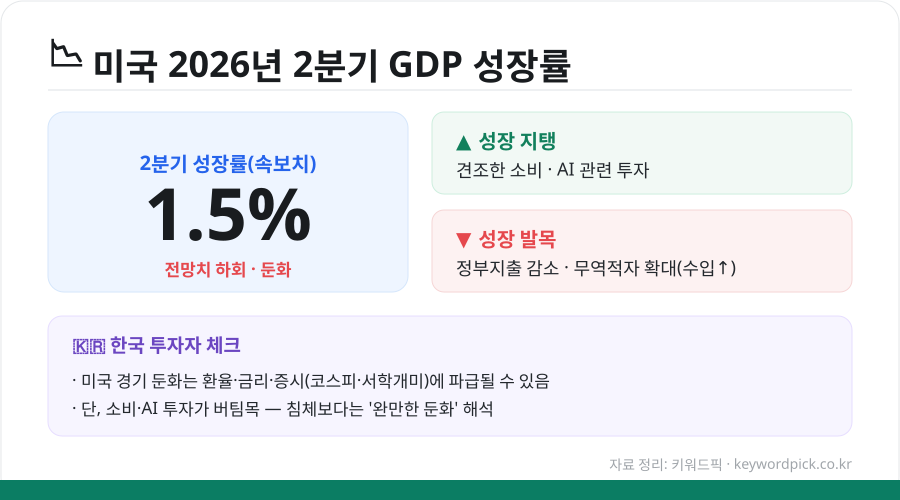

미국의 **2026년 2분기 경제성장률(GDP)** 속보치가 **1.5%**로 발표됐습니다. 시장 전망치를 밑돌며 '둔화' 신호로 읽히는데요. 숫자가 무엇을 뜻하는지, 한국 투자자 관점에서 무엇을 봐야 하는지 쉽게 정리했습니다.

<figure class="large"><figcaption>미국 2분기 GDP 요약 (자료 정리: 키워드픽)</figcaption></figure>

## 핵심 요약

- **성장률**: 2분기 GDP 속보치 **1.5%**(연율 기준)
- **평가**: **시장 전망치를 하회**하며 성장세 둔화
- **지탱 요인**: 견조한 **소비**와 **AI 관련 투자**
- **발목 요인**: **정부지출 감소**, **무역적자 확대**(수입 증가)

## '1.5%'가 왜 둔화 신호인가

GDP 성장률은 경제가 이전보다 얼마나 커졌는지를 보여주는 지표입니다. 이번 1.5%는 **시장이 기대했던 수준보다 낮았기 때문에**, 미국 경제의 성장 동력이 다소 약해졌다는 신호로 해석됩니다. 다만 마이너스가 아닌 플러스 성장인 만큼, '침체'라기보다는 **'성장 속도가 느려진(완만한 둔화)'** 국면에 가깝습니다.

## 무엇이 성장을 끌어내렸나

이번 둔화의 배경으로는 다음이 꼽힙니다.

- **정부지출 감소**: 정부의 재정 지출이 줄면서 성장 기여도가 낮아졌습니다.
- **무역적자 확대**: 수입이 늘어나면서 순수출(수출-수입)이 성장률을 깎아내렸습니다.

## 그래도 버틴 이유 — 소비와 AI 투자

반대로 성장을 지탱한 것은 **소비**와 **AI 관련 투자**입니다. 소비가 견조하게 유지됐고, AI 붐에 따른 기업 투자가 이어지면서 성장률이 급격히 무너지는 것을 막았습니다. 즉 '소비·투자는 버티고, 정부·무역이 발목을 잡은' 그림입니다.

## 한국 투자자가 알아둘 점

미국 경제 지표는 국내에도 영향을 줍니다.

- **환율·금리**: 미국 경기 둔화는 금리 인하 기대 등을 통해 **원/달러 환율**에 영향을 줄 수 있습니다.
- **증시**: **코스피**와 미국 주식에 투자하는 **'서학개미'** 에게 미국 경기 흐름은 중요한 변수입니다.
- **해석 주의**: 지표 하나로 방향을 단정하기보다, 다음 지표(고용·물가 등)와 함께 흐름을 봐야 합니다.

## 정리

미국 2분기 GDP는 ① **1.5%로 전망치 하회**, ② **정부지출·무역적자가 발목**, ③ **소비·AI 투자가 지탱**이라는 그림입니다. 침체보다는 완만한 둔화에 가깝지만, 환율·증시에 미칠 영향을 감안해 흐름을 지켜볼 필요가 있습니다.

---

※ 정확한 수치(속보치·잠정치·확정치는 다를 수 있음)와 세부 항목은 발행 전 공식 통계·최신 보도로 재확인하세요. **이 글은 투자 권유가 아닙니다.**

### 참고 자료 (2026.7 보도)
- 美 2분기 GDP 성장률 속보치 1.5%, 전망치 하회 — 연합인포맥스·한국경제
- 소비·AI 투자가 성장 지탱 — MBC
- 정부지출 감소·무역적자 확대가 발목 — 헤럴드경제·글로벌이코노믹
