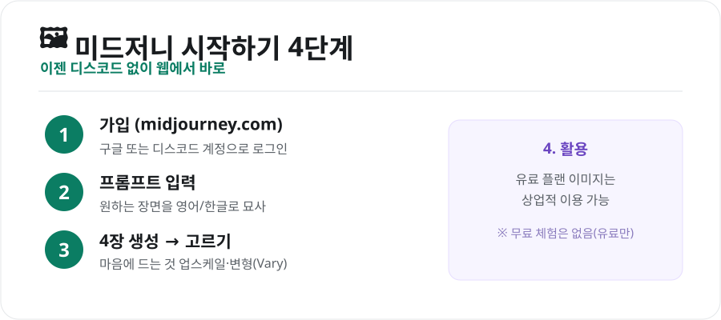
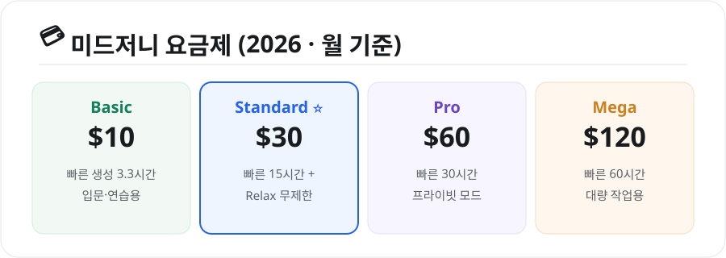

퀄리티 높은 AI 이미지 하면 빠지지 않는 도구, **미드저니(Midjourney)** 입니다. 예전엔 디스코드로만 써야 해서 진입장벽이 있었는데, 이제는 **웹에서 바로** 쓸 수 있게 됐습니다. 시작 방법부터 요금까지 정리했습니다.

## 미드저니 시작하기 4단계

<figure class="large"><figcaption>미드저니 시작하기 4단계 (자료 정리: 키워드픽)</figcaption></figure>

1. **가입** — **[midjourney.com](https://www.midjourney.com)** 에서 구글 또는 디스코드 계정으로 로그인
2. **프롬프트 입력** — 원하는 장면을 묘사 (예: "cozy cafe in the rain, warm light")
3. **4장 생성 → 고르기** — 한 번에 4장이 나오면, 마음에 드는 것을 **업스케일(고화질)** 하거나 **변형(Vary)**
4. **활용** — 유료 플랜에서 만든 이미지는 **상업적 이용**이 가능

## 요금제 — 무료 체험은 없어요

미드저니는 **무료 체험이 없고, 유료 구독**이 필요합니다. 대신 모든 유료 이미지의 **상업적 사용이 허용**됩니다.

<figure class="large"><figcaption>미드저니 요금제 (2026년 월 기준, 자료 정리: 키워드픽)</figcaption></figure>

| 플랜 | 월 요금 | 특징 |
|---|---|---|
| **Basic** | $10 | 빠른 생성 3.3시간 — 입문·연습용 |
| **Standard** | $30 | 빠른 15시간 + **Relax(대기) 무제한** — 가성비 |
| **Pro** | $60 | 빠른 30시간 + 프라이빗 모드 |
| **Mega** | $120 | 빠른 60시간 — 대량 작업용 |

> 💡 **초보는 Basic($10)** 으로 충분히 배울 수 있고, 이미지를 많이 뽑는다면 **Standard($30)** 가 'Relax 무제한' 덕에 가성비가 좋습니다. (연간 결제 시 약 20% 할인)

## 초보를 위한 팁

- **간단히 시작**: 처음엔 짧은 프롬프트로, 마음에 들면 세부 묘사·스타일 추가
- **'--ar' 비율**: 세로/가로 등 화면비를 지정하면 용도에 맞게 뽑기 좋음
- **레퍼런스 활용**: 참고 이미지를 함께 주면 원하는 느낌에 가까워짐
- **Relax 모드**: 급하지 않으면 대기 생성으로 fast 시간을 아끼기

## ⚠️ 주의점

- **저작권·초상권**: 실존 인물·특정 캐릭터·브랜드를 무단 생성·상업 이용하면 문제가 될 수 있습니다.
- **요금 정책**은 수시로 바뀌니 공식 페이지에서 최신 정보를 확인하세요.

## 정리

미드저니는 ① 이제 **웹에서 4단계로 간편**하게 시작하고, ② **무료 체험 없이 유료**($10~)지만 **상업 이용이 가능**하며, ③ 초보는 Basic, 다작이면 Standard가 알맞습니다. 고퀄 이미지가 필요하다면 여전히 강력한 선택지입니다.

---

### 참고
- [미드저니 v7 초보 가이드 2026 — TechJournal](https://techjournal.org/how-to-use-midjourney-v7)
- [미드저니 요금제 2026 — eesel AI](https://www.eesel.ai/blog/midjourney-pricing)
