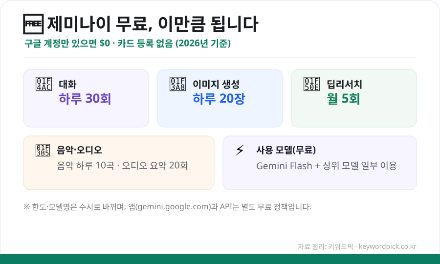

구글의 AI **제미나이(Gemini)** 는 **구글 계정만 있으면 무료**로 쓸 수 있습니다. 그런데 "정확히 뭘, 얼마나 공짜로 되는 걸까?"가 헷갈리죠. 무료로 시작하는 법과 사용 범위·한도를 한 번에 정리했습니다.

## 제미나이, 정말 공짜인가?

네. **제미나이 앱(gemini.google.com)** 은 **구글 계정만 있으면 $0**, 카드 등록도 필요 없습니다. 대화는 물론 이미지 생성·리서치 등 상당한 기능을 무료로 쓸 수 있습니다. 다만 무료인 만큼 **하루 사용량 한도**가 있습니다.

<figure class="large"><figcaption>제미나이 무료 사용 범위 요약 (2026년 기준, 자료 정리: 키워드픽)</figcaption></figure>

## 무료로 쓸 수 있는 것 & 한도

2026년 기준 대략적인 무료 한도입니다. (정책은 수시로 바뀌므로 앱 내 안내로 최신 정보를 확인하세요.)

| 기능 | 무료 한도(대략) |
|---|---|
| **대화(프롬프트)** | 하루 약 30회 |
| **이미지 생성·편집** | 하루 약 20장 |
| **딥리서치(심층 리포트)** | 월 약 5회 |
| **음악 생성** | 하루 약 10곡 |
| **오디오 요약** | 하루 약 20회 |
| **사용 모델** | Gemini Flash + 상위 모델 일부 |

> 💡 일반적인 질문·정리·간단한 이미지 만들기 정도는 **무료로도 충분**합니다. 아주 많이 쓰거나 반복 작업이 잦으면 한도에 걸릴 수 있어요.

## 시작하는 법 (3단계)

1. **[gemini.google.com](https://gemini.google.com)** 접속 (또는 스마트폰 **Gemini 앱** 설치)
2. **구글 계정으로 로그인**
3. 바로 대화 시작 — 질문을 입력하거나, "이미지 만들어줘"처럼 요청

스마트폰에서는 구글 앱·어시스턴트와 연동돼 더 편하게 쓸 수 있습니다.

## 이렇게 활용해요

- **정보 정리**: "이 주제 핵심만 표로 정리해줘"
- **글쓰기·번역**: 이메일 초안, 요약, 번역
- **이미지**: 블로그·발표용 간단한 그림 생성 (하루 한도 내)
- **리서치**: 딥리서치로 특정 주제 심층 리포트(월 한도 내)

## 앱과 API는 다르다 (참고)

**일반 사용자**는 위의 **제미나이 앱**을 쓰면 됩니다. 반면 **개발자**가 프로그램에 연동할 때 쓰는 **제미나이 API**는 **무료 한도가 별도**로 운영됩니다(예: 이미지 API는 하루 수백 장 등). 용도가 다르니 헷갈리지 마세요.

## ⚠️ 주의점

- **사실 확인**: AI는 그럴듯하게 틀릴 수 있으니 중요한 정보는 원출처로 확인하세요.
- **개인정보**: 민감한 개인정보·기밀은 입력하지 않는 게 안전합니다.
- **저작권**: 생성한 이미지·글의 상업적 사용은 이용약관을 확인하세요.

## 정리

제미나이는 ① **구글 계정만 있으면 무료**, ② 대화·이미지·리서치를 **하루/월 한도 내에서** 쓸 수 있고, ③ **앱과 API는 별도** 정책입니다. 일상적인 활용에는 무료로도 충분하니, 부담 없이 시작해 보세요.

---

### 참고
- Google Gemini 무료 플랜·기능·한도 안내(2026)
- 제미나이 앱 vs API 무료 한도 비교 자료
