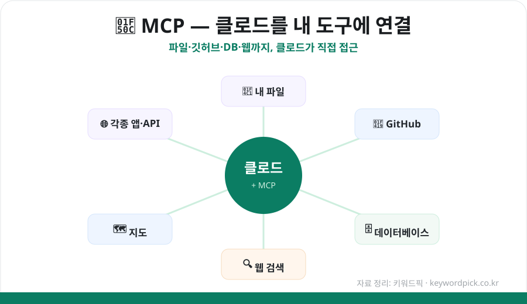

AI 챗봇에게 "내 파일 좀 정리해줘", "우리 깃허브 코드 확인해줘"라고 시킬 수 있다면 어떨까요? **MCP(Model Context Protocol)** 를 쓰면 클로드(Claude)를 **내 파일·앱·데이터에 직접 연결**할 수 있습니다. 개념부터 시작 방법까지 초보자 눈높이로 정리했습니다.

## MCP가 뭔가요?

**MCP(Model Context Protocol)** 는 AI와 외부 도구·데이터를 연결하는 **개방형 표준**입니다. 앤트로픽이 공개했고, 지금은 여러 AI 앱이 함께 지원합니다.

- **MCP 서버**가 도구와 데이터를 AI에게 노출합니다.
- 노출되는 것은 크게 두 가지 — **리소스**(파일·DB 기록·API 응답 등 '읽을 것')와 **도구**(파일 쓰기·쿼리 실행·HTTP 요청 등 '할 수 있는 것')입니다.
- 즉, 클로드가 대화 중에 **내 컴퓨터의 파일을 읽거나, 깃허브를 관리하거나, 데이터베이스를 조회**할 수 있게 됩니다.

<figure class="large"><figcaption>MCP로 클로드와 내 도구를 연결하는 구조 (자료 정리: 키워드픽)</figcaption></figure>

## 어디서 쓸 수 있나

2026년 기준 MCP는 **클로드 데스크톱(맥·윈도우)**, **Claude.ai(프로 구독)**, **클로드 API**, 그리고 커서(Cursor) 등 **여러 서드파티 앱**에서 지원됩니다. 가장 접근하기 쉬운 건 **클로드 데스크톱 앱**입니다.

## 시작하는 법 — 2가지 방법

**① 데스크톱 확장(가장 쉬움)**
최근에는 **원클릭 설치형 '데스크톱 확장(Desktop Extension)'** 이 생겨, 브라우저 확장 설치하듯 MCP 서버를 손쉽게 추가할 수 있습니다. JSON을 직접 만질 필요 없이 클릭 몇 번이면 됩니다.

**② 수동 설정(JSON)**
개발자라면 설정 파일(JSON)에 MCP 서버를 직접 등록할 수도 있습니다. 예를 들어 간단한 '날씨 서버'를 만들어 클로드에 연결하면, `날씨 조회`·`경보 조회` 같은 도구를 쓸 수 있게 됩니다.

## 대표 MCP 서버 (앤트로픽 기본 제공)

앤트로픽이 제공하는 대표적인 참조 서버들입니다. (이 외에도 공개 레지스트리에 **9,000개 이상**의 서버가 있습니다.)

| MCP 서버 | 이런 걸 할 수 있어요 |
|---|---|
| **Filesystem** | 내 컴퓨터의 파일 읽기·쓰기·정리 |
| **GitHub** | 저장소·이슈·코드 조회 및 관리 |
| **PostgreSQL** | 데이터베이스 조회·분석 |
| **Brave Search** | 웹 검색으로 최신 정보 가져오기 |
| **Puppeteer** | 브라우저 자동 제어(크롤링 등) |
| **Google Maps** | 지도·장소·경로 정보 활용 |

## 이렇게 활용해요 (예시)

- **문서 정리**: "이 폴더의 회의록들 요약해서 표로 만들어줘" (Filesystem)
- **개발 보조**: "우리 저장소 최근 이슈 정리하고 우선순위 매겨줘" (GitHub)
- **데이터 분석**: "이번 달 주문 데이터에서 상위 상품 뽑아줘" (PostgreSQL)
- **리서치**: "○○ 최신 뉴스 검색해서 핵심만 정리해줘" (Brave Search)

## ⚠️ 주의점 — 보안이 핵심

MCP는 강력한 만큼 **권한도 큽니다.** 서버에 따라 내 파일·시스템·계정에 접근하므로:

- **신뢰할 수 있는 MCP 서버만** 설치하세요(출처 확인).
- 민감한 파일·계정을 다루는 서버는 **권한 범위**를 꼭 확인하세요.
- 자동으로 파일을 쓰거나 외부로 데이터를 보내는 작업은 **한 번 더 확인**하는 습관이 안전합니다.

## 정리

MCP는 ① 클로드를 **내 파일·깃허브·DB·웹에 연결**하는 개방형 표준이고, ② **데스크톱 확장으로 원클릭 설치**가 가능하며, ③ **9,000개 이상**의 서버로 활용 폭이 넓습니다. 단, **신뢰할 수 있는 서버만, 권한을 확인하고** 쓰는 것이 중요합니다. 잘 활용하면 AI가 '대화만 하는 도구'에서 '내 일을 직접 돕는 조수'로 바뀝니다.

---

### 참고
- MCP 공식 문서 및 앤트로픽 클로드 데스크톱 안내
- 2026년 MCP 서버·설정 가이드 종합
