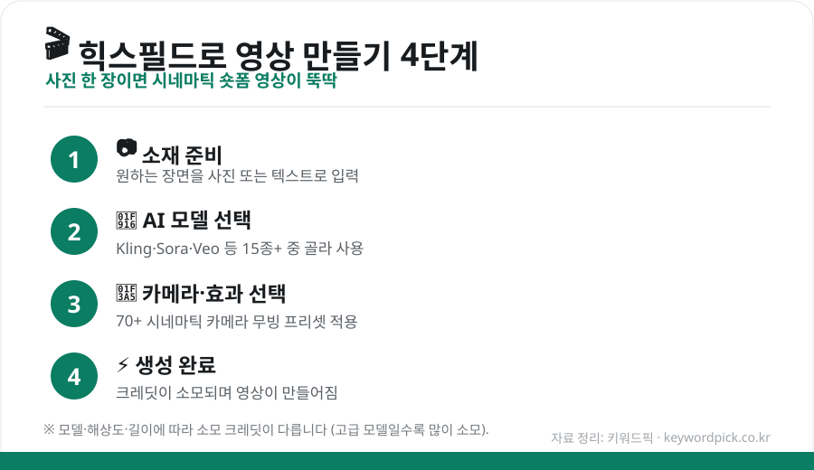

사진 한 장이나 짧은 문구만으로 **시네마틱한 영상**을 만들 수 있는 AI 도구, **힉스필드(Higgsfield)** 가 숏폼·마케팅 제작자들 사이에서 화제입니다. 무엇을 할 수 있고 어떻게 쓰는지, 요금까지 한 번에 정리했습니다.

## 힉스필드가 뭔가요?

힉스필드는 **여러 AI 영상 모델을 한 곳에 모아둔 영상 생성 플랫폼**입니다. **Sora 2, Veo 3.1, Kling 3.0** 등 **15종 이상의 모델**을 하나의 구독으로 골라 쓸 수 있는 것이 가장 큰 특징입니다.

- **실제 카메라 무빙**처럼 연출하는 **70+ 시네마틱 프리셋**
- **캐릭터 일관성**(같은 인물을 여러 장면에 유지)
- **립싱크**, **시네마 스튜디오** 등 편집 도구
- **모바일 친화적** — 숏폼 제작에 강점

<figure class="large"><figcaption>힉스필드 영상 만들기 4단계 (자료 정리: 키워드픽)</figcaption></figure>

## 영상 만드는 법 — 4단계

1. **소재 준비** — 원하는 장면을 **사진 또는 텍스트**로 입력
2. **AI 모델 선택** — Kling·Sora·Veo 등 원하는 모델 선택 (모델마다 특성·비용 다름)
3. **카메라·효과 선택** — 70여 가지 카메라 무빙 프리셋으로 연출
4. **생성** — 크레딧이 소모되며 영상이 완성됨

## 크레딧과 요금제

힉스필드는 **크레딧 기반**입니다. **영상 길이·해상도·선택한 모델**에 따라 소모 크레딧이 다르고, 고급 모델(예: Sora·Veo)일수록 많이 씁니다.

| 요금제 | 대략 비용/월 | 특징 |
|---|---|---|
| **Free(무료)** | $0 | 소량의 체험 크레딧 (맛보기용) |
| **Starter** | 약 $15 | 입문용 |
| **Plus** | 약 $49 | 약 1,000 크레딧 |
| **Ultra** | 약 $129 | 약 3,000 크레딧 |
| Business/Enterprise | 별도 | 팀·기업용 |

> 💡 참고로 Kling 계열은 영상 1개당 크레딧이 적게 들고(약 6), Sora·Veo 계열은 많이 듭니다(약 40~70). **저렴한 모델로 먼저 테스트**하고, 마음에 들면 고급 모델로 뽑는 게 크레딧을 아끼는 요령입니다.

## ⚠️ 무료로 계속 쓸 수 있나?

**아쉽지만 '지속적인 무료'는 아닙니다.** 신규 가입 시 **체험 크레딧**으로 품질을 테스트해볼 수 있지만, 크레딧이 빨리 소모되기 때문에 꾸준히 만들려면 **유료 플랜**이 필요합니다. 먼저 무료 체험으로 결과물을 확인한 뒤 결정하는 것을 추천합니다.

## 이렇게 활용해요

- **SNS 숏폼**: 릴스·쇼츠용 짧은 시네마틱 영상
- **마케팅·광고**: 제품 소개 영상, 브랜드 무드컷
- **콘텐츠 제작**: 썸네일 배경 영상, 인트로 클립

## 크레딧 아끼는 팁

- **저비용 모델로 초안** → 마음에 들면 고급 모델로 최종본
- **해상도는 필요한 만큼** (4K는 크레딧 많이 소모)
- **프롬프트·프리셋을 미리 정리**해 재생성 낭비 줄이기

## ⚠️ 이것만은 주의

- **초상권·딥페이크**: 실존 인물의 얼굴을 무단으로 합성·생성하면 **법적 문제**가 될 수 있습니다.
- **저작권**: 만든 영상의 상업적 사용은 이용약관을 확인하세요.
- **요금 확인**: 요금·크레딧 정책은 수시로 바뀌니 **공식 페이지에서 최신 정보**를 확인하세요.

## 정리

힉스필드는 ① **15종+ AI 영상 모델**을 한 곳에서 쓰는 플랫폼이고, ② **사진/텍스트 → 모델·카메라 선택 → 생성**의 간단한 흐름이며, ③ **크레딧 기반 유료**(무료는 체험 수준)입니다. 저비용 모델로 테스트하며 크레딧을 아끼고, **초상권·저작권**에 유의해 활용하면 좋은 영상 도구가 됩니다.

---

### 참고
- Higgsfield AI 기능·요금·크레딧 안내(2026)
- 힉스필드 지원 모델·플랜 비교 자료
