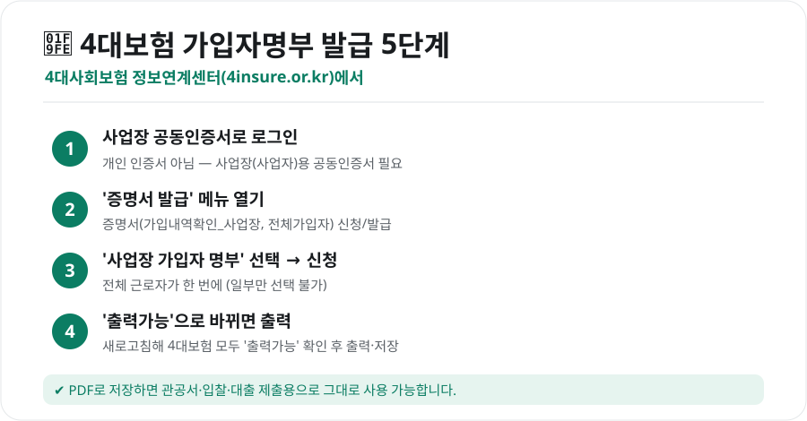
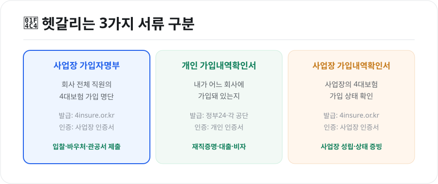

입찰·바우처·관공서 제출용으로 **4대보험 가입자명부**를 떼야 할 때가 있습니다. 처음이면 "어디서, 어떻게?" 막막한데, 알고 보면 **4대사회보험 정보연계센터**에서 3분이면 끝납니다. 발급 방법과, 헷갈리는 비슷한 서류들과의 차이까지 정리했습니다.

<figure class="large"><figcaption>4대보험 가입자명부 발급 5단계 (자료 정리: 키워드픽)</figcaption></figure>

## 4대보험 가입자명부란?

특정 **사업장에 가입된 근로자 전체의 4대보험 가입 명단**입니다. 관공서 제출, 정부 입찰, 바우처 사업, 대출 심사 등에서 "우리 회사 직원이 실제로 4대보험에 가입돼 있다"를 증명할 때 씁니다. **일부 직원만 골라 뽑을 수는 없고, 전체 근로자**가 한 번에 나옵니다.

## 발급 방법 (사업장 공동인증서 필요)

발급처는 **4대사회보험 정보연계센터(www.4insure.or.kr)**입니다. **사업장(사업자)용 공동인증서**로 로그인해야 발급할 수 있어요(개인 인증서로는 안 됩니다).

1. 4대사회보험 정보연계센터 접속 → **사업장 공동인증서로 로그인**
2. **증명서 발급** 메뉴 → '증명서(가입내역확인_사업장, 전체가입자) 신청/발급'
3. 확인 버튼 → **'사업장 가입자 명부'** 선택 후 **신청**
4. 새로고침해 4대보험이 모두 **'출력가능'**으로 바뀌는지 확인
5. **출력** 버튼으로 인쇄하거나 **PDF로 저장**

PDF로 저장하면 이메일 제출이나 온라인 첨부에 그대로 쓸 수 있습니다.

<a href="https://www.4insure.or.kr" target="_blank" rel="noopener" style="display:inline-block;background:#0b7d63;color:#fff;padding:13px 26px;border-radius:10px;font-weight:800;font-size:16px;text-decoration:none;">🔗 4대사회보험 정보연계센터 바로가기</a>

> 로그인·발급은 사업장 공동인증서가 필요합니다. 인증서가 준비돼 있어야 진행됩니다.

## 비슷한 서류, 헷갈리지 마세요

이름이 비슷한 서류가 여럿이라 자주 헷갈립니다. 용도에 맞게 골라야 해요.

<figure class="large"><figcaption>헷갈리는 3가지 서류 구분 (자료 정리: 키워드픽)</figcaption></figure>

| 서류 | 내용 | 발급처 · 인증 |
|---|---|---|
| **사업장 가입자명부** | 회사 전체 직원의 가입 명단 | 4insure.or.kr · 사업장 인증서 |
| **개인 가입내역확인서** | 내가 어느 회사에 가입돼 있는지 | 정부24·각 공단 · 개인 인증서 |
| **사업장 가입내역확인서** | 사업장의 가입 상태 | 4insure.or.kr · 사업장 인증서 |

- **회사가 직원 명단을 제출**할 일 → 사업장 가입자명부
- **개인이 재직·가입을 증명**할 일(대출·비자 등) → 개인 가입내역확인서(정부24 등)

## 알아두면 좋은 점

- **공동인증서 준비**: 사업장 명부는 사업장 인증서가 없으면 발급 자체가 안 됩니다. 미리 챙기세요.
- **각 공단에서도 가능**: 국민연금공단·건강보험공단 등 개별 공단 사이트에서도 관련 증명을 뗄 수 있지만, **4대보험을 한 번에** 보려면 정보연계센터가 편합니다.
- **개인용은 정부24**: 근로자 개인이 필요하면 [정부24](정부24-민원-발급-방법.html)나 각 공단에서 본인 인증으로 발급하세요.
- **요율·계산이 궁금하면**: 함께 보면 좋은 [4대보험 계산기 사용법](4대보험-계산기-2026-요율.html)도 참고하세요.

## 마무리

4대보험 가입자명부는 **"4대사회보험 정보연계센터 + 사업장 공동인증서"** 두 가지만 알면 끝입니다. 로그인 → 증명서 발급 → 사업장 가입자 명부 선택 → 출력. 개인이 필요한 재직·가입 증명과는 다른 서류라는 점만 기억하세요.

*자료: 4대사회보험 정보연계센터(www.4insure.or.kr) 안내. 메뉴 명칭·절차는 사이트 개편에 따라 달라질 수 있으니 화면 안내를 함께 확인하세요.*
