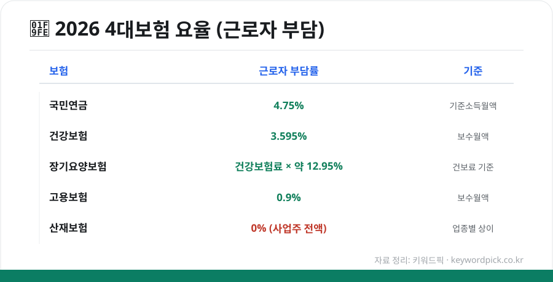
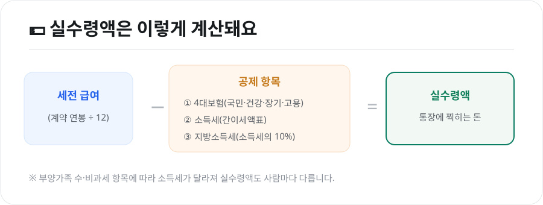

매달 월급명세서를 보면 '세전 급여'와 '실수령액'이 꽤 차이 납니다. 그 차이의 대부분이 **4대보험과 세금 공제**인데요. 2026년 요율을 기준으로 무엇이 얼마나 빠지는지, 계산기를 어떻게 쓰는지 정리했습니다.

<figure class="large"><figcaption>2026년 4대보험 요율(근로자 부담) (자료 정리: 키워드픽)</figcaption></figure>

## 1. 4대보험이란

근로자가 의무적으로 가입하는 네 가지 사회보험입니다.

- **국민연금** — 노후 소득 보장
- **건강보험**(+**장기요양보험**) — 의료비 보장
- **고용보험** — 실업급여 등
- **산재보험** — 업무상 재해 보상

이 중 **산재보험은 회사(사업주)가 전액** 부담하고, 나머지 셋은 **회사와 근로자가 나눠서** 냅니다.

## 2. 2026년 요율 (근로자 부담 기준)

| 보험 | 전체 요율 | 근로자 부담 | 부과 기준 |
|---|---|---|---|
| **국민연금** | 9.5% | **4.75%** | 기준소득월액 |
| **건강보험** | 7.19% | **3.595%** | 보수월액 |
| **장기요양보험** | 건강보험료의 약 12.95% | 절반 부담 | 건강보험료 기준 |
| **고용보험**(실업급여) | — | **0.9%** | 보수월액 |
| **산재보험** | 업종별 상이 | **0%**(사업주 전액) | 보수총액 |

> **국민연금은 2026년부터 9%→9.5%로 인상**되었고, 2033년까지 매년 0.5%p씩 올라 13%가 됩니다. 건강보험도 7.09%→7.19%로 소폭 올랐습니다.

## 3. 월급에서 얼마가 빠질까 — 계산 예시

**세전 월급 300만원, 부양가족 본인 1명** 가정(대략적인 예시):

- 국민연금: 300만원 × 4.75% = **약 142,500원**
- 건강보험: 300만원 × 3.595% = **약 107,850원**
- 장기요양: 건강보험료 × 약 12.95% = **약 13,900원**
- 고용보험: 300만원 × 0.9% = **약 27,000원**
- **4대보험 합계: 약 291,000원**

여기에 **소득세(간이세액표)와 지방소득세(소득세의 10%)**가 더 빠집니다. 그래서 세전 300만원이라도 실제 통장에는 그보다 적게 들어옵니다.

<figure class="large"><figcaption>실수령액 계산 원리 (자료 정리: 키워드픽)</figcaption></figure>

## 4. 4대보험 계산기 사용법

정확한 금액은 **공식 계산기**로 확인하는 것이 가장 정확합니다.

- **4대사회보험 정보연계센터** 홈페이지의 '4대보험료 계산' 기능
- **국민연금공단·건강보험공단** 홈페이지의 모의계산
- 포털에서 '**4대보험 계산기**'를 검색하면 나오는 계산기

**사용 순서**
1. **월 급여(세전, 보수월액)**를 입력
2. (필요 시) 부양가족 수·근로자 수 등 조건 입력
3. 국민연금·건강·장기요양·고용보험 **항목별 공제액**과 합계 확인

> 계산기는 대부분 4대보험만 계산합니다. **소득세·지방소득세**까지 포함한 실수령액을 보려면 '실수령액 계산기'를 별도로 이용하세요.

## 5. 알아두면 좋은 점

- **상·하한**: 국민연금은 기준소득월액 상한(659만원)·하한(41만원)이 있어, 소득이 아주 높아도 일정액 이상은 더 내지 않습니다.
- **건강보험 정산**: 건강보험료는 연말·퇴사 시 실제 소득으로 **정산**되어 추가 납부하거나 환급받을 수 있습니다.
- **두루누리 지원**: 소규모 사업장의 저임금 근로자는 국민연금·고용보험료의 일부를 **지원**받을 수 있습니다.

## 마무리

4대보험은 매달 나가는 돈이라 부담스럽게 느껴지지만, **노후·의료·실업·재해**를 함께 대비하는 안전망입니다. 이직·연봉 협상 전에 **4대보험 계산기로 실수령액을 미리 확인**해두면, 실제 손에 쥐는 금액을 기준으로 더 현명하게 판단할 수 있습니다.

---

*본 글은 공개된 요율 자료를 바탕으로 정리한 참고용 정보입니다. 요율·상하한·계산 방식은 매년 바뀌므로, 실제 금액은 4대사회보험 정보연계센터 등 공식 계산기로 확인하시기 바랍니다.*

**참고 자료**
- 4대사회보험 정보연계센터(보험료 계산)
- 국민건강보험공단·국민연금공단 보험료 안내
