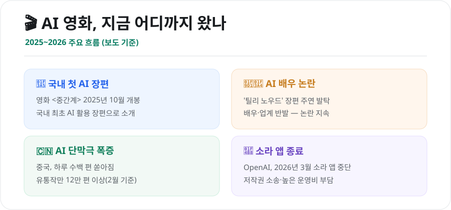
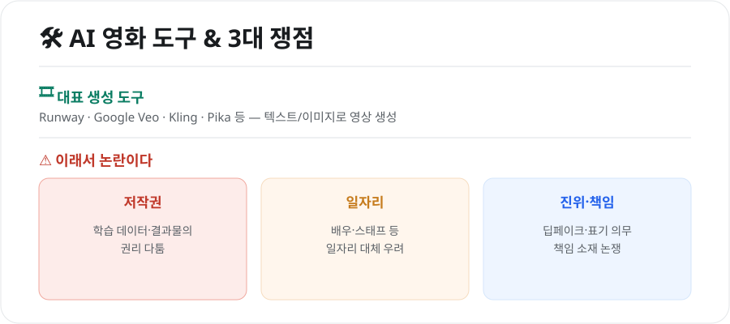

텍스트 몇 줄로 영상을 만들어내는 생성형 AI가 이제 '영화'의 영역까지 들어왔습니다. 짧은 영상 클립을 넘어 장편영화와 'AI 배우'까지 등장하면서, 기대만큼이나 논란도 뜨겁습니다. 2026년 현재 AI 영화가 어디까지 왔는지, 무엇이 쟁점인지 정리했습니다.

<figure class="large"><figcaption>2025~2026 AI 영화 주요 흐름 (자료 정리: 키워드픽)</figcaption></figure>

## 1. 2026년, AI 영화의 현주소

- **국내 첫 AI 활용 장편**: 영화 **〈중간계〉**가 2025년 10월 개봉해 국내 최초의 AI 활용 장편영화로 소개됐습니다.
- **AI 배우 논란**: **'틸리 노우드'**라는 AI 배우가 장편 영화 주연으로 발탁되며 배우·업계의 반발을 불러왔고, 논란이 계속되고 있습니다.
- **콘텐츠 폭증**: 중국에서는 AI로 만든 단막극이 하루 수백 편씩 쏟아져, 유통 중인 작품만 12만 편이 넘는 것으로 전해집니다.
- **AI 영화제**: AI로 만든 작품만을 위한 영화제들도 생겨나, 국내에서도 관련 국제영화제가 열렸습니다.

이처럼 AI 영상 제작은 '실험'을 넘어 하나의 **산업 흐름**으로 자리 잡아가고 있습니다.

## 2. 소라(Sora) 앱 종료가 남긴 것

한편 OpenAI는 화제를 모았던 AI 영상 생성 앱 **소라(Sora)를 2026년 3월 종료**한 것으로 알려졌습니다. 배경으로는 **저작권 소송 리스크와 막대한 운영 비용**이 꼽힙니다.

- 하루 추론 비용은 크게 들었지만 매출은 이에 미치지 못했고,
- 다운로드도 빠르게 줄면서 서비스 지속이 어려워졌다는 분석입니다.

이는 **"기술이 놀랍다고 곧바로 지속 가능한 사업이 되는 것은 아니다"**라는 점을 보여주는 사례입니다.

## 3. 무엇이 문제인가 — 3대 쟁점

<figure class="large"><figcaption>AI 영화 도구 & 3대 쟁점 (자료 정리: 키워드픽)</figcaption></figure>

### ⚖️ 저작권
AI가 **무엇을 학습했는지**, 그 결과물의 **권리는 누구에게 있는지**를 두고 다툼이 이어집니다. 기존 창작물을 무단 학습했는지가 소송의 핵심 쟁점입니다.

### 💼 일자리
AI 배우·AI 생성 영상이 늘면서 **배우·스태프 등 기존 인력의 일자리 대체** 우려가 큽니다. 창작 생태계를 어떻게 지킬지가 과제로 떠올랐습니다.

### 🎭 진위와 책임
실제와 구분이 어려운 영상이 만들어지면서 **딥페이크·표기 의무**, 문제가 생겼을 때의 **책임 소재**가 중요해졌습니다.

## 4. 대표 도구들

현재 AI 영상 제작에는 **Runway, Google Veo, Kling, Pika** 등이 많이 쓰입니다. 텍스트나 이미지를 넣으면 짧은 영상을 만들어주며, 이를 편집·연결해 더 긴 작품을 완성합니다. (각 도구의 사용법은 별도 가이드를 참고하세요.)

## 5. 앞으로는?

AI는 **제작 비용과 진입 장벽을 크게 낮춰**, 1인 창작자도 영화적 영상을 만들 수 있게 했습니다. 동시에 **저작권·일자리·윤리** 문제를 풀지 못하면 갈등이 커질 수밖에 없습니다. 결국 관건은 **"AI를 어떻게 쓰고, 누가 책임질 것인가"**에 대한 사회적 합의입니다.

## 마무리

AI 영화는 이미 실험실을 벗어나 극장과 시장에 들어왔습니다. 창작의 문턱을 낮추는 도구가 될지, 창작 생태계를 흔드는 변수가 될지는 **제도와 합의**에 달려 있습니다. 기술의 속도만큼 **논의의 속도**도 중요해진 시점입니다.

---

*본 글은 공개된 언론 보도와 자료를 바탕으로 정리한 참고용 정보입니다. 개별 작품·서비스·소송의 사실관계는 시점에 따라 달라질 수 있으므로, 최신 보도를 함께 확인하시기 바랍니다.*

**참고 자료**
- 영화진흥위원회(KOFIC) AI 관련 자료
- AI 영화·AI 배우 관련 국내외 언론 보도(2025~2026)
