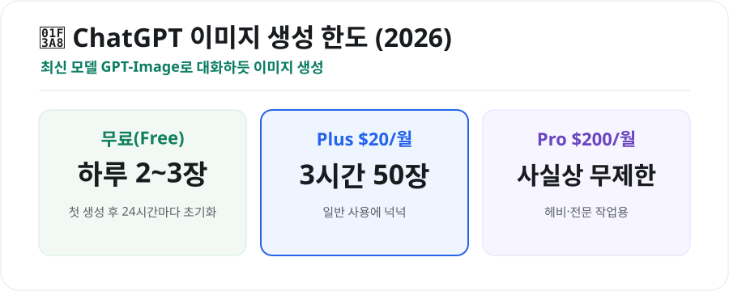
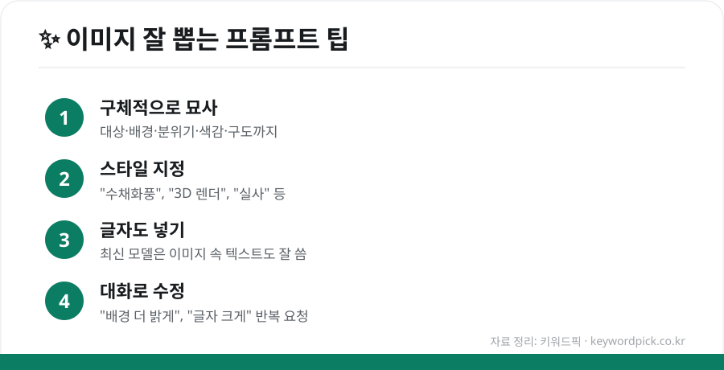

이제 **ChatGPT 안에서 바로 이미지를 만들 수 있습니다.** 별도 앱 없이, 대화하듯 "○○ 그려줘"라고만 하면 되는데요. 무료로 얼마나 되는지, 원하는 그림을 잘 뽑는 요령까지 정리했습니다.

## ChatGPT 이미지 생성, 이렇게 바뀌었다

과거 별도 도구였던 'DALL·E'는 이제 **ChatGPT 안에 통합**됐습니다. 텍스트·코드를 다루는 같은 모델(현재 **GPT-Image** 계열)이 이미지도 만들기 때문에, **대화 맥락을 이해하고 복잡한 요청도 잘 따릅니다.** 이미지 속 **글자**도 예전보다 정확하게 써주고, "더 밝게"처럼 **대화로 수정**하기도 쉽습니다.

## 무료로 얼마나 되나

<figure class="large"><figcaption>ChatGPT 이미지 생성 한도 (2026년 기준, 자료 정리: 키워드픽)</figcaption></figure>

| 플랜 | 이미지 한도(대략) |
|---|---|
| **무료(Free)** | 하루 약 2~3장 (첫 생성 후 24시간마다 초기화) |
| **Plus($20/월)** | 3시간당 약 50장 |
| **Pro($200/월)** | 사실상 무제한(빠른 생성) |

> 💡 가볍게 써보기엔 무료로 충분하고, 자주 만든다면 Plus가 실용적입니다.

## 이미지 만드는 법

1. **[chatgpt.com](https://chatgpt.com)** 접속·로그인
2. 채팅창에 **"○○를 그려줘"** 입력 (예: "노을 지는 해변, 수채화풍으로")
3. 결과가 나오면 **"배경 더 밝게"** 처럼 대화로 수정

## 원하는 그림 잘 뽑는 프롬프트 팁

<figure class="large"><figcaption>이미지 잘 뽑는 프롬프트 4가지 (자료 정리: 키워드픽)</figcaption></figure>

1. **구체적으로 묘사** — 대상·배경·분위기·색감·구도까지 자세히
2. **스타일 지정** — "수채화풍", "3D 렌더", "실사 사진처럼" 등
3. **글자도 넣기** — 포스터·썸네일용 문구도 이미지에 넣어달라고 요청
4. **대화로 수정** — 한 번에 완벽하지 않아도, 반복 요청으로 다듬기

## ⚠️ 주의점

- **저작권·초상권**: 실존 인물·특정 캐릭터·브랜드 로고를 무단 생성·상업 이용하면 문제가 될 수 있습니다.
- **상업적 사용**: 만든 이미지의 이용 범위는 OpenAI 약관을 확인하세요.

## 정리

ChatGPT 이미지 생성은 ① **대화하듯 간편**하고, ② **무료는 하루 2~3장**(Plus는 넉넉), ③ **구체적 묘사 + 스타일 + 수정 요청**으로 품질을 크게 높일 수 있습니다. 저작권만 유의하면 블로그·SNS·발표 자료에 유용합니다.

---

### 참고
- [ChatGPT Free 이미지 한도 2026 — CometAPI](https://www.cometapi.com/how-many-images-can-you-create-with-chatgpt-free-in-2026/)
- [ChatGPT 이미지 한도 플랜별 — gptimg](https://gptimg.co/blog/chatgpt-image-limits)
