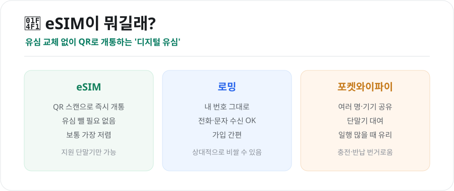
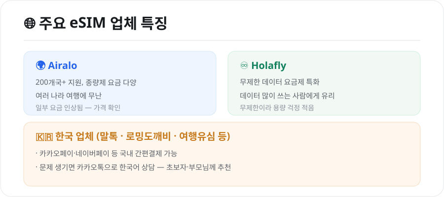

해외에서 인터넷을 쓰는 방법 중 요즘 가장 주목받는 게 **eSIM**입니다. 로밍보다 저렴하고, 유심을 갈아 끼울 필요도 없어 편리하죠. 다만 업체가 많아 뭘 골라야 할지 헷갈립니다. 개념부터 업체 비교, 선택 요령까지 정리했습니다.

<figure class="large"><figcaption>eSIM vs 로밍 vs 포켓와이파이 (자료 정리: 키워드픽)</figcaption></figure>

## 1. eSIM이 뭔가요?

eSIM은 휴대폰 안에 내장된 **디지털 유심**입니다. 물리 유심을 빼서 갈아 끼우는 대신, 업체에서 받은 **QR코드를 스캔**하면 현지 데이터가 바로 개통됩니다.

- **장점**: 대체로 **가장 저렴**, 유심 분실 걱정 없음, 출발 전 미리 설치 가능
- **단점**: **eSIM 지원 단말기**에서만 사용 가능(비교적 최신 스마트폰)

전화·문자를 그대로 받아야 하면 로밍, 일행이 많으면 포켓와이파이가 나을 수 있지만, **혼자 여행 + 최신폰**이면 eSIM이 가성비 최고입니다.

## 2. 주요 업체 비교

<figure class="large"><figcaption>주요 eSIM 업체 특징 (자료 정리: 키워드픽)</figcaption></figure>

| 업체 | 특징 | 추천 대상 |
|---|---|---|
| **Airalo** | 200개국+ 지원, 종량제 요금 다양 | 여러 나라 도는 여행 |
| **Holafly** | 무제한 데이터 요금제 특화 | 데이터 많이 쓰는 사람 |
| **말톡·로밍도깨비·여행유심 등(한국 업체)** | 국내 간편결제·카톡 한국어 상담 | 초보자·부모님·안심 원하면 |

- **Airalo**는 종량제(용량제)라 나라·용량 조합이 다양합니다. 다만 일부 국가는 요금이 오른 경우가 있으니 **결제 전 최신 가격**을 확인하세요.
- **Holafly**는 무제한이라 지도·영상·SNS를 많이 쓰는 사람에게 편합니다.
- **한국 업체**는 문제가 생겼을 때 **카카오톡으로 한국어 상담**이 되고, 카카오페이·네이버페이로 결제할 수 있어 처음이라면 마음이 놓입니다.

> 참고: 유럽 5GB 요금제가 대략 **2만원 안팎**, 10GB가 **3만원 안팎**대에서 형성됩니다(업체·시점별 차이).

## 3. 나에게 맞는 eSIM 고르기

- **짧은 여행 + 지도·검색 위주** → 3~5GB 종량제로 충분
- **SNS·영상·테더링 많이** → 무제한(Holafly) 또는 대용량
- **여러 나라 연속 여행** → 광역(리저널) 요금제나 Airalo
- **기계 조작이 걱정** → 한국어 상담되는 국내 업체

## 4. 개통 순서 (공통)

1. 업체 앱·웹에서 **방문국·용량 선택** 후 구매
2. 받은 **QR코드**로 eSIM 설치(설정 → 셀룰러 → eSIM 추가)
3. 현지 도착 후 **데이터 로밍 ON**, eSIM 회선을 데이터로 지정
4. 필요 시 내 원래 번호는 **전화·문자 수신용**으로 유지

> 출발 전 집에서 미리 설치해두고, **현지 도착 후 활성화(ON)**만 하면 됩니다. eSIM 지원 여부는 '설정'에서 eSIM 추가 메뉴가 있는지로 확인하세요.

## 마무리

eSIM은 **로밍보다 저렴하고 유심 교체가 필요 없는** 요즘 대세 방식입니다. 혼자·최신폰이면 종량제(Airalo)나 무제한(Holafly)을, 안심을 원하면 **한국어 상담되는 국내 업체**를 고르면 됩니다. 결제 전 **가격·용량·지원 단말기**만 확인하면 실패가 없습니다.

---

*본 글은 공개된 자료를 바탕으로 정리한 참고용 정보입니다. 특정 업체를 광고하지 않으며, 요금·지원 국가·단말기 호환은 수시로 바뀌므로 결제 전 각 업체 공식 안내를 확인하시기 바랍니다.*

**참고 자료**
- 각 eSIM 업체(Airalo·Holafly·말톡 등) 공식 안내
- 스마트폰 제조사 eSIM 지원 단말기 안내
