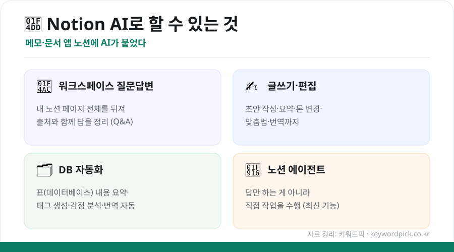
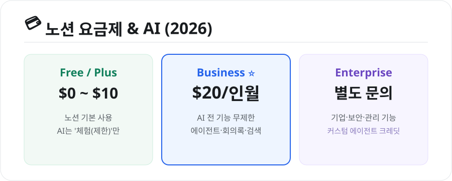

메모·문서·프로젝트 관리를 한 곳에서 하는 앱 **노션(Notion)** 에 AI가 붙었습니다. 단순히 글을 써주는 걸 넘어, **내가 쌓아둔 노션 페이지 전체를 뒤져 답을 주고, 작업까지 대신**하는데요. 무엇을 할 수 있고 어떻게 쓰는지 정리했습니다.

## Notion AI로 할 수 있는 4가지

<figure class="large"><figcaption>Notion AI 주요 기능 4가지 (자료 정리: 키워드픽)</figcaption></figure>

- **워크스페이스 질문답변(Q&A)**: "지난달 회의에서 정한 일정 뭐였지?"처럼 물으면, **내 노션 문서 수천 개를 뒤져 출처와 함께** 답해줍니다.
- **글쓰기·편집**: 초안 작성, 요약, 톤 변경, 맞춤법·번역 등
- **DB 자동화**: 표(데이터베이스)의 각 행을 자동 요약하거나 태그·감정 분석·번역
- **노션 에이전트**: 답만 하는 게 아니라 **직접 작업을 수행**하는 최신 기능

## 어떻게 쓰나

1. 새 줄에서 **`스페이스바`** 를 누르거나, 텍스트를 선택해 **'AI에게 요청'**
2. 오른쪽 위 **AI 아이콘**을 누르면 워크스페이스 전체에 질문 가능
3. 원하는 작업(요약·번역·표 만들기 등)을 자연어로 요청

## 요금제 — 무료로는 '체험'만

<figure class="large"><figcaption>노션 요금제와 AI (2026년 기준, 자료 정리: 키워드픽)</figcaption></figure>

| 플랜 | 비용(대략) | AI 이용 |
|---|---|---|
| **Free / Plus** | $0 ~ $10/인월 | AI는 **제한적 체험**만 |
| **Business** | 약 $20/인월 | **AI 전 기능 무제한**(에이전트·회의록·검색) |
| **Enterprise** | 별도 | 기업·보안·관리 기능 |

> ⚠️ 예전과 달리 **AI가 Business 플랜에 통합**됐습니다. 무료·Plus에서는 맛보기 수준이고, **무제한 AI는 Business($20)** 부터입니다.

## 이렇게 활용해요

- **회의록 정리**: AI 회의록 → 자동 요약·할 일 추출
- **자료 검색**: 흩어진 문서에서 필요한 정보 즉시 찾기
- **문서 초안**: 기획서·보고서 뼈대 빠르게 만들기

## ⚠️ 주의점

- 회사 문서를 다루므로 **보안·권한 설정**을 확인하세요.
- AI 답변도 **원문서로 한 번 더 확인**하는 습관이 안전합니다.

## 정리

Notion AI는 ① **내 문서 전체를 아는 비서**처럼 질문답변·검색이 되고, ② **글쓰기·DB 자동화·에이전트**까지 하며, ③ **무제한 사용은 Business($20)** 부터입니다. 노션을 이미 쓰고 있다면 업무 효율을 크게 높여주는 도구입니다.

---

### 참고
- [Notion AI 가이드 2026 — BitsMinds](https://www.bitsminds.com/guides/notion-ai-productivity-guide)
- [Notion AI 요금제 2026 — Fello AI](https://felloai.com/notion-ai-pricing/)
