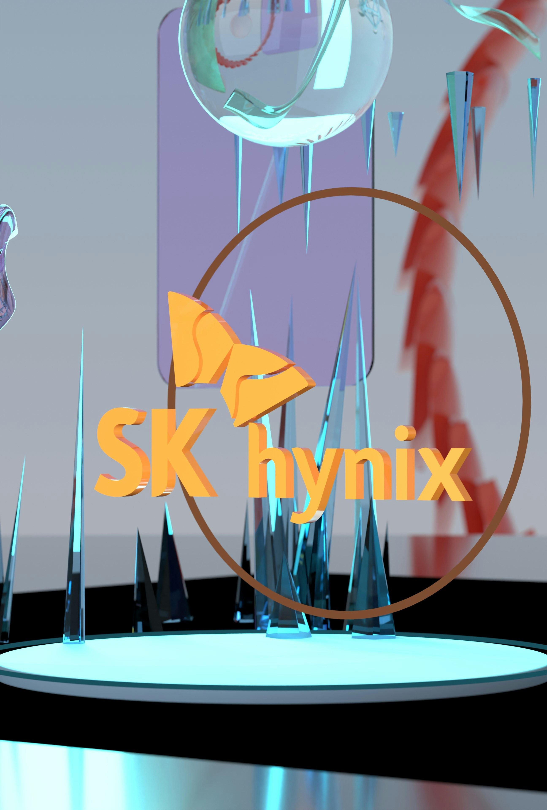

SK하이닉스가 미국 나스닥 시장에 **ADR(미국주식예탁증서)** 형태로 상장하며 글로벌 자본시장 한복판에 들어섰습니다. 뉴욕 타임스스퀘어에 '웰컴 투 나스닥' 문구가 걸리는 등 화려하게 데뷔했는데요. 이번 상장이 정확히 무슨 의미인지, 투자자와 일반 소비자 입장에서 무엇이 달라지는지 쉽게 풀어봤습니다.

## ADR이 뭐길래? — '직접 상장'과의 차이

먼저 헷갈리기 쉬운 개념부터 짚어야 합니다. 이번 SK하이닉스의 나스닥 등장은 국내 주식을 미국에서 직접 파는 '중복 상장'이 아니라 **ADR**을 통한 것입니다.

- **ADR(American Depositary Receipt)**: 미국 예탁기관이 해외 기업의 원주(原株)를 보관하고, 이를 근거로 발행한 '예탁증서'를 미국 시장에서 거래하는 방식입니다.
- 미국 투자자는 환전·해외 계좌 없이 **달러로** SK하이닉스에 투자할 수 있게 됩니다.
- 기업 입장에선 한국 증시 상장을 유지하면서 **글로벌 투자 접점**을 넓히는 효과가 있습니다.

즉 '한국 주식을 미국에 새로 판다'기보다, **미국 투자자가 접근하기 쉬운 창구를 하나 더 열었다**고 이해하면 됩니다.

<figure class="small"></figure>

## 왜 하필 지금, 왜 나스닥인가

핵심은 **AI 반도체**입니다. AI 서버에 필수인 고대역폭 메모리(HBM) 시장에서 SK하이닉스는 강력한 위치를 차지하고 있고, 이 수요의 최대 고객은 미국의 빅테크·AI 기업들입니다.

나스닥은 애플·엔비디아·마이크로소프트 등 글로벌 기술주가 모인 시장입니다. 이곳에 이름을 올린다는 것은 단순한 자금 조달을 넘어,

- 글로벌 AI 파트너·투자자와의 **접점 강화**
- 글로벌 무대에서의 **브랜드·신뢰도 제고**

라는 상징적 의미가 큽니다. 'AI 반도체의 핵심 공급자'라는 정체성을 세계 시장에 각인시키는 행보인 셈입니다.

## 국내 증시와 투자자에게 주는 의미

이번 상장은 국내 증시 전반의 **'AI 모멘텀'을 시험하는 계기**로 평가됩니다. 국내 대표 반도체 기업이 해외 자본시장에서 어떤 평가를 받는지가, 앞으로 다른 국내 기업들의 해외 진출·자본 조달에도 참고 사례가 될 수 있기 때문입니다.

다만 투자자라면 냉정하게 볼 부분도 있습니다.

- ADR 상장 자체가 **곧바로 실적이나 주가 상승을 보장하지는 않습니다.**
- 반도체 경기, HBM 수요, 환율 등 **외부 변수**가 여전히 주가를 좌우합니다.
- 단기 이벤트(상장 데뷔)와 장기 펀더멘털을 구분해서 봐야 합니다.

## 정리

SK하이닉스의 나스닥 ADR 상장은 ① 미국 투자자의 접근성을 높이고 ② AI 반도체 대표기업이라는 위상을 세계에 알리는 전략적 행보입니다. 국내 증시에도 상징적 의미가 크지만, 실제 주가와 실적은 이후 반도체 시장 상황에 달려 있는 만큼 차분히 지켜볼 필요가 있습니다.

---

이 글은 투자 권유가 아닙니다.

### 참고 자료
- SK하이닉스 ADR 거래 시작 — 연합뉴스
- 하이닉스 미국 오프닝 벨, 자본주의 심장부 데뷔 — 조선일보
- AI 모멘텀 시험대 오른 국내 증시 — 이코노미스트
