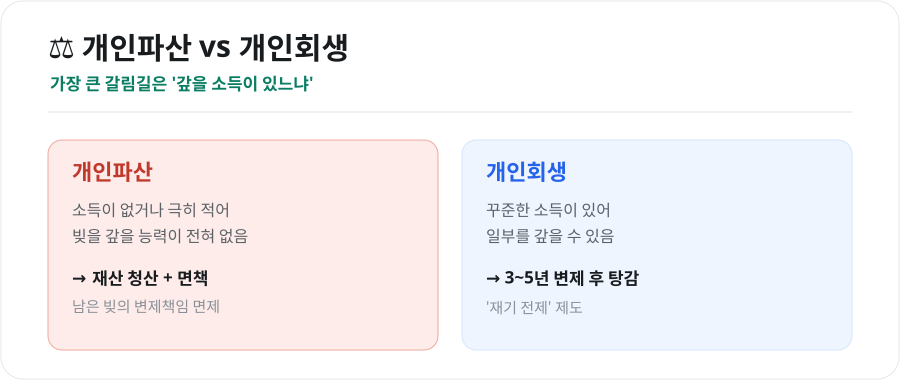
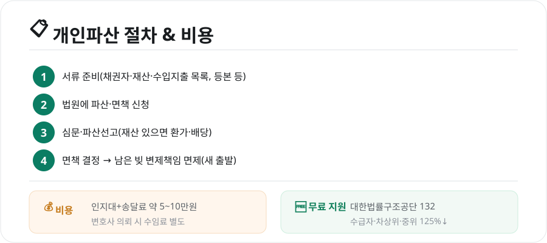

빚이 감당할 수 없는 수준이 되면 '개인파산'이라는 제도로 다시 시작할 수 있습니다. 하지만 파산과 개인회생을 헷갈리거나, 절차·비용이 막막해 미루는 경우가 많습니다. 핵심만 쉽게 정리했습니다. (본 글은 일반 정보이며, 개별 사안은 전문가 상담을 권합니다.)

<figure class="large"><figcaption>개인파산 vs 개인회생 (자료 정리: 키워드픽)</figcaption></figure>

## 1. 개인파산이란 — 그리고 개인회생과의 차이

가장 중요한 갈림길은 **'갚을 소득이 있느냐'**입니다.

- **개인파산**: 소득이 없거나 극히 적어 **빚을 갚을 능력이 전혀 없을 때**, 재산을 청산하고 남은 빚의 변제책임을 **면제(면책)**받는 제도
- **개인회생**: **꾸준한 소득이 있는 사람**이 일정 기간(보통 3~5년) 일부를 갚고 나머지를 탕감받는, '재기를 전제로 한' 제도

즉, **소득이 없으면 개인파산, 정기 소득이 있으면 개인회생**이 적합한 경우가 많습니다.

## 2. 신청 자격 — '지급불능' 상태

개인파산의 핵심 요건은 **지급불능**입니다. 현재의 소득·재산으로는 빚을 갚을 수 없는 상태를 뜻합니다.

- 소득 수준, 재산, 부채 규모 등을 종합적으로 봅니다.
- 낭비·도박 등으로 진 빚이거나 재산을 숨긴 경우 등은 **면책이 제한**될 수 있습니다(면책 불허가 사유).

## 3. 절차와 비용

<figure class="large"><figcaption>개인파산 절차 & 비용 (자료 정리: 키워드픽)</figcaption></figure>

### 절차 4단계
1. **서류 준비**: 채권자 목록, 재산 목록, 수입·지출 내역, 가족관계증명서, 주민등록등본 등
2. **법원에 파산·면책 신청**(보통 파산과 면책을 함께 신청)
3. **심문·파산선고**: 재산이 있으면 환가·배당 절차
4. **면책 결정**: 남은 빚의 변제책임 면제 → 새 출발

### 비용
- 법원 **인지대+송달료 약 5~10만원** 수준
- 변호사에게 맡기면 별도 수임료가 발생

## 4. 무료 법률 지원 — 법률구조공단 132

비용이 부담되면 **대한법률구조공단**의 도움을 받을 수 있습니다.

- 전화 **132**로 상담 예약·안내
- **기초생활수급자, 차상위계층, 중위소득 125% 이하** 등은 **변호사 비용 없이** 진행 가능
- 법원의 개인파산 안내센터에서도 서류 작성을 도와줍니다

## 5. 파산하면 어떻게 되나 — 오해와 사실

- **선거권·기본 생활**: 파산·면책을 받아도 선거권 등 기본권은 유지되며, 일상생활에 큰 제약은 없습니다.
- **면책의 효과**: 면책되면 대부분의 빚에서 벗어나 경제활동을 다시 시작할 수 있습니다.
- **불이익**: 면책 전까지 일부 자격 제한이 있을 수 있고, 신용정보에 기록이 남아 일정 기간 대출·카드 이용에 제약이 생깁니다.
- **면책 제외 채무**: 세금, 벌금, 고의 불법행위 손해배상, 양육비 등 일부는 면책되지 않습니다.

## 마무리

개인파산은 '실패의 낙인'이 아니라, **성실하지만 불운하게 빚을 감당할 수 없게 된 사람에게 새 출발의 기회**를 주는 제도입니다. 내 상황이 파산인지 회생인지 판단이 어렵다면, **법률구조공단(132)이나 법원 안내센터**에 먼저 상담하세요. 혼자 끙끙 앓기보다 제도를 활용하는 것이 재기의 첫걸음입니다.

---

*본 글은 공개된 제도 자료를 바탕으로 정리한 일반적인 참고 정보이며, 법률 자문이 아닙니다. 개별 사안의 자격·절차·결과는 사정에 따라 다르므로, 반드시 대한법률구조공단·법원·전문가 상담을 통해 확인하시기 바랍니다.*

**참고 자료**
- 대한법률구조공단(개인파산·면책 상담, 132)
- 서울회생법원·찾기쉬운 생활법령정보(개인파산·면책 절차)
