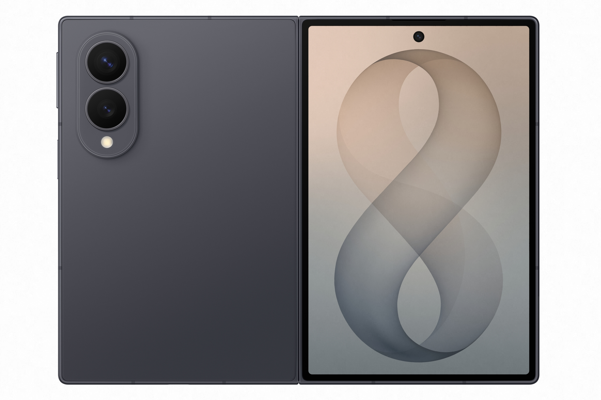

2026년 7월 **갤럭시 언팩 2026**에서 삼성전자가 새 폴더블 라인업 **'갤럭시 Z 폴드8'** 시리즈를 공개했습니다. 이번엔 라인업이 세 갈래로 넓어졌고, "주름이 안 보인다"는 반응이 나올 만큼 완성도가 올라갔는데요. 어떤 모델을 골라야 할지, 전작·애플과 무엇이 다른지 비교해 정리했습니다.

## 폴더블 3종으로 확대 — 폴드8 · 폴드8 울트라 · 플립8

가장 큰 변화는 **라인업 확대**입니다. 기존의 '폴드 + 플립' 구성에서 나아가, 이번엔 **폴드8 울트라 / 폴드8 / 플립8** 세 가지로 선택지가 늘었습니다. 상위 티어인 '울트라'가 새로 추가되면서, 성능·화면·카메라를 더 원하는 사용자층까지 겨냥한 것이 특징입니다.

<figure class="medium"><figcaption>출처: 삼성전자</figcaption></figure>

## 전작과 뭐가 달라졌나

폴드8에서 이용자들이 가장 먼저 체감한 개선점은 다음과 같습니다.

- **주름(크레이즈) 감소** — "주름이 잘 안 보인다"는 외신·체험 리뷰가 이어졌습니다. 폴더블의 오랜 약점이 크게 개선됐다는 평가입니다.
- **화면 비율·크기 변화** — 커버 화면이 '완벽 비율'로 언급되는 **4:3**에 가깝게 넓어져, 접은 상태에서도 일반 스마트폰처럼 쓰기 편해졌습니다. "여권만 해졌다"는 표현이 나올 만큼 대화면 지향입니다.
- **콘텐츠 감상 최적화** — 넓어진 화면비 덕분에 영상·문서·게임 등 콘텐츠 소비 경험이 강화됐습니다.

즉, '아재폰' 이미지를 벗고 **일상용 + 대화면**의 균형을 잡는 방향으로 진화했습니다.

## 어떤 모델을 골라야 할까 (라인업 비교)

| 구분 | 갤럭시 Z 플립8 | 갤럭시 Z 폴드8 | 갤럭시 Z 폴드8 울트라 |
|---|---|---|---|
| 폼팩터 | 위아래로 접는 콤팩트형 | 좌우로 펼치는 대화면 | 폴드8의 상위(프리미엄) |
| 추천 대상 | 휴대성·가성비 중시 | 대화면·멀티태스킹 | 최고 사양·카메라 원하는 사용자 |
| 특징 | 주머니에 쏙 | 4:3 넓은 화면 | 성능·스펙 강화(최상위) |

> ⚠️ 정확한 화면 크기·칩셋·RAM·배터리·카메라 화소·가격은 **삼성전자 공식 사양**을 반드시 확인하세요. (모델·용량·색상별로 다릅니다.)

## 삼성 vs 애플 — 폴더블 정면승부

이번 언팩이 특히 주목받은 이유는 **애플의 폴더블폰 진입**과 맞물렸기 때문입니다. 그동안 폴더블 시장을 사실상 주도해 온 삼성은, 이번 폴드8로 **완성도와 가격 경쟁력**을 앞세워 애플과의 정면승부를 예고했습니다. 애플 폴더블이 더 비싼 가격에도 경쟁력을 가질지, 삼성이 완성도로 방어할지가 하반기 스마트폰 시장의 관전 포인트입니다.

## 가격·구매 체크포인트

- **가격 전략**: 부품가 상승(이른바 '칩플레이션') 속에서도 **가격 인상을 최소화**하려 한 것으로 전해졌습니다. 다만 정확한 출고가는 공식 발표 기준으로 확인해야 합니다.
- **사전예약 혜택**: 폴드·울트라·플립 모두 사전예약 프로모션이 진행됩니다. 색상·용량·추가 혜택을 비교하세요.
- **약정 vs 알뜰폰**: 통신사 약정할인과 자급제+알뜰폰 요금제를 비교하면 **총비용**이 달라집니다. 오래 쓸수록 자급제+알뜰폰이 유리한 경우가 많습니다.

## 정리 — 나에게 맞는 폴드8은?

- **휴대성·가성비** → 플립8
- **대화면·멀티태스킹** → 폴드8
- **최고 사양·카메라** → 폴드8 울트라

폴드8 시리즈의 핵심은 ① 라인업 3종 확대 ② 주름 감소·4:3 대화면 ③ 애플과의 경쟁 구도입니다. 구매 전 **공식 사양·출고가·사전예약 혜택**을 꼭 비교해 보세요.

---

### 참고 자료 (2026.7.22~24 보도)
- 갤럭시 언팩 2026, 폴더블 3종 라인업 — 삼성 뉴스룸
- '주름 사라진' 갤폴드8 써보니 / 4:3 완벽비율 — 중앙일보·비즈워치·지디넷코리아
- 갤Z폴드8 vs 애플 폴더블 정면승부 / 가격 경쟁력 — 한국경제·아시아경제
- 전작과 스펙 비교 — 뉴스포스트
