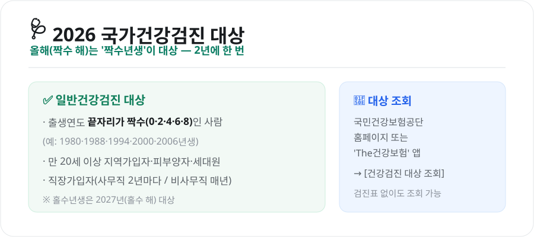
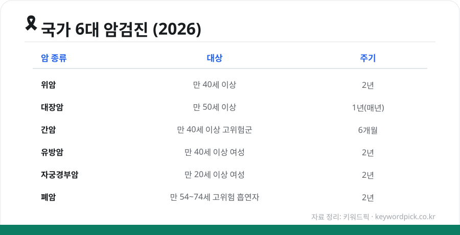

국가건강검진은 **무료 또는 소액**으로 내 몸 상태를 점검할 수 있는 좋은 제도인데, "올해 내가 대상인지" 몰라서 놓치는 경우가 많습니다. 2026년 기준으로 누가 대상인지, 어떻게 조회하는지, 어떤 검사를 받는지 정리했습니다.

<figure class="large"><figcaption>2026년 국가건강검진 대상 & 조회 방법 (자료 정리: 키워드픽)</figcaption></figure>

## 1. 올해 내가 대상일까? — 짝수년생 필독

일반건강검진은 **2년에 한 번**이 원칙이고, **출생연도 끝자리**로 대상 연도가 갈립니다.

- **2026년(짝수 해)**: 출생연도 **끝자리가 짝수(0·2·4·6·8)**인 사람이 대상
  - 예: 1980·1988·1994·2000·2006년생 등
- **홀수년생**은 2027년(홀수 해)이 대상

단, **직장가입자 중 비사무직**은 매년 대상이고, 사무직은 2년마다입니다. 만 20세 이상 지역가입자·피부양자·세대원도 포함됩니다.

## 2. 대상 조회 방법 (1분)

검진표(안내문)를 못 받았어도 **본인이 직접 조회**할 수 있습니다.

- **국민건강보험공단 홈페이지** 로그인 → [건강검진 대상 조회]
- 또는 모바일 앱 **'The건강보험'** → [건강검진] → 대상·검진기관 조회

여기서 **검진 대상 여부, 받을 수 있는 항목, 가까운 검진기관**까지 확인할 수 있습니다.

## 3. 6대 암검진 — 나이·주기

일반건강검진과 함께, 나이에 따라 **국가 암검진**도 받을 수 있습니다.

<figure class="large"><figcaption>국가 6대 암검진 대상·주기 (자료 정리: 키워드픽)</figcaption></figure>

| 암 종류 | 대상 | 주기 |
|---|---|---|
| **위암** | 만 40세 이상 | 2년 (위내시경) |
| **대장암** | 만 50세 이상 | 1년 (분변검사, 이상 시 대장내시경) |
| **간암** | 만 40세 이상 고위험군 | 6개월 (초음파+혈액) |
| **유방암** | 만 40세 이상 여성 | 2년 (유방촬영) |
| **자궁경부암** | 만 20세 이상 여성 | 2년 |
| **폐암** | 만 54~74세 고위험 흡연자 | 2년 (저선량 CT) |

간암 고위험군은 간경변증·B형/C형 간염 바이러스 보유자 등이 해당하며, 폐암은 30갑년 이상 흡연력 등 기준을 충족한 경우입니다.

## 4. 비용과 주의할 점

- **비용**: 국가건강검진은 대부분 **무료**입니다. 일부 암검진은 본인부담 10%(건강보험료 상위 50% 가구)가 있지만, **자궁경부암·대장암은 전액 무료**입니다. 의료급여 수급자는 국가·지자체가 부담합니다.
- **검진 기간**: 보통 연말로 갈수록 검진기관이 붐빕니다. **상반기~가을에 미리** 받는 것이 좋습니다.
- **미수검 주의**: 직장가입자(사업장)의 경우 일반건강검진을 받지 않으면 **사업주·근로자에게 과태료**가 부과될 수 있습니다.

## 마무리

건강검진은 "받을 수 있을 때 챙기는 것"이 이득입니다. 먼저 **The건강보험 앱으로 올해 대상인지 1분 만에 확인**하고, 나이에 맞는 암검진까지 함께 예약해보세요. 조기 발견이 최고의 치료라는 말은 검진에서 시작됩니다.

---

*본 글은 공개된 제도 자료를 바탕으로 정리한 참고용 정보입니다. 대상 기준·검진 항목·비용은 변경될 수 있으므로, 실제 검진 전 국민건강보험공단의 최신 안내를 확인하시기 바랍니다.*

**참고 자료**
- 국민건강보험공단(건강검진 대상 조회·검진기관 안내)
- 국가암검진 사업 안내(6대 암)
