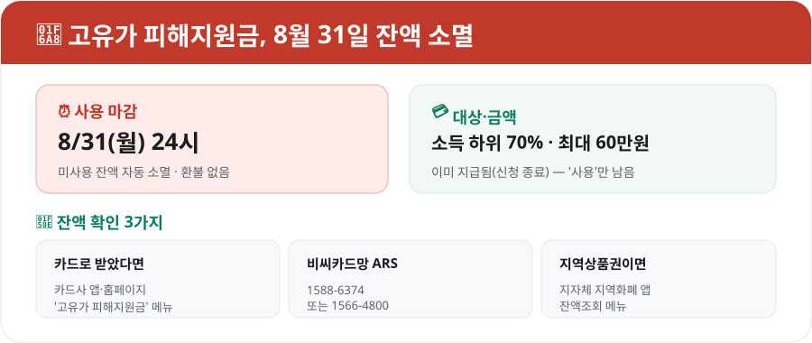

받아둔 **고유가 피해지원금**, 혹시 아직 다 못 쓰셨나요? **2026년 8월 31일(월) 밤 24시**가 지나면 남은 잔액은 **자동으로 사라집니다.** 환불도 이월도 안 되고 국고로 환수되니, 지금 바로 잔액부터 확인하는 게 좋습니다.

<figure class="large"><figcaption>고유가 피해지원금 핵심 요약 (자료 정리: 키워드픽)</figcaption></figure>

## 무엇이 사라지나요?

- **대상**: 소득 하위 70% (취약계층·일반 국민 대상으로 올봄에 신청·지급 완료)
- **금액**: 최대 60만원, 취약계층일수록·지방(인구감소지역)일수록 더 두텁게 차등 지급
- **형태**: 신용·체크카드 포인트 또는 지역사랑상품권으로 지급됨
- **신청은 이미 종료** — 지금 남은 건 '사용'뿐입니다

즉, 새로 신청하는 게 아니라 **이미 받은 돈을 기한 안에 쓰는 것**이 핵심입니다.

## ⏰ 마감은 8월 31일 24시

사용 기한은 **2026년 8월 31일(월) 자정까지**입니다. 이 시간이 지나면 카드·상품권에 남아 있던 잔액은 **자동 소멸되어 국고로 환수**됩니다. 돌려받을 수 없으니, 마지막 주말에 몰리기 전에 미리 쓰는 걸 추천합니다.

## 잔액, 이렇게 확인하세요

받은 형태에 따라 확인 방법이 다릅니다.

| 받은 형태 | 잔액 확인 방법 |
|---|---|
| **신용·체크카드** | 카드사 앱·홈페이지의 '고유가 피해지원금' 메뉴 |
| **비씨카드망 이용** | 전용 ARS **1588-6374** 또는 **1566-4800** |
| **지역사랑상품권** | 해당 지자체 **지역화폐 앱**의 잔액조회 메뉴 |

카드사 앱은 로그인만 하면 바로 잔액이 뜨고, ARS는 주민등록번호·카드 정보를 입력하면 음성으로 안내해 줍니다.

## 어디서 쓸 수 있나요?

- **사용처는 본인 주민등록 주소지 관할 지역**으로 제한됩니다.
- 가장 정확한 방법은 **카드사 앱의 위치 기반 가맹점 검색**, 지역상품권은 **지역화폐 앱·시청/군청 홈페이지의 사용처 안내**입니다.
- 대형마트·백화점·온라인 결제 등은 사용이 안 될 수 있으니, 쓰기 전에 가맹점 여부를 확인하세요.

## 놓치기 쉬운 점

- **소액 잔액도 챙기세요** — 몇 천 원, 몇 만 원이라도 안 쓰면 그대로 사라집니다.
- **결제 시 자동 차감** — 대부분 해당 카드로 결제하면 지원금이 먼저 차감됩니다(카드사별 차이 확인).
- **마지막 날 몰림 주의** — 8월 말에는 접속·사용이 몰릴 수 있으니 **미리** 소진하는 게 안전합니다.

## 마무리

핵심은 딱 하나입니다. **8월 31일 전에 잔액을 확인하고, 남았다면 다 쓰는 것.** 지금 카드사 앱을 열어 잔액부터 확인해 보세요. 생활비에서 그만큼 아낄 수 있는 돈이니 놓치면 아깝습니다.

*자료: 정부·카드사 안내(2026년 고유가 피해지원금). 사용처·차감 방식은 카드사·지자체별로 다를 수 있으니, 정확한 내용은 본인 카드사 앱·주소지 지자체 안내로 확인하세요.*
