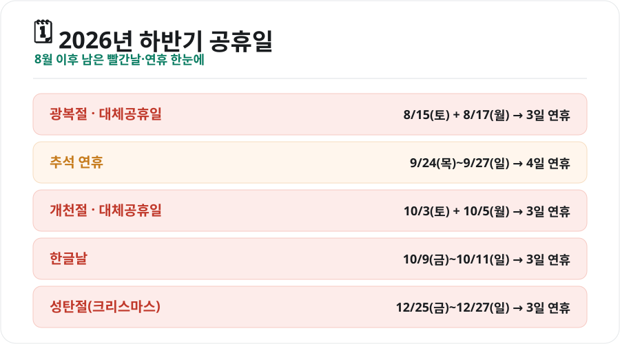
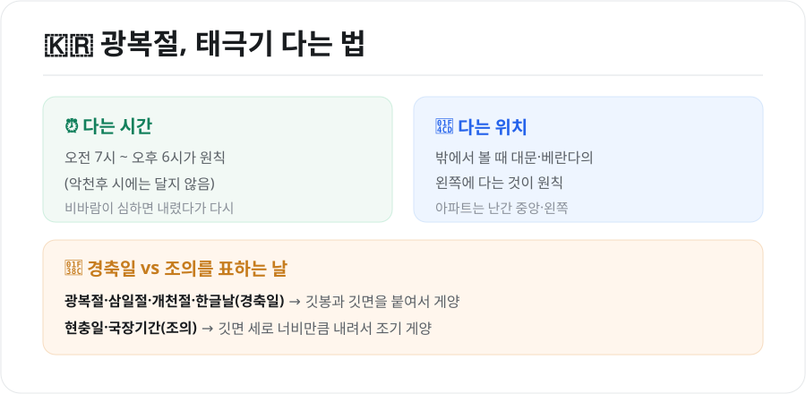

무더위가 한창인 8월, 가장 먼저 기다려지는 건 **광복절 연휴**입니다. 올해 광복절은 토요일이라 대체공휴일이 붙어 3일을 쉬게 되는데요. 광복절을 시작으로 연말까지 남은 공휴일과 연휴를 한 번에 정리하고, 광복절에 태극기를 어떻게 다는지도 함께 살펴보겠습니다.

<figure class="large"><figcaption>2026년 하반기 남은 공휴일·연휴 요약 (자료 정리: 키워드픽)</figcaption></figure>

## 1. 2026년 하반기 공휴일·연휴

| 공휴일 | 날짜 | 연휴 |
|---|---|---|
| **광복절 + 대체공휴일** | 8월 15일(토) + 8월 17일(월) | 15~17일 **3일** |
| **추석 연휴** | 9월 24일(목)~26일(토), 추석 9월 25일 | 24~27일 **4일** |
| **개천절 + 대체공휴일** | 10월 3일(토) + 10월 5일(월) | 3~5일 **3일** |
| **한글날** | 10월 9일(금) | 9~11일 **3일** |
| **성탄절** | 12월 25일(금) | 25~27일 **3일** |

### 대체공휴일이 붙는 날, 안 붙는 날
헷갈리기 쉬운 부분이 대체공휴일입니다. 공휴일이 **토요일이나 일요일, 다른 공휴일과 겹칠 때** 그다음 평일을 대체공휴일로 지정합니다.

- **광복절**은 8월 15일이 토요일 → 다음 평일인 **8월 17일(월)**이 대체공휴일
- **개천절**은 10월 3일이 토요일 → **10월 5일(월)**이 대체공휴일
- **추석**은 연휴가 목·금·토(9/24~26)로 **일요일과 겹치지 않아** 별도 대체공휴일이 없습니다. 9월 27일은 원래 일요일이라 27일까지 4일 연휴가 됩니다.
- **한글날**(10/9)은 금요일이라 대체공휴일 없이 금·토·일 3일 연휴입니다.

## 2. 연차로 만드는 '황금연휴' 팁

며칠 안 되는 연차를 잘 쓰면 긴 휴가를 만들 수 있습니다.

- **추석 연휴(9/24~27)**: 연휴가 목요일에 시작하니, 그 앞 **9월 21일(월)~23일(수)에 연차 3일**을 붙이면 최대 **9일 연휴**(9/19 토 ~ 9/27 일)까지 가능합니다.
- **개천절·한글날 사이(10월 초)**: 10월 5일(대체공휴일 월)과 10월 9일(한글날 금) 사이인 **10월 6일(화)~8일(목)에 연차 3일**을 쓰면 **10월 3일부터 11일까지 9일**을 이어 쉴 수 있습니다.

물론 회사 사정에 따라 다르니, 연차 계획은 미리 조율하는 것이 좋습니다.

## 3. 광복절, 태극기 다는 법

광복절은 나라의 경사를 기념하는 **경축일**입니다. 이런 날은 태극기를 바르게 다는 것만으로도 의미가 있습니다.

<figure class="large"><figcaption>광복절 태극기 게양 방법 (자료 정리: 키워드픽)</figcaption></figure>

- **다는 시간**: 오전 7시부터 오후 6시까지가 원칙입니다. 비바람이 심한 날(악천후)에는 달지 않습니다.
- **다는 위치**: 밖에서 봤을 때 **대문·현관·베란다의 왼쪽**에 답니다. 아파트는 난간 중앙이나 왼쪽에 답니다.
- **게양 방법**: 광복절·삼일절·개천절·한글날 같은 **경축일**에는 깃봉과 깃면을 **붙여서** 답니다. 반면 현충일처럼 조의를 표하는 날에는 깃면의 세로 너비만큼 아래로 내려 **조기(弔旗)**로 답니다.

## 마무리

2026년 하반기에는 광복절부터 성탄절까지 3일 이상 연휴가 여러 번 이어집니다. 대체공휴일과 연차를 잘 조합하면 알찬 휴식을 계획할 수 있습니다. 특히 광복절에는 태극기 한 장으로 그날의 의미를 되새겨보는 것도 좋겠습니다.

---

*본 글은 공개된 공휴일 정보를 바탕으로 정리한 참고용 자료입니다. 임시공휴일 지정 등으로 일정이 바뀔 수 있으니, 중요한 계획은 관공서·달력의 최신 정보를 확인하시기 바랍니다.*

**참고 자료**
- 관공서의 공휴일에 관한 규정(대체공휴일 기준)
- 행정안전부 국기 게양 안내
