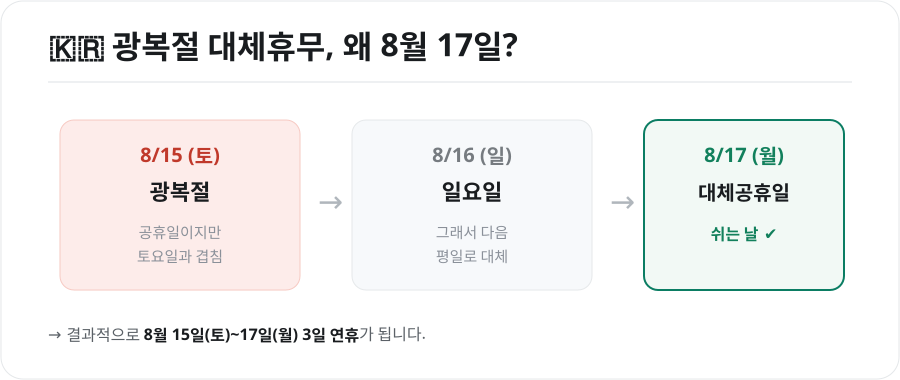
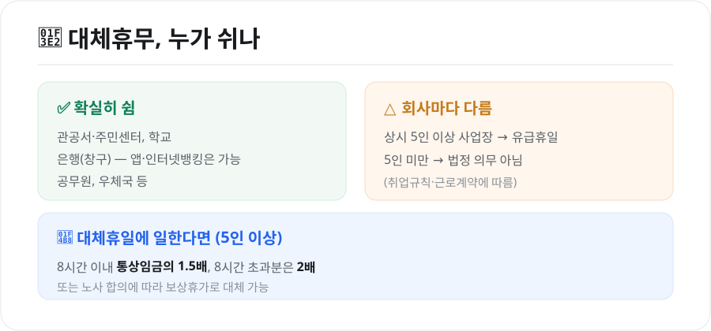

올해 광복절은 8월 15일 토요일입니다. "그럼 대체휴무가 생기나?" "8월 17일 월요일은 진짜 쉬는 날인가?" 헷갈리는 분이 많은데요. 결론부터 말하면 **8월 17일(월)이 대체공휴일**입니다. 왜 그런지, 그리고 누가 쉬고 못 쉬면 어떻게 되는지 정리했습니다.

<figure class="large"><figcaption>광복절 대체휴무가 8월 17일인 이유 (자료 정리: 키워드픽)</figcaption></figure>

## 1. 왜 8월 17일이 쉬는 날일까

대체공휴일은 **공휴일이 토요일·일요일 또는 다른 공휴일과 겹칠 때, 그다음 평일을 대신 쉬게 해주는** 제도입니다.

- 2026년 광복절은 **8월 15일(토)** → 토요일과 겹침
- 8월 16일은 일요일
- 그래서 그다음 평일인 **8월 17일(월)**이 대체공휴일

결과적으로 **8월 15일(토)부터 17일(월)까지 3일 연휴**가 됩니다. 광복절은 삼일절·개천절·한글날과 함께 대체공휴일이 적용되는 공휴일입니다.

## 2. 그래서, 누가 쉬나요?

<figure class="large"><figcaption>대체휴무, 누가 쉬고 일하면 수당은? (자료 정리: 키워드픽)</figcaption></figure>

### 확실히 쉬는 곳
- **관공서·주민센터, 학교, 공무원, 우체국**
- **은행 창구**는 휴무입니다. 단, **인터넷·모바일뱅킹, ATM**은 평소처럼 이용할 수 있습니다.

### 회사(민간)는 상황에 따라 다름
대체공휴일은 근로기준법에 따라 **상시 근로자 5인 이상 사업장**에는 **유급휴일**로 적용됩니다. 즉 5인 이상 회사라면 이날 쉬어도 임금이 나갑니다.

- **상시 5인 이상 사업장**: 유급휴일(쉬는 것이 원칙)
- **상시 5인 미만 사업장**: 법정 의무가 아니며, **취업규칙·근로계약**에 따라 결정

내가 다니는 회사가 애매하다면, 취업규칙이나 인사팀에 확인하는 것이 정확합니다.

## 3. 대체휴일에 일하면 — 휴일근로수당

5인 이상 사업장에서 대체공휴일에 근무했다면 **휴일근로수당**을 받아야 합니다.

| 근로 시간 | 가산 기준 |
|---|---|
| 8시간 이내 | 통상임금의 **1.5배**(휴일가산 50%) |
| 8시간 초과분 | 통상임금의 **2배**(휴일+연장 가산) |

- 수당 대신 **보상휴가**로 갈음할 수도 있습니다(노사 합의 시).
- 월급제 근로자도 유급휴일 근로에 대해서는 별도의 휴일근로 가산수당이 발생합니다.

## 4. 자주 묻는 질문

**Q. 8월 17일에 병원·마트도 쉬나요?**
관공서가 아닌 병원·대형마트·카페 등은 **자율**입니다. 문을 여는 곳이 많지만, 개별적으로 휴무일 수 있으니 방문 전 확인하세요.

**Q. 택배·우편은?**
우체국(관공서)은 휴무입니다. 민간 택배는 회사·대리점에 따라 배송이 지연될 수 있습니다.

**Q. 주식·증시도 쉬나요?**
공휴일이므로 국내 증시는 **휴장**합니다.

## 마무리

정리하면, 2026년 광복절은 토요일이라 **8월 17일(월)이 대체공휴일**이고, **관공서·학교·은행과 5인 이상 사업장**은 쉽니다. 5인 미만 사업장은 회사 규정에 따르며, 이날 일하면 **휴일근로수당(1.5배)**을 받을 수 있습니다. 모처럼의 3일 연휴, 미리 계획해두면 좋겠습니다.

---

*본 글은 공개된 제도·법령 정보를 바탕으로 정리한 참고용 자료입니다. 개별 사업장 적용 여부·수당은 근로계약과 상황에 따라 다를 수 있으므로, 구체적인 사안은 고용노동부·전문가 상담을 통해 확인하시기 바랍니다.*

**참고 자료**
- 관공서의 공휴일에 관한 규정(대체공휴일)
- 근로기준법(공휴일 유급휴일·휴일근로 가산수당)
