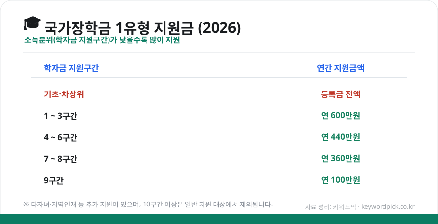
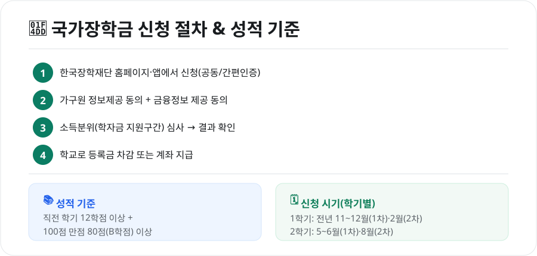

대학 등록금 부담을 크게 덜어주는 것이 **국가장학금**입니다. 소득이 낮을수록 더 많이 지원되고, 신청만 제때 하면 되는데 **기간을 놓쳐 못 받는** 경우가 의외로 많습니다. 2026년 기준으로 지원금액·신청 기간·성적 기준을 정리했습니다.

<figure class="large"><figcaption>2026 국가장학금 1유형 소득구간별 지원금 (자료 정리: 키워드픽)</figcaption></figure>

## 1. 얼마나 받나 — 소득구간별 지원금 (1유형)

국가장학금은 **학자금 지원구간(소득분위)**을 기준으로 지원액이 달라집니다. 구간이 낮을수록(=소득이 적을수록) 더 많이 받습니다.

| 학자금 지원구간 | 연간 지원금액 |
|---|---|
| **기초·차상위** | 등록금 전액(최대) |
| **1~3구간** | 연 600만원 |
| **4~6구간** | 연 440만원 |
| **7~8구간** | 연 360만원 |
| **9구간** | 연 100만원 |

- 위 금액은 **1유형(학생 직접지원형)** 기준이며, 실제 지원액은 등록금 범위 내에서 지급됩니다.
- **다자녀 가구·지역인재** 등에는 별도의 추가 지원이 있습니다.
- 10구간 이상(고소득)은 일반 국가장학금 지원 대상에서 제외됩니다.

### 참고: 2026년 학자금 지원구간 경곗값
소득인정액(월) 기준으로 대략 **1구간 약 195만원 이하(중위 30%)**, **5구간 약 649만원 이하(중위 100%)**, **9구간 약 1,948만원 이하(중위 300%)** 수준입니다. 정확한 구간은 신청 후 심사로 결정됩니다.

## 2. 신청 절차와 성적 기준

<figure class="large"><figcaption>국가장학금 신청 절차 · 성적 기준 (자료 정리: 키워드픽)</figcaption></figure>

### 신청 절차
1. **한국장학재단** 홈페이지 또는 앱에서 신청(공동인증서·간편인증)
2. **가구원 정보제공 동의** + **금융정보 제공 동의** (소득분위 산정에 필수)
3. 학자금 지원구간 **심사 → 결과 확인**
4. 학교로 **등록금 차감** 또는 계좌로 지급

> ✅ 2번의 **가구원·금융정보 동의**를 안 하면 소득 심사가 진행되지 않아 장학금을 못 받습니다. 신청 후 반드시 완료하세요.

### 성적 기준
- **직전 학기 12학점 이상 이수** + **100점 만점에 80점(B학점) 이상**
- **신입생·편입생·재입학생의 첫 학기**는 성적 기준을 적용하지 않습니다.
- 기초·차상위 및 일부 구간은 **C학점 경고제**(일정 횟수 구제) 등이 적용됩니다.

## 3. 신청 시기 — 놓치면 다음 학기

국가장학금은 **학기마다 1차·2차 신청 기간**이 있습니다.

- **1학기**: 전년도 11~12월(1차), 2월(2차)
- **2학기**: 5~6월(1차), 8월(2차)

**1차 신청**을 하는 것이 유리합니다. 2차는 재학생 지원 제한 등이 있을 수 있으니, 가급적 1차 기간에 신청하세요. 정확한 일정은 **한국장학재단 공지**로 확인해야 합니다.

## 4. 자주 하는 실수

- **가구원 동의 누락**: 부모 등 가구원이 정보제공에 동의하지 않으면 심사 지연·미선정
- **기간 초과**: 마감일이 지나면 그 학기는 신청 불가
- **성적 미달**: 직전 학기 학점·평점 기준 미달 시 제외(신입생 제외)
- **계좌·학적 정보 오류**: 지급 지연의 원인

## 마무리

국가장학금은 **소득분위 심사만 통과하면 등록금 부담을 크게 줄일 수 있는** 제도입니다. 핵심은 세 가지 — **신청 기간 지키기, 가구원·금융정보 동의 완료, 성적 기준 유지.** 특히 신입생은 첫 학기 성적 기준이 없으니 꼭 신청하세요.

---

*본 글은 공개된 제도 자료를 바탕으로 정리한 참고용 정보입니다. 지원 금액·구간 경곗값·신청 일정은 매년 바뀌므로, 실제 신청 전 한국장학재단(kosaf)의 최신 공지를 반드시 확인하시기 바랍니다.*

**참고 자료**
- 한국장학재단(국가장학금 신청·소득구간 안내)
- 교육부 국가장학금 지원 계획
