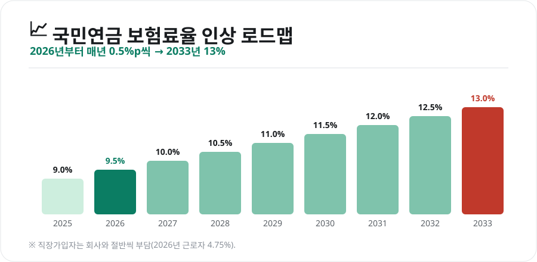
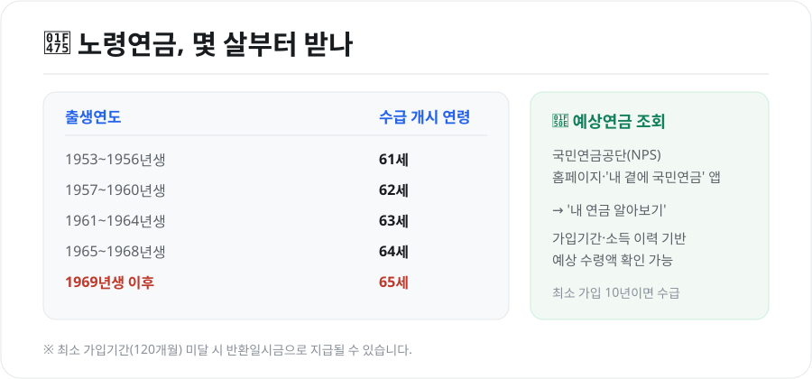

2026년은 국민연금에 큰 변화가 시작되는 해입니다. 오랜 논의 끝에 **보험료율 인상**이 시작되기 때문인데요. 내 월급에서 얼마가 더 빠지는지, 나중에 몇 살부터 얼마를 받는지, 핵심만 정리했습니다.

<figure class="large"><figcaption>국민연금 보험료율 인상 로드맵 (자료 정리: 키워드픽)</figcaption></figure>

## 1. 보험료율, 9% → 9.5%로 인상 시작

국민연금 보험료율은 1998년 이후 오랫동안 **9%**로 고정돼 있었습니다. 2026년부터 이 요율이 **매년 0.5%p씩 단계적으로 올라 2033년에 13%**에 도달합니다.

| 연도 | 보험료율 | 직장가입자 근로자 부담 |
|---|---|---|
| ~2025년 | 9.0% | 4.5% |
| **2026년** | **9.5%** | **4.75%** |
| 2027년 | 10.0% | 5.0% |
| … | … | … |
| 2033년 | 13.0% | 6.5% |

- **직장가입자**는 회사와 **절반씩** 부담합니다. 즉 2026년 근로자 본인 부담은 **4.75%**입니다.
- **지역가입자**(자영업자 등)는 본인이 전액 부담합니다.

### 보험료 계산 예시
보험료는 **기준소득월액 × 보험료율**로 계산합니다. 2026년 기준소득월액은 **최저 41만원 ~ 최고 659만원** 범위입니다.

- 월 소득 300만원 → 300만원 × 9.5% = **월 28만 5천원** (직장인은 이 중 절반인 약 14만 2천원을 본인이 부담)

## 2. 몇 살부터 받나 — 수급 개시 연령

노령연금은 **최소 10년(120개월) 이상 가입**해야 받을 수 있고, 받기 시작하는 나이는 **출생연도**에 따라 다릅니다.

<figure class="large"><figcaption>출생연도별 수급 개시 나이 · 예상연금 조회 (자료 정리: 키워드픽)</figcaption></figure>

| 출생연도 | 수급 개시 연령 |
|---|---|
| 1953~1956년생 | 61세 |
| 1957~1960년생 | 62세 |
| 1961~1964년생 | 63세 |
| 1965~1968년생 | 64세 |
| **1969년생 이후** | **65세** |

- **조기노령연금**: 사정에 따라 최대 5년 일찍 받을 수 있지만, 한 살 앞당길 때마다 연금액이 줄어듭니다.
- **연기연금**: 반대로 수급을 늦추면 연금액이 늘어납니다.

## 3. 내 예상연금 확인하는 법

지금까지 낸 보험료로 나중에 얼마를 받을지 궁금하다면, **국민연금공단(NPS)**에서 직접 조회할 수 있습니다.

- **국민연금공단 홈페이지** 또는 **'내 곁에 국민연금' 앱** → **'내 연금 알아보기'**
- 공동인증서·간편인증으로 로그인하면 **가입 기간·납부 이력·예상 수령액**을 확인할 수 있습니다.

## 4. 알아두면 좋은 제도

- **임의가입**: 소득이 없는 전업주부·학생도 본인이 원하면 가입해 가입기간을 늘릴 수 있습니다.
- **임의계속가입**: 60세가 넘어도 가입기간이 부족하거나 더 채우고 싶으면 65세까지 계속 납부 가능합니다.
- **추후납부(추납)**: 과거 납부하지 못한 기간의 보험료를 나중에 납부해 가입기간을 늘릴 수 있습니다.
- **크레딧 제도**: 출산·군 복무 등에 대해 가입기간을 추가로 인정해 줍니다.

가입기간이 조금 모자라 수급 요건(10년)을 못 채운 경우, 임의계속가입이나 추납으로 채우면 연금으로 받을 수 있어 유리한 경우가 많습니다.

## 마무리

2026년부터 보험료 부담이 조금씩 늘지만, 국민연금은 물가에 연동해 평생 지급되는 **노후의 기본 안전망**입니다. 지금 할 일은 두 가지입니다 — **내 수급 개시 나이를 확인하고, 예상연금을 한 번 조회해보는 것.** 부족하다면 임의가입·추납 같은 제도로 미리 보완할 수 있습니다.

---

*본 글은 공개된 제도 자료를 바탕으로 정리한 참고용 정보입니다. 보험료율·기준소득월액·수급 요건은 변경될 수 있으므로, 실제 판단 전 국민연금공단(NPS)의 최신 안내를 확인하시기 바랍니다.*

**참고 자료**
- 국민연금공단(NPS) 연금정보·예상연금 조회
- 국민연금법 개정(보험료율 단계적 인상) 안내
