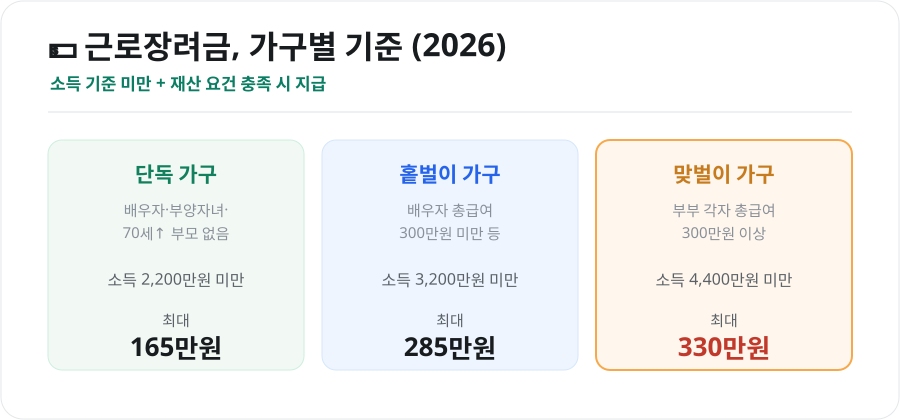
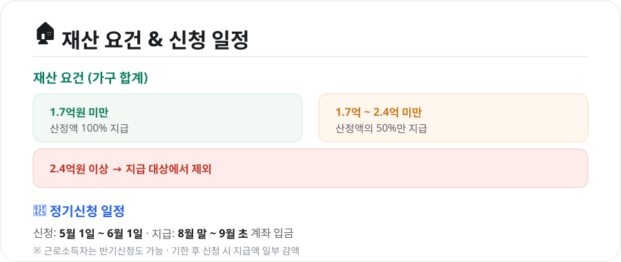

일은 하는데 소득이 넉넉지 않은 가구를 돕기 위해 나라가 현금을 지원하는 제도가 **근로장려금(EITC)**입니다. 조건만 맞으면 매년 수백만 원을 받을 수 있는데, **신청하지 않으면 못 받습니다.** 2026년 기준으로 대상·금액·신청법을 정리했습니다.

<figure class="large"><figcaption>가구 유형별 소득기준 & 최대 지급액 (자료 정리: 키워드픽)</figcaption></figure>

## 1. 누가, 얼마나 받나

가구 유형에 따라 소득 기준과 최대 지급액이 다릅니다.

| 가구 유형 | 연 소득 기준 | 최대 지급액 |
|---|---|---|
| **단독 가구** | 2,200만원 미만 | 165만원 |
| **홑벌이 가구** | 3,200만원 미만 | 285만원 |
| **맞벌이 가구** | 4,400만원 미만 | 330만원 |

### 가구 유형이 헷갈린다면
- **단독 가구**: 배우자, 부양자녀, 70세 이상 부모가 **모두 없는** 가구
- **홑벌이 가구**: 배우자·부양자녀·70세 이상 부모 중 하나가 있고, 배우자 총급여가 300만원 미만인 가구
- **맞벌이 가구**: 부부 각자의 총급여가 각각 300만원 이상인 가구

지급액은 소득 구간에 따라 점점 늘었다가 다시 줄어드는 구조라, 소득이 아주 적으면 오히려 적게 나올 수 있고 특정 구간에서 최대가 됩니다.

## 2. 재산 요건 — 2.4억이 기준선

소득 기준을 넘지 않아도 **재산이 많으면** 대상에서 빠지거나 감액됩니다.

<figure class="large"><figcaption>재산 요건 & 신청 일정 (자료 정리: 키워드픽)</figcaption></figure>

- **1.7억원 미만**: 산정액 100% 지급
- **1.7억원 이상 ~ 2.4억원 미만**: 산정액의 **50%만** 지급
- **2.4억원 이상**: 지급 대상에서 **제외**

재산에는 주택·토지·전세보증금·자동차·예금 등이 포함됩니다.

## 3. 신청 방법과 일정

- **정기신청**: 매년 **5월 1일 ~ 6월 1일**
- **지급**: 정기신청분은 **8월 말 ~ 9월 초** 본인 계좌로 입금
- **신청 방법**: 국세청 **홈택스(모바일 손택스)**, ARS 전화, 안내문(모바일 안내) 간편신청

국세청이 대상자에게 **안내문(카카오톡·우편)**을 보내는 경우가 많고, 안내받은 경우 **간편신청**으로 몇 번의 클릭만에 신청할 수 있습니다.

### 반기신청(근로소득자)
근로소득만 있는 경우 **반기신청**도 가능합니다. 상반기분·하반기분을 나눠 미리 받을 수 있어 자금 사정에 도움이 됩니다.

> **기한 후 신청**도 가능하지만, 이 경우 지급액이 일부(약 5~10%) **감액**됩니다. 되도록 정기신청 기간에 신청하세요.

## 4. 자녀장려금도 함께 확인

부양자녀가 있는 저소득 가구는 **자녀장려금**을 함께 신청할 수 있습니다. 근로장려금과 신청 시기·창구가 같으니, 신청할 때 **자녀장려금 대상인지 함께 확인**하면 좋습니다.

## 마무리

근로장려금은 **"신청해야 받는" 돈**입니다. 내가 단독·홑벌이·맞벌이 중 어디에 해당하는지, 소득·재산 기준을 넘지 않는지 확인하고, **5월 정기신청 기간**을 놓치지 마세요. 안내문을 받았다면 홈택스·손택스로 1분이면 신청할 수 있습니다.

---

*본 글은 공개된 제도 자료를 바탕으로 정리한 참고용 정보입니다. 소득·재산 기준과 지급액·일정은 매년 바뀔 수 있으므로, 실제 신청 전 국세청 홈택스·안내문의 최신 기준을 확인하시기 바랍니다.*

**참고 자료**
- 국세청 홈택스(근로·자녀장려금 안내)
- 조세특례제한법(근로장려세제)
