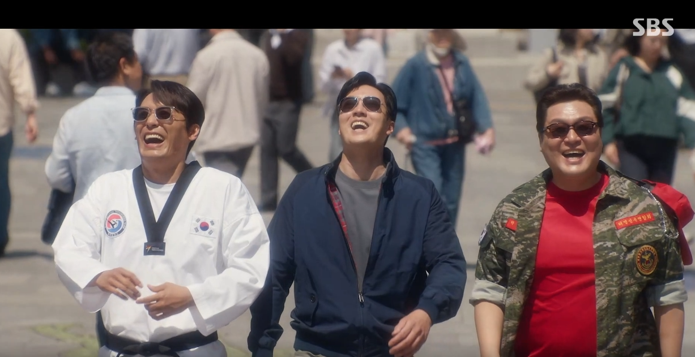

소지섭 주연 SBS 드라마 **'김부장'** 이 2026년 7월 25일 **해피엔딩으로 종영**했습니다. '아빠 유니버스', '부성애 신드롬'을 일으키며 큰 사랑을 받은 이 작품의 결말을 스포일러 포함해 정리했습니다. (※ 결말 내용이 있으니 아직 안 보신 분은 주의하세요.)

## 종영 — 최고 시청률 23.2%

'김부장'은 종영까지 꾸준히 상승세를 탔습니다. **6회 연속 시청률 20%를 돌파**했고, 막방에서는 **최고 23.2%**를 기록하며 유종의 미를 거뒀습니다. 첩보·액션에 부성애를 결합한 소지섭표 드라마가 안방극장을 사로잡았다는 평가입니다.

<figure class="medium"><figcaption>출처:  SBS 드라마 김부장</figcaption></figure>

## 결말 정리 — '완벽한 해피엔딩'

결말의 핵심은 **소지섭(김부장)의 통쾌한 승리와 해피엔딩**입니다.

- **주상욱 몰락**: 김부장은 끝까지 자신의 정체(이름)를 숨긴 채, 대립하던 주상욱을 몰락시켰습니다.
- **약속 이행**: 극 중 '박강성'과의 약속까지 지켜내며 '완벽한 엔딩'을 완성했습니다.
- **유골함 반전**: 방영 내내 '유골함' 장면으로 사망 엔딩(비극) 우려가 제기됐지만, 실제로는 이를 뒤집는 **해피엔딩**으로 마무리됐습니다.
- **아빠들의 새 출발**: 소지섭과 함께한 최대훈·윤경호까지, '아빠 삼인방'이 모두 해피엔딩을 맞았고 **새 직장 면접**을 보는 장면으로 훈훈하게 끝났습니다.

## '시즌2' 암시

특히 결말에서 주인공이 **새 직장을 찾아 나서는 전개**가 그려지며, 자연스럽게 **시즌2 가능성을 암시**했다는 해석이 나옵니다. 신드롬급 인기를 감안하면 후속 시즌에 대한 기대도 커지고 있습니다.

## 배우들의 종영 소감

작품을 마무리한 배우들도 진솔한 소감을 남겼습니다.

- **소지섭**: "넘치도록 과분한 사랑을 잊지 않겠다", "영광"이라며 감사를 전했고, '이 시대 아저씨들'을 응원하는 메시지도 남겼습니다.
- **최대훈·윤경호**: "어안이 벙벙하다", "감사하다"며 벅찬 마음을 드러냈습니다.
- **주상욱**: 극 중 대립을 뒤로하고 "미안하다, 사랑한다"는 말로 유종의 미를 표현했습니다.

소지섭은 이번 흥행으로 **SBS 연기대상 유력 후보**로도 거론되고 있습니다.

## '아빠 유니버스'가 남긴 것

'김부장'은 단순한 액션 드라마를 넘어, **가장(家長)·아버지의 헌신**이라는 정서를 자극하며 폭넓은 공감을 얻었습니다. 화려한 액션과 부성애의 결합, 그리고 배우들의 열연이 '신드롬'으로 이어졌다는 점에서 올여름을 대표한 드라마로 남게 됐습니다.

## 정리

'김부장'은 ① **최고 23.2% 시청률**로 ② 주상욱을 몰락시킨 **완벽한 해피엔딩**, ③ 유골함 반전, ④ **시즌2 암시**, ⑤ 배우들의 훈훈한 소감으로 마무리됐습니다. 올여름 안방극장을 뜨겁게 달군 '아빠 유니버스'의 유종의 미였습니다.

> 함께 보면 좋은 글:
> - ['김부장' 21% 돌풍에 14년 전 소지섭 영화 '회사원'까지 역주행](/blog/김부장-소지섭-영화-역주행.html)
> - ['김부장' 마지막회 앞두고 — 소지섭 '융단폭격' 액션과 결말 관전 포인트](/blog/김부장-마지막회-액션-결말.html)
> - [[인물탐구] '김부장' 소지섭 딸 役 신예 서수민](/blog/인물탐구-서수민-김부장-소지섭-딸.html)

---

### 참고 자료 (2026.7.25 보도)
- '김부장' 소지섭, 주상욱 몰락시키고 완벽한 엔딩 — 스포츠경향
- '김부장' 해피엔딩 종영…새 직장 찾고 '시즌2' 암시 — 네이트
- 종영 D-DAY, 최고 23.2% 시청률 — 위키트리
- 소지섭·최대훈·윤경호 종영 소감 — OSEN·머니투데이
