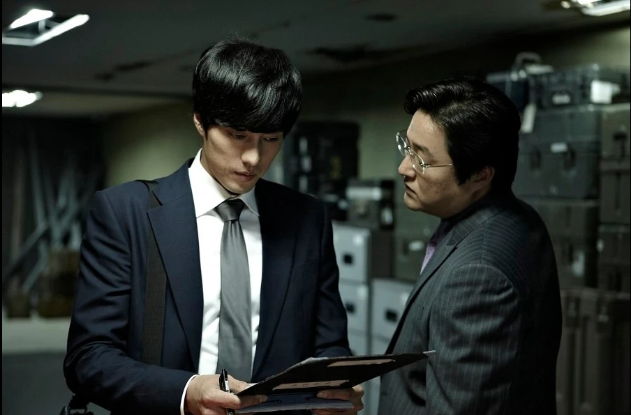

소지섭이 주연한 SBS 드라마 **'김부장'** 이 시청률 21%를 넘기며 돌풍을 일으키고 있습니다. 그 열기는 드라마 한 편에서 그치지 않았습니다. 14년 전 소지섭이 출연했던 영화 **'회사원'(2012)** 이 넷플릭스 순위에 다시 올라오면서, 이른바 '역주행' 현상이 화제가 되고 있습니다.

## '김부장', 소지섭의 화려한 복귀

'김부장'은 소지섭이 오랜만에 브라운관으로 돌아온 작품입니다. 방송 초반부터 화제를 모으며 전국 시청률 **20%를 넘겼고, 21%대까지** 올라섰습니다. SBS 방영과 함께 넷플릭스에도 공개돼 국내를 넘어 글로벌 시청자에게도 노출되면서, 소지섭이라는 배우에 대한 관심이 다시 한 번 크게 살아났습니다.

이렇게 한 배우가 재조명될 때 자연스럽게 따라오는 것이 바로 '전작 다시 보기'입니다. 이번에는 그 대상이 무려 14년 전 영화였습니다.

<figure><figcaption>드라마 '김부장' (출처: SBS)</figcaption></figure>

## 14년 전 영화 '회사원'의 뜻밖의 귀환

역주행의 주인공은 2012년 개봉한 영화 **'회사원'** 입니다. '회사원'은 평범한 기업으로 위장한 청부살인 조직을 배경으로, 냉정한 킬러이면서 겉으로는 **'영업2부 과장'** 으로 살아가는 지형도(소지섭)의 이야기를 그린 액션 누아르입니다.

개봉한 지 14년이나 지났지만, '김부장' 흥행에 힘입어 넷플릭스 **'대한민국의 TOP 10 영화' 9위**에 오르며 다시 순위권에 진입했습니다. 공교롭게도 '회사원'에서 회사원으로 위장한 킬러를 연기했던 소지섭이, 이번엔 진짜 '부장님'으로 돌아왔다는 점이 팬들 사이에서 재미있는 연결고리로 회자되고 있습니다.

<figure><figcaption>영화 '회사원' (2012)</figcaption></figure>

## 'OTT 역주행'이라는 흥행 공식

이런 현상은 소지섭 한 사람에게 국한되지 않습니다. '김부장'이 인기를 끌면서 과거의 한국 드라마·영화들도 넷플릭스 TOP 10에 다시 이름을 올리는 흐름이 나타나고 있습니다.

화제작 한 편이 뜨면, 그 배우나 장르에 대한 관심이 OTT 라이브러리 전체로 번지는 '역주행'은 이제 하나의 흥행 공식처럼 자리 잡았습니다. 이미 만들어져 플랫폼에 쌓여 있던 콘텐츠가 새로운 계기를 만나 다시 소비되는, 스트리밍 시대의 특징적인 장면이라 할 수 있습니다.

---

### 참고 자료
- [위키트리 — '김부장' 터지자 14년 만에 넷플릭스 9위 찍은 소지섭 영화](https://www.wikitree.co.kr/articles/1145483)
- [나우무비 — '김부장' 때문에 역주행 중인 소지섭 청불 액션](https://view.nate.com/enter/view/394226/)
- [다음 — '13년'만에 '부장님'으로 돌아온 소지섭](https://v.daum.net/v/20260613143050030)
- [넷플릭스 — 김부장](https://www.netflix.com/title/82682338)
