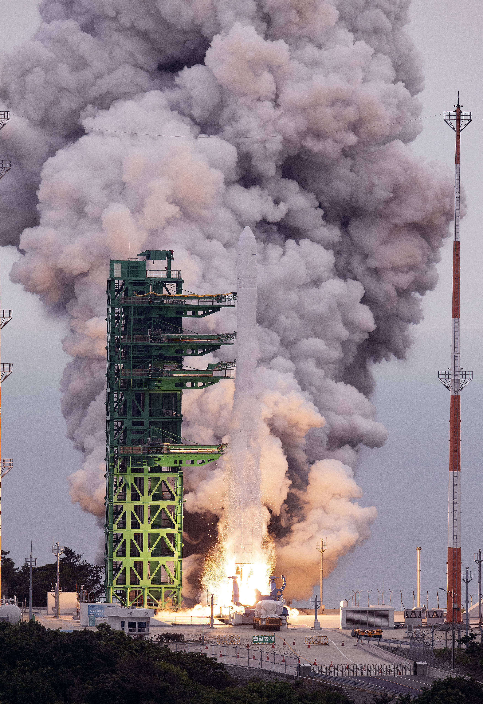

대한민국 우주개발의 상징 **누리호**. 그 성공 뒤에 숨겨졌던 '실패의 기록'이 처음으로 대중 앞에 공개됐습니다. 한국항공우주연구원(항우연)이 개발 과정에서 **시험 중 폭발했던 75t급 엔진 실물**을 전시한 것인데요. 완성품이 아닌 '파손된 엔진'을 굳이 공개한 이유를 짚어봅니다.

## 공개된 것은 '폭발한 엔진'

이번에 공개된 엔진은 누리호 개발 초기, **지상 연소 시험 도중 폭발 사고**를 겪은 75t급 엔진의 실물입니다. 파손된 형태가 그대로 남아 있어, 완벽한 발사체를 만들기까지 얼마나 많은 시행착오가 있었는지를 생생하게 보여줍니다. 매끈한 성공의 이미지가 아니라, 그 이면의 험난한 과정을 드러낸 셈입니다.

<figure class="small"><figcaption>누리호 발사사진</figcaption></figure>

## 왜 '실패'를 전시할까

핵심 메시지는 이것입니다 — **"실패를 숨기지 않고 기록·공유하는 것이 우주 강국으로 가는 길."**

로켓 엔진 개발은 대표적인 '고위험 기술'입니다. 수많은 폭발과 파손을 분석하고 개선하는 과정 없이는 신뢰성 있는 발사체를 만들 수 없습니다. 즉 이 파손된 엔진은 실패의 증거가 아니라, **성공을 위한 밑거름이자 데이터**입니다. 실패의 흔적을 당당히 전시한다는 것은, 그만큼 기술적 자신감이 쌓였다는 방증이기도 합니다.

## 누리호가 남긴 것

누리호의 성공은 단 한 번의 발사로 이뤄진 것이 아닙니다.

- 수년간 축적한 **연소 시험 데이터**
- 폭발·파손 사례의 **원인 분석과 개선**
- 발사체 핵심 기술의 **국산화**

이런 과정이 쌓여 만들어진 결과입니다. 이번 전시는 그 여정을 대중과 공유하며, 우주개발이 '천재의 한 방'이 아니라 **집요한 시행착오의 축적**임을 일깨워 줍니다.

## 정리

폭발한 누리호 엔진의 공개는 단순한 전시가 아니라, **실패를 자산으로 삼아온 한국 우주개발의 철학**을 보여주는 상징적 장면입니다. 실패의 데이터를 기록하고 공유하는 문화가, 앞으로의 우주 도전에서도 든든한 밑거름이 될 것입니다.

### 참고 자료
- 시험 중 폭발한 누리호 엔진 파손 실물 최초 공개 — 다음/채널A 등
- 항우연, 폭발한 누리호 엔진 첫 공개…"실패도 우주개발 역사" — 충남일보
