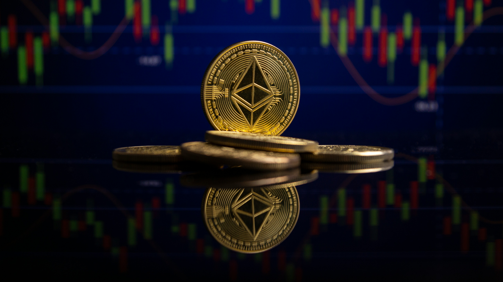

**디지털 자산(가상자산)** 시장이 다시 주목받고 있습니다. 각국의 규제 정비와 대기업의 인프라 투자가 맞물리면서, 시장의 판이 새로 짜이는 국면인데요. 복잡해 보이는 흐름을 초보자도 이해할 수 있게 '규제'와 '인프라' 두 축으로 정리했습니다.

## 먼저, 용어 정리

'디지털 자산'은 비트코인·이더리움 같은 **가상자산(암호화폐)** 을 폭넓게 부르는 말입니다. 최근 논의의 핵심은 이 자산을 법적으로 **'증권'으로 볼 것인가, '상품'으로 볼 것인가** 하는 문제입니다. 이 분류에 따라 규제 주체와 세금·투자자 보호 방식이 완전히 달라지기 때문에, 시장의 가장 큰 관심사입니다.

<figure class="small"></figure>

## 축① 글로벌 규제 — '코인의 룰'이 짜인다

미국 당국은 가상자산을 증권/상품 중 어디로 분류할지에 대한 **새로운 규칙 마련**에 나서며 시장 질서 정립을 시도하고 있습니다. 규칙이 명확해지면 제도권 자금 유입의 발판이 될 수 있다는 기대가 있는 반면, 규제 강도에 따라 시장이 위축될 수 있다는 우려도 공존합니다.

이런 움직임은 미국만의 일이 아닙니다. 파키스탄이 이슬람 율법에 근거한 디지털 자산 지위를 논의하는 등, 각국이 자국 상황에 맞는 규제 방안을 모색 중입니다. 국내에서도 '미국의 디지털자산 패권 전략과 한국의 대응'을 주제로 한 세미나가 열리는 등 정책 논의가 활발합니다.

## 축② 인프라 투자 — 대기업이 들어온다

기술 토대도 빠르게 다져지고 있습니다. **삼성SDS가 두나무(업비트 운영사)에 투자**하며 금융과 디지털 자산을 잇는 인프라 구축에 나섰다는 소식이 대표적입니다. 대기업의 참여는 시장의 **신뢰성과 확장성**을 높이는 신호로 읽힙니다.

다만 시장 지표는 신중합니다. 7월 둘째 주 업비트 지수가 소폭(약 1.28%) 하락하는 등, 전반적으로 조정 국면을 보였습니다. 인프라 개선이 실제 시장 안정으로 이어질지는 시간을 두고 확인할 문제입니다.

## 정리 & 투자 유의

최근 디지털 자산 시장의 두 축은 ① **규제 명확화**와 ② **인프라 투자 확대**입니다. 두 흐름 모두 장기적으로는 시장 성숙의 신호일 수 있지만, 단기 가격은 여전히 변동성이 큽니다.

이 글은 투자 권유가 아니며, 가상자산 투자는 원금 손실 위험이 있습니다.

### 참고 자료
- 가상자산은 증권? 상품?…美 새 '코인의 룰' — 조선일보
- 두나무 투자한 삼성SDS, 금융·디지털자산 인프라 — 전자신문
- 7월 둘째 주 디지털자산 시장 소폭 조정 — 한국정경신문
