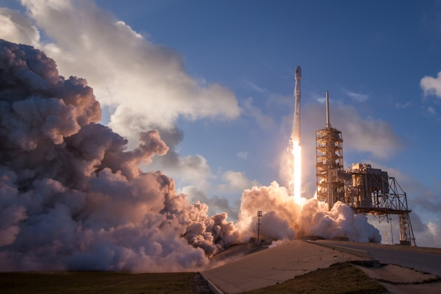

이번 주(2026년 7월) 일론 머스크를 둘러싼 소식이 한꺼번에 쏟아졌습니다. 테슬라와 스페이스X **두 회사 주가가 동반 급락**했고, 이를 노린 **공매도 세력이 큰 이익**을 봤으며, 머스크가 **두 회사의 합병 가능성**을 시사했습니다. 여기에 **스타십 13차 시험발사**까지 예정돼 있습니다. 복잡하게 얽힌 이슈를 사실 위주로 정리했습니다.

## 테슬라·스페이스X 동반 급락

시작은 테슬라의 실적이었습니다. 테슬라가 시장 기대에 못 미치는 **'어닝 쇼크'(순이익 실망)** 를 발표하면서 시간외 거래에서 하락했고, 그 여파가 스페이스X로도 번졌습니다. 여러 매체는 스페이스X 주가가 **6%대 급락**했고, 최근 낙폭이 누적되며 고점 대비 크게 하락했다고 전했습니다. 머스크를 상징하는 '두 날개'가 동시에 흔들린 셈입니다.

<figure class="medium"><figcaption>스페이스X</figcaption></figure>

## 공매도 세력의 '대박'

주가 하락의 반대편에는 **공매도(주가 하락에 베팅) 세력**이 있었습니다. 스페이스X 주가가 크게 빠지면서, 공매도 투자자들이 **수십조 원(약 200억 달러)대의 평가이익**을 얻은 것으로 보도됐습니다. (평가이익 규모는 매체·기준에 따라 다르게 제시되므로 정확한 수치는 확인이 필요합니다.)

머스크는 공매도 세력을 향해 강하게 경고해 왔지만, 최근의 주가 흐름은 오히려 이들에게 유리하게 전개된 국면입니다.

## 머스크, '합병 가능성' 첫 시사

주가 급락 속에 머스크는 주목할 만한 발언을 내놨습니다. **테슬라와 스페이스X의 사업 접점이 점점 커지고 있다**며, 두 회사의 **합병 가능성을 처음으로 시사**한 것입니다. 일부 월가 전문가들도 두 회사의 합병 가능성이 커지고 있다는 분석을 내놓았습니다.

두 회사는 전기차(테슬라)와 우주 발사체·위성(스페이스X)으로 사업 영역이 다르지만, 배터리·AI·제조 등에서 기술이 겹치는 부분이 늘고 있다는 점이 배경으로 거론됩니다. 다만 이는 아직 **'가능성 시사'** 단계로, 구체적인 계획이 확정된 것은 아닙니다.

## 스타십 13차 시험발사

우주 사업에서는 **스타십(Starship) 13차 시험발사**가 예정돼 있습니다. 당초 일정에서 **날씨 문제로 하루 연기**돼 금요일 발사가 추진되고 있습니다. 스타십은 스페이스X의 차세대 대형 발사체로, 이번 발사의 성패는 회사의 신사업 전망과 주가 흐름에도 영향을 줄 수 있어 관심이 집중됩니다.

## 그 밖의 소식 — xAI '그록 4.6' 예고

머스크가 이끄는 AI 기업 xAI는 차기 모델 **'그록(Grok) 4.6'** 을 예고했습니다. 머스크는 이 모델이 대규모 매개변수를 바탕으로 경쟁 모델을 능가할 것이라고 주장했습니다. 테슬라·스페이스X에 더해 AI까지, 머스크의 사업 전선이 여전히 넓게 펼쳐져 있음을 보여줍니다.

## 정리

이번 주 머스크 관련 핵심은 ① 테슬라 어닝 쇼크발 **테슬라·스페이스X 동반 급락**, ② 공매도 세력의 대규모 평가이익, ③ **테슬라–스페이스X 합병 가능성 시사**, ④ **스타십 13차 발사**(날씨로 연기)입니다. 주가·발사 결과·합병 논의가 앞으로 어떻게 전개될지가 관전 포인트입니다.

### 참고 자료 (2026.7.22~24 보도)
- 테슬라 어닝 쇼크에 스페이스X도 휘청 — 조선일보·뉴시스
- 스페이스X 공매도 평가익(약 200억 달러) — 연합뉴스·한국경제·글로벌이코노믹
- 머스크 "테슬라·스페이스X 점점 더 겹친다" 합병 시사 — 지디넷코리아·AI타임스
- 스타십 13차 시험발사 날씨로 연기 — 경향신문·중앙일보
- xAI '그록 4.6' 예고 — 지디넷코리아
