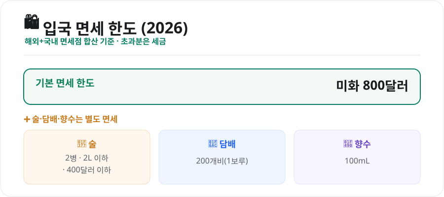
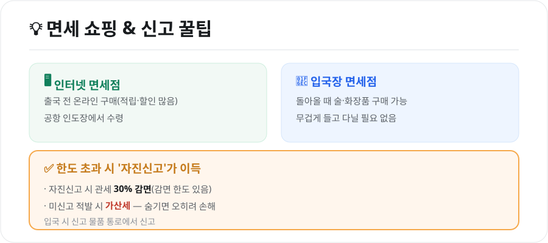

해외여행의 즐거움 중 하나가 **면세 쇼핑**입니다. 그런데 면세 한도를 넘겨 세금을 물거나, 규정을 몰라 낭패를 보는 경우가 있습니다. 2026년 기준 면세 한도와 술·담배 규정, 똑똑하게 사는 팁을 정리했습니다.

<figure class="large"><figcaption>2026년 입국 면세 한도 (자료 정리: 키워드픽)</figcaption></figure>

## 1. 면세 한도 — 기본 800달러

해외여행에서 돌아올 때 적용되는 1인당 기본 면세 한도는 **미화 800달러**입니다. 이 한도는 **해외에서 산 물건 + 국내 면세점(인터넷 포함)에서 산 물건을 모두 합산**해 계산합니다.

- 한도를 넘으면 **초과분에 대해 세금(관세 등)**이 부과됩니다.
- 술·담배·향수는 이 800달러와 **별도**로 면세 범위가 있습니다.

## 2. 술·담배·향수 별도 규정

| 품목 | 면세 범위 |
|---|---|
| **술** | 2병 + 합산 2L 이하 + 400달러 이하 (세 조건 동시 충족) |
| **담배** | 200개비(1보루) |
| **향수** | 100mL |

- **술**은 세 조건을 **모두** 만족해야 합니다. 예를 들어 2병이어도 총 용량이 2L를 넘거나 400달러를 넘으면 과세 대상입니다.
- 담배·향수는 성인 기준이며, 담배는 종류별 한도가 있습니다.

## 3. 똑똑한 면세 쇼핑 팁

<figure class="large"><figcaption>면세 쇼핑 & 신고 꿀팁 (자료 정리: 키워드픽)</figcaption></figure>

### 🖥️ 인터넷 면세점
출국 전 온라인으로 미리 구매하면 **적립금·할인 쿠폰** 혜택이 많고, 물건은 **공항 인도장**에서 받습니다. 여행 짐을 늘리지 않아 편리합니다.

### 🛬 입국장 면세점
예전에는 출국할 때만 면세점을 이용할 수 있었지만, 이제는 **입국장 면세점**에서 술·화장품 등을 살 수 있습니다. 여행 내내 무겁게 들고 다닐 필요가 없습니다.

### ✅ 한도 초과 시엔 '자진신고'
한도를 넘겼다면 숨기지 말고 **자진신고**하세요.

- **자진신고 시 관세 30% 감면**(감면 한도 있음)
- **미신고로 적발되면 가산세**가 붙어 오히려 더 냅니다.
- 입국 시 **신고 물품 통로**에서 신고하면 됩니다.

## 4. 알아두면 좋은 점

- **여행자 휴대품 신고**는 모바일(관세청 앱)로 미리 작성할 수 있어 입국이 빠릅니다.
- **선물·미개봉이라도 합산**됩니다. 가족이 함께 입국하면 각자 한도가 적용되니 나눠 담는 것도 방법입니다.
- **고가품(명품 가방·시계 등)**은 초과분 세금이 크니, 구매 전 예상 세액을 가늠해보세요.

## 마무리

면세 쇼핑의 핵심은 **"기본 800달러 + 술·담배·향수 별도"** 한도를 기억하고, **초과 시 자진신고**로 감면받는 것입니다. 인터넷·입국장 면세점을 잘 활용하면 짐도 줄이고 혜택도 챙길 수 있습니다. 규정만 알면 면세 쇼핑이 훨씬 즐거워집니다.

---

*본 글은 공개된 관세·면세 제도를 바탕으로 정리한 참고용 정보입니다. 면세 한도·품목별 규정은 바뀔 수 있으므로, 실제 구매·입국 전 관세청의 최신 안내를 확인하시기 바랍니다.*

**참고 자료**
- 관세청(여행자 휴대품 면세범위·자진신고 안내)
- 찾기쉬운 생활법령정보(면세점 이용)
