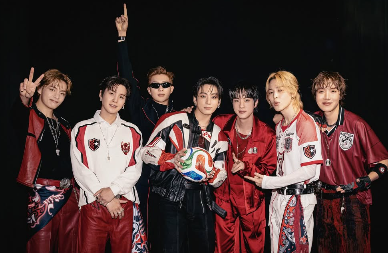

전 세계적 영향력을 이어가는 그룹 **방탄소년단(BTS)** 이 다양한 소식으로 화제입니다. 멤버들의 개인 활동부터 그룹을 둘러싼 이슈까지, 최근 근황을 한 번에 정리했습니다.

## 멤버들의 개인 활동

**진**은 유명 매거진(엘르) 8월호 표지 모델로 나서며 압도적 화제성을 증명했습니다. 표지 여러 종이 판매 순위 상위권을 휩쓸며 '표지 파워'를 다시 입증했습니다.

**뷔**는 유통가 스타 마케팅의 중심에 서며, 그가 착용한 스타일이 '옥코어(oldmoney·클래식 무드)'라는 패션 트렌드 확산에 영향을 준 것으로 회자됩니다. 멤버 개개인이 음악을 넘어 **패션·광고·문화 트렌드**를 이끄는 영향력을 보여주는 대목입니다.

<figure class="medium"><figcaption>사진출처: BTS official 인스타그램</figcaption></figure>

## 표절 의혹, 소속사의 대응

최근 BTS의 곡 **'스윔(Swim)'** 이 미국에서 표절 의혹에 휘말렸습니다. 이에 소속사 빅히트는 **"일방적 주장"이라며 강경 대응하겠다는 입장**을 밝혔습니다. 아티스트의 창작물을 둘러싼 논란인 만큼, 향후 공식 대응과 사실관계 확인이 이어질 전망입니다. (구체적 진행 상황은 공식 발표로 확인이 필요합니다.)

## 여전한 '티켓 파워'

최근 미국 팝 시장의 전반적 부진 속에서도 **BTS의 티켓 파워는 건재**하다는 평가가 이어집니다. 매진 행렬이 현재 시장 상황과 비교해 이례적이라는 분석까지 나올 정도인데요. 이는 단순한 인기를 넘어, 글로벌 팬덤의 **충성도와 구매력**이 얼마나 견고한지를 보여줍니다.

## 왜 여전히 화제의 중심일까

BTS는 ① 멤버 개인의 광범위한 영향력, ② 견고한 글로벌 팬덤, ③ 트렌드를 만드는 문화적 파급력이라는 세 가지를 동시에 갖췄습니다. 개별 활동과 그룹 이슈가 끊임없이 뉴스가 되는 이유이자, 국내외 검색량 상위를 유지하는 배경입니다.

## 정리

최근 방탄소년단은 진의 화보, 뷔발(發) 패션 트렌드, 표절 의혹 대응, 그리고 여전한 티켓 파워까지 다방면에서 화제를 모으고 있습니다. 멤버 개개인과 그룹 모두 강력한 영향력을 이어가는 모습입니다.

### 참고 자료
- 방탄소년단 진, 엘르 8월호 표지 판매 1위 — 다음
- BTS '스윔', 美 표절 의혹…빅히트 "강경 대응" — 연합뉴스
- BTS 티켓 매진이 놀라운 이유 — 한국경제
