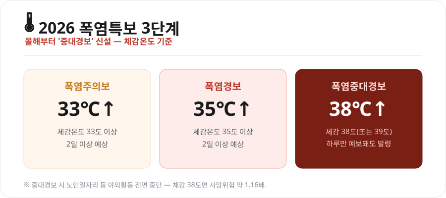
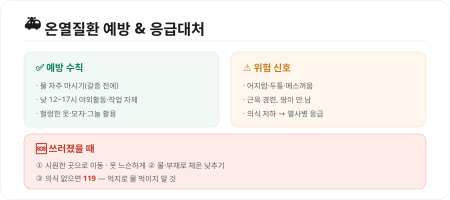

연일 이어지는 찜통더위 속에 서울에 **처음으로 '폭염중대경보'**가 발령됐습니다. 올해 새로 생긴 이 단계는 뭐가 다르고, 왜 이렇게까지 경보를 올렸을까요? 폭염특보 체계와 함께, 무엇보다 중요한 **온열질환 대처법**을 정리했습니다.

<figure class="large"><figcaption>2026 폭염특보 3단계 기준 (자료 정리: 키워드픽)</figcaption></figure>

## 1. 올해부터 '중대경보' 신설 — 3단계로

기존 폭염특보는 '주의보-경보' 2단계였는데, **2026년부터 '중대경보'가 추가돼 3단계**로 바뀌었습니다. 모두 **체감온도**를 기준으로 합니다.

| 단계 | 기준 | 의미 |
|---|---|---|
| **폭염주의보** | 체감온도 33℃ 이상 2일↑ | 더위 시작, 주의 |
| **폭염경보** | 체감온도 35℃ 이상 2일↑ | 위험, 야외활동 자제 |
| **폭염중대경보** | 체감온도 **38℃ 이상**(또는 기온 39℃ 이상) | 하루만 예보돼도 발령, 최고 수준 |

- **중대경보**는 다른 단계와 달리 **하루만 예보돼도** 발령될 만큼 위급한 단계입니다.
- 발령 시 **노인일자리 등 야외활동이 전면 중단**되는 등 대응 수위가 올라갑니다.

## 2. 서울, 첫 폭염중대경보

서울은 강남 등 일부 지역 체감온도가 **38도**에 이르면서 **첫 폭염중대경보**가 내려졌습니다. 이미 서울 전역에 폭염경보가 발효 중이었고, **열대야도 9일째** 이어지는 등 밤낮없는 더위가 계속됐습니다. 서울시는 폭염 위기경보를 격상하고, **무더위쉼터 운영·쪽방 주민·고령층 등 취약계층 특별관리**에 나섰습니다.

### 왜 이렇게까지 올렸나
질병관리청 분석에 따르면 **체감온도가 38도에 이르면 전체 사망위험이 약 1.16배, 심혈관질환 사망위험이 약 1.14배**까지 높아집니다. 그만큼 38도는 건강한 사람도 위험한 온도라, 더 세분화된 경보 체계가 필요했던 것입니다.

## 3. 온열질환, 이렇게 대처하세요

무엇보다 중요한 건 내 몸을 지키는 일입니다.

<figure class="large"><figcaption>온열질환 예방 & 응급대처 (자료 정리: 키워드픽)</figcaption></figure>

### ✅ 예방 수칙
- **물을 자주** 마시세요(갈증을 느끼기 전에).
- **낮 12시~오후 5시** 사이 야외활동·작업을 피하세요.
- 헐렁하고 밝은 옷, 모자, 그늘을 활용하세요.
- 어린이·노약자·만성질환자는 특히 주의하고, 차 안에 잠깐도 두지 마세요.

### ⚠️ 위험 신호
어지럼·두통·메스꺼움, 근육 경련, **땀이 나지 않고 피부가 뜨거움**, 의식이 흐려지면 온열질환(열사병 등)을 의심해야 합니다.

### 🆘 쓰러졌을 때
1. **시원한 곳**으로 옮기고 옷을 느슨하게
2. 물·부채·얼음으로 **체온을 낮추기**
3. **의식이 없으면 119** — 이때 **억지로 물을 먹이지 마세요**(기도로 넘어갈 수 있음)

## 4. 폭염 대응 팁

- **무더위쉼터**(경로당·주민센터·은행 등)를 적극 이용하세요.
- 야외 근로자는 **물·그늘·휴식**(하루 중 가장 더운 시간대 작업 조정)을 지키세요.
- 이웃의 **홀몸 어르신·취약계층**을 자주 살피는 것도 중요합니다.

## 마무리

'폭염중대경보'는 단순한 더위가 아니라 **생명을 위협하는 수준의 폭염**이라는 신호입니다. 체감 38도 이상에서는 건강한 사람도 위험하니, **한낮 야외활동을 줄이고 수분을 충분히** 섭취하세요. 특히 어르신·아이·야외 근로자의 안전을 함께 챙기는 것이 이 여름을 무사히 나는 길입니다.

---

*본 글은 기상청·질병관리청 등 공개 자료와 언론 보도를 바탕으로 정리한 참고용 정보입니다. 실시간 특보·행동요령은 기상청 날씨누리와 재난문자·지자체 안내를 확인하시기 바랍니다.*

**참고 자료**
- 기상청 폭염특보 기준(2026년 개편)
- 질병관리청 온열질환 예방 안내
