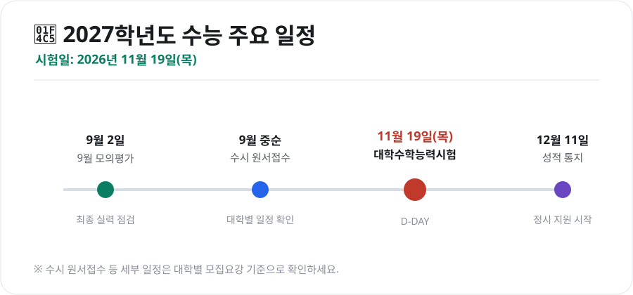
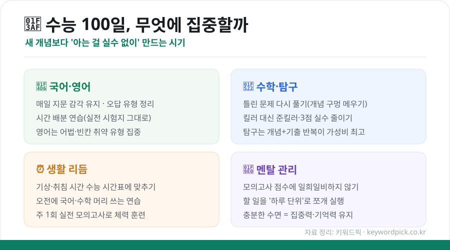

여름이 지나면 수험생에게 가장 긴장되는 시기가 찾아옵니다. **2027학년도 대학수학능력시험은 2026년 11월 19일(목요일)**에 치러집니다. 8월 중순이면 딱 100일 안팎이 남는 셈인데요. 이 시기를 어떻게 보내느냐에 따라 결과가 크게 달라집니다. 먼저 전체 일정을 정리하고, 남은 기간 무엇에 집중해야 하는지 살펴보겠습니다.

<figure class="large"><figcaption>2027학년도 수능 주요 일정 (자료 정리: 키워드픽)</figcaption></figure>

## 1. 2027학년도 수능 일정 한눈에

| 일정 | 날짜 | 내용 |
|---|---|---|
| **9월 모의평가** | 2026년 9월 2일 | 한국교육과정평가원 주관, 실력 최종 점검 |
| **수시 원서접수** | 9월 중순(대학별) | 대학별 모집요강 일정 확인 필수 |
| **수능** | **2026년 11월 19일(목)** | 대학수학능력시험 |
| **성적 통지** | 2026년 12월 11일(금) | 이후 정시 원서접수 진행 |

9월 모의평가는 실제 수능 출제기관인 평가원이 내는 시험이라, **현재 위치를 가장 정확하게 보여주는 지표**입니다. 이 성적을 기준으로 수시 지원 대학을 현실적으로 조정하게 됩니다.

## 2. 남은 100일, 핵심 원칙

100일은 새로운 개념을 처음부터 쌓기엔 짧고, 아는 것을 완성하기엔 충분한 시간입니다. 그래서 이 시기의 원칙은 하나입니다 — **"새 것을 늘리기보다, 아는 것을 실수 없이 만들기."**

<figure class="large"><figcaption>수능 100일 집중 전략 — 과목·생활·멘탈 (자료 정리: 키워드픽)</figcaption></figure>

### 과목별 마무리 전략
- **국어·영어**: 매일 지문을 읽어 감각을 유지하고, 자주 틀리는 유형을 따로 정리하세요. 특히 실전 시험지 그대로 **시간 배분 연습**이 중요합니다.
- **수학**: 새 문제집을 늘리기보다 **틀린 문제를 다시 풀며 개념 구멍을 메우는 것**이 효율적입니다. 최고난도 문항보다 준킬러·3점 문항의 실수를 줄이는 편이 점수 상승에 유리합니다.
- **탐구**: 개념 + 기출 반복이 가장 가성비가 높습니다. 짧은 시간에 점수를 끌어올리기 좋은 영역입니다.

### 생활·컨디션 관리
공부만큼 중요한 것이 몸의 리듬입니다.

- **기상·취침 시간을 수능 시간표에 맞추세요.** 오전에 국어·수학처럼 머리를 많이 쓰는 과목을 푸는 연습을 해두면 실전에서 유리합니다.
- **주 1회는 실전처럼** 모의고사 한 세트를 시간 맞춰 풀어 체력과 집중 지구력을 키우세요.
- **수면을 줄이지 마세요.** 잠은 집중력과 기억 정착에 직접 영향을 줍니다. 밤을 새우는 공부는 다음 날 하루를 통째로 무너뜨립니다.

### 멘탈 관리
9월 모의평가나 사설 모의고사 점수에 **일희일비하지 않는 것**이 가장 어렵고도 중요합니다. 점수는 오르내리기 마련이니, 할 일을 하루 단위로 쪼개어 **오늘 할 일을 끝냈는지**로 자신을 평가하세요.

## 3. 수시·정시, 지금부터 준비할 것

- **수시**: 9월 원서접수 전까지 지원 대학·전형을 3~6개로 좁히세요. 모평 성적으로 지원 가능선을 현실적으로 잡는 것이 핵심입니다.
- **정시**: 수능 이후가 본게임이지만, 지금부터 관심 대학의 **수능 반영 비율(국·수·영·탐 가중치)**을 알아두면 남은 기간 어느 과목에 힘을 실을지 판단이 서게 됩니다.

## 마무리

수능 100일은 "얼마나 많이 하느냐"보다 **"얼마나 흔들리지 않고 꾸준히 하느냐"**의 싸움입니다. 일정과 목표를 정리했다면, 이제 남은 것은 하루하루를 실전처럼 쌓아가는 일입니다. 수험생 여러분과 가족 모두를 응원합니다.

---

*본 글은 공개된 일정·자료를 바탕으로 정리한 참고용 정보입니다. 수시 원서접수 등 세부 일정과 반영 비율은 대학별 모집요강 기준으로 반드시 확인하시기 바랍니다.*

**참고 자료**
- 한국교육과정평가원 대학수학능력시험 시행 안내
- 대한민국 정책브리핑(2027학년도 수능 시행일 보도자료)
