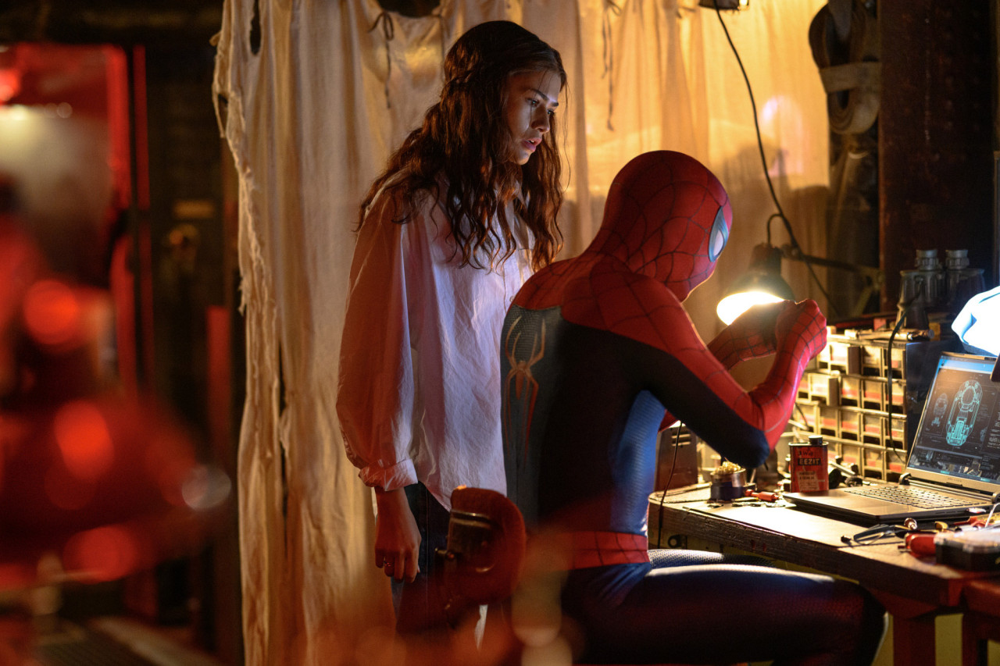

마블의 신작 **'스파이더맨: 브랜드 뉴 데이'** 가 사전 예매량 10만 장을 넘기며 뜨거운 관심을 받고 있습니다. 특별관 상영과 이색 테마존까지 화제가 이어지는 가운데, **관람 전 알아두면 좋은 정보**를 정리했습니다.

## 뜨거운 사전 예매 열기

이 작품은 공개 전부터 사전 예매량 **10만 장**을 돌파하며 흥행을 예고했습니다. 인기 시간대·명당 좌석은 빠르게 마감되는 경우가 많으니, 원하는 회차가 있다면 서두르는 편이 좋습니다. (예매 관련 일부 이슈가 보도되기도 했는데, 구체적 상황은 극장·배급사 공지로 확인하는 것이 정확합니다.)

<figure class="medium"><figcaption>출처: 스파이더맨 영화 공식배포 이미지</figcaption></figure>

## SCREENX·4DX, 어떤 특별관으로 볼까

이번 영화는 CJ 4DPLEX의 **'Shot for SCREENX'** 기술이 적용된 첫 작품으로 알려져 특별관 관람 수요가 높습니다. 각 포맷의 특징을 간단히 비교하면:

- **SCREENX**: 정면+좌우 3면을 활용한 파노라마 상영. 스파이더맨의 도심 스윙 장면에서 몰입감이 큽니다.
- **4DX**: 좌석 움직임·바람·향 등 오감 효과. 액션 체감형 관람을 원한다면 추천.
- **2D 일반관**: 오롯이 화면·스토리에 집중하고 싶을 때, 가장 부담 없는 선택.

액션 스펙터클이 강한 작품인 만큼, 처음이라면 SCREENX나 4DX 같은 특별관 경험도 고려해 볼 만합니다.

## 서울스카이 특별 테마존

영화 개봉과 연계해 **롯데월드타워 서울스카이 555m 상공**에 특별 테마존이 운영되고 있습니다. 영화 팬이라면 관람과 함께 들러볼 만한 포토·체험 공간으로, 가족·연인 나들이 코스로도 좋습니다. 운영 기간·입장 방식은 방문 전 공식 안내로 확인하세요.

## 정리

'스파이더맨: 브랜드 뉴 데이'는 ① 사전 예매 열기가 뜨겁고 ② SCREENX·4DX 특별관 관람 수요가 높으며 ③ 서울스카이 테마존 같은 연계 이벤트까지 있는 작품입니다. 원하는 회차·특별관은 조기 마감될 수 있으니 예매 계획을 미리 세워두는 것을 추천합니다.

---

### 참고 자료
- 예매량 10만 돌파, 스파이더맨 브랜드 뉴 데이 — 톱스타뉴스
- 서울스카이 555m 특별 테마존 오픈 — 뉴스핌
- SCREENX·4DX 사전예매 오픈, CJ 4DPLEX — CJ 뉴스룸
