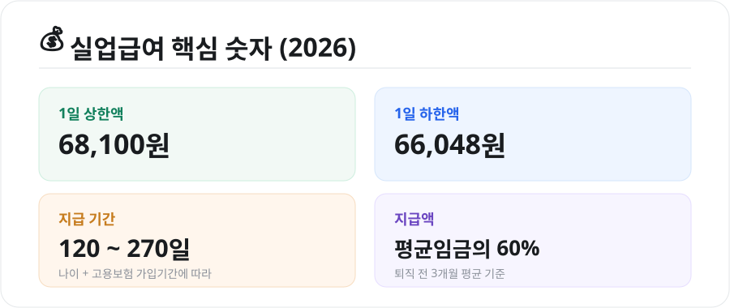
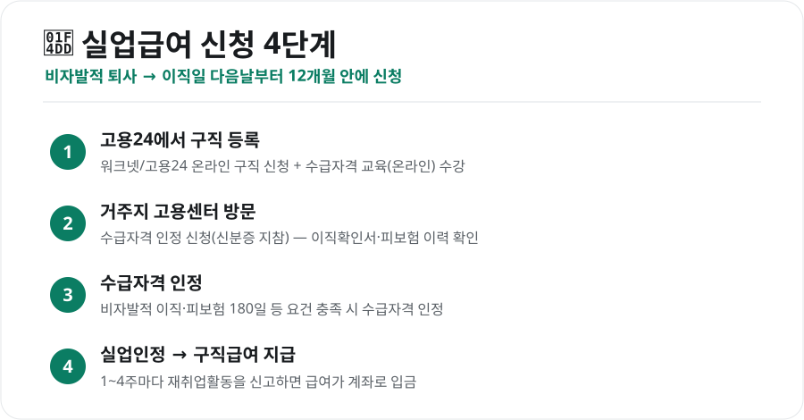

갑작스러운 퇴사, 막막할 때 가장 먼저 챙겨야 할 것이 **실업급여**입니다. 정식 명칭은 '구직급여'로, 고용보험에 가입했던 사람이 실직 후 재취업을 준비하는 동안 생계를 돕는 제도입니다. 조건과 신청 방법, 얼마를 얼마나 받는지 핵심만 정리했습니다.

<figure class="large"><figcaption>2026년 실업급여 핵심 숫자 (자료 정리: 키워드픽)</figcaption></figure>

## 1. 받을 수 있는 조건

아래 조건을 **모두** 충족해야 합니다.

- **비자발적 이직**: 회사 사정에 의한 권고사직, 계약 만료, 경영상 해고 등. 스스로 그만둔 자발적 퇴사는 원칙적으로 제외(단, 임금 체불·통근 곤란 등 정당한 사유가 인정되면 예외)
- **피보험단위기간 180일 이상**: 이직 전 18개월 동안 고용보험 가입 기간이 180일 이상
- **근로 의사와 능력**: 일할 의사와 능력이 있는데도 취업하지 못한 상태
- **적극적 재취업활동**: 구직활동을 실제로 하고 있어야 함

> 자발적 퇴사라도 **정당한 이직 사유**가 인정되면 받을 수 있는 경우가 있으니, 애매하면 고용센터에 먼저 상담하세요.

## 2. 신청 방법 — 4단계

<figure class="large"><figcaption>실업급여 신청 절차 4단계 (자료 정리: 키워드픽)</figcaption></figure>

1. **고용24에서 구직 등록** + 수급자격 신청자 온라인 교육 수강
2. **거주지 관할 고용센터 방문**해 수급자격 인정 신청(신분증 지참)
3. **수급자격 인정** — 요건 충족 시 인정
4. **실업인정 → 구직급여 지급** — 1~4주마다 재취업활동을 신고하면 계좌로 입금

퇴사하면 회사가 **이직확인서**와 고용보험 상실 신고를 처리해야 신청이 매끄럽습니다. 처리가 늦으면 회사에 요청하세요.

## 3. 얼마를, 얼마나 받나

### 지급액
**퇴직 전 3개월 평균임금의 60% × 소정급여일수**로 계산합니다. 단, 상·하한이 있습니다.

- **1일 상한액**: 68,100원
- **1일 하한액**: 66,048원 (최저임금과 연동)

평균임금이 아주 높아도 상한액까지만, 아주 낮아도 하한액은 보장됩니다.

### 지급 기간(소정급여일수)
퇴직 당시 **나이와 고용보험 가입 기간**에 따라 **120일~270일** 사이에서 정해집니다.

| 가입기간 | 50세 미만 | 50세 이상·장애인 |
|---|---|---|
| 1년 미만 | 120일 | 120일 |
| 1년~3년 | 150일 | 180일 |
| 3년~5년 | 180일 | 210일 |
| 5년~10년 | 210일 | 240일 |
| 10년 이상 | 240일 | 270일 |

> 실업급여는 **이직일 다음 날부터 12개월 안에** 받아야 합니다. 이 기간이 지나면 남은 일수가 있어도 받지 못하니, 퇴사 후 **되도록 빨리 신청**하는 것이 좋습니다.

## 4. 주의할 점

- **부정수급 금지**: 취업·소득 발생을 숨기면 지급액 반환은 물론 추가 징수·형사처벌 대상이 됩니다. 아르바이트·단기 근로도 반드시 신고하세요.
- **실업인정일 준수**: 정해진 실업인정일에 재취업활동을 신고하지 않으면 그 회차 급여가 지급되지 않습니다.
- **조기재취업수당**: 남은 급여일수가 많은 상태에서 빨리 재취업해 일정 기간 근무하면 남은 급여의 일부를 수당으로 받을 수 있습니다.

## 마무리

실업급여의 핵심은 **"비자발적 이직 + 피보험 180일"** 조건을 확인하고, 퇴사 후 **빠르게 고용24에서 구직 등록**을 시작하는 것입니다. 재취업활동만 성실히 신고하면 최대 270일까지 생계 부담을 덜 수 있습니다.

---

*본 글은 공개된 제도 자료를 바탕으로 정리한 참고용 정보입니다. 상·하한액과 세부 요건은 매년 바뀌므로, 실제 신청 전 고용24(고용노동부)·거주지 고용센터의 최신 안내를 확인하시기 바랍니다.*

**참고 자료**
- 고용노동부 고용24(실업급여 안내)
- 고용보험 구직급여 소정급여일수 기준
