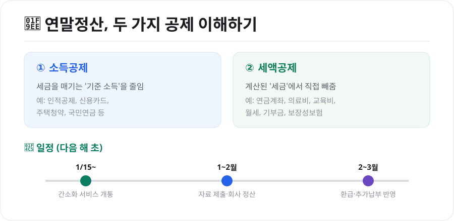
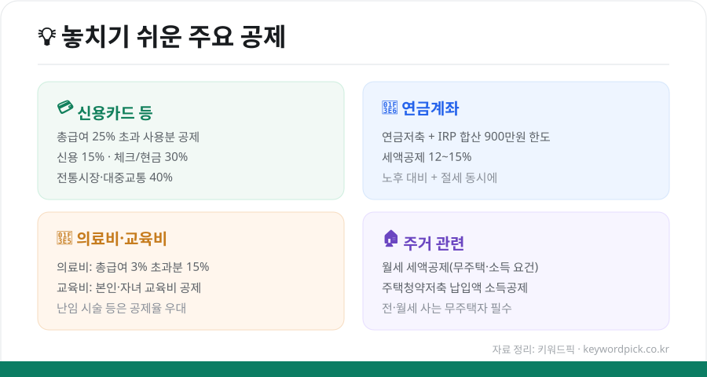

직장인이라면 매년 초 마주하는 것이 **연말정산**입니다. 잘 챙기면 '13월의 월급'이 되고, 놓치면 오히려 세금을 더 낼 수도 있습니다. 용어가 어렵게 느껴지지만 구조만 이해하면 간단합니다. 초보자 눈높이로 정리했습니다.

<figure class="large"><figcaption>연말정산의 두 가지 공제 & 일정 (자료 정리: 키워드픽)</figcaption></figure>

## 1. 연말정산이란?

회사는 매달 급여에서 세금을 **미리 떼어(원천징수)** 냅니다. 그런데 이건 대략적인 금액이라, 1년이 끝나면 **실제로 냈어야 할 세금과 비교해 정산**합니다. 더 냈으면 **돌려받고(환급)**, 덜 냈으면 **더 냅니다(추가납부)**. 이 과정이 연말정산입니다.

## 2. 소득공제 vs 세액공제 — 이 둘만 알면 끝

가장 중요한 개념입니다.

- **소득공제**: 세금을 매기는 **기준 소득(과세표준)을 줄여**주는 것. 소득이 줄면 그만큼 세금도 줄어듭니다. (예: 인적공제, 신용카드, 주택청약, 국민연금)
- **세액공제**: 계산이 끝난 **세금에서 직접 빼**주는 것. 금액이 그대로 세금 절감으로 이어져 체감이 큽니다. (예: 연금계좌, 의료비, 교육비, 월세, 기부금)

> 쉽게 말해, **소득공제는 "세금 매기기 전 소득을 깎는 것"**, **세액공제는 "다 계산된 세금을 깎는 것"**입니다.

## 3. 일정 — 다음 해 1~3월

- **1월 15일경**: 홈택스 **연말정산 간소화 서비스** 개통(자료 조회)
- **1~2월**: 간소화 자료·영수증을 회사에 제출, 회사가 정산
- **2~3월 급여**: 환급 또는 추가납부 반영

## 4. 놓치기 쉬운 주요 공제

<figure class="large"><figcaption>놓치기 쉬운 주요 공제 (자료 정리: 키워드픽)</figcaption></figure>

### 💳 신용카드 등 사용액 (소득공제)
총급여의 **25%를 초과**해 쓴 금액부터 공제됩니다. 공제율은 **신용카드 15%, 체크카드·현금영수증 30%, 전통시장·대중교통 40%**입니다. 25%까지는 공제가 안 되니, 그 이후엔 **체크카드·현금영수증**을 쓰는 게 유리합니다.

### 🏦 연금계좌 (세액공제)
**연금저축 + IRP를 합쳐 연 900만원 한도**로, 낸 금액의 **12~15%**를 세금에서 빼줍니다(총급여 5,500만원 이하는 15%). 노후 대비와 절세를 동시에 잡는 대표적인 항목입니다.

### 🏥 의료비·교육비 (세액공제)
의료비는 **총급여의 3%를 초과**한 금액의 15%를 공제합니다(난임 시술 등은 우대). 본인·부양가족의 교육비도 일정 한도로 공제됩니다.

### 🏠 주거 관련
- **월세 세액공제**: 무주택 근로자가 일정 소득 이하일 때, 낸 월세의 일부를 세금에서 공제
- **주택청약종합저축**: 무주택 세대주가 납입한 금액을 소득공제

전·월세에 사는 무주택자라면 꼭 챙겨야 할 항목입니다.

## 5. 환급 많이 받는 팁

- **부양가족 등록**: 소득 없는 부모·자녀 등 인적공제를 빠짐없이 반영(중복공제 주의)
- **맞벌이 부부**: 의료비·자녀공제 등을 **소득이 높은 배우자에게 몰아주면** 유리한 경우가 많음
- **간소화에 안 잡히는 자료**: 안경·콘택트렌즈 구입비, 일부 기부금, 취학 전 학원비 등은 **직접 영수증**을 챙겨 제출
- **홈택스 미리보기**: 연말 전에 홈택스 '연말정산 미리보기'로 예상 세액을 확인하고 부족한 공제를 채우면 좋습니다.

## 마무리

연말정산의 핵심은 **소득공제·세액공제의 차이를 이해하고, 나에게 해당하는 공제를 빠짐없이 챙기는 것**입니다. 특히 **연금계좌·월세·의료비**는 절세 효과가 크니 놓치지 마세요. 매년 세법이 조금씩 바뀌므로, 홈택스 안내를 확인하며 준비하면 '13월의 월급'을 제대로 챙길 수 있습니다.

---

*본 글은 공개된 제도를 바탕으로 정리한 참고용 정보입니다. 공제 한도·율·요건은 매년 개정되므로, 실제 신고 전 국세청 홈택스의 최신 안내를 확인하시기 바랍니다.*

**참고 자료**
- 국세청 홈택스(연말정산 간소화·미리보기)
- 국세청 연말정산 종합안내
