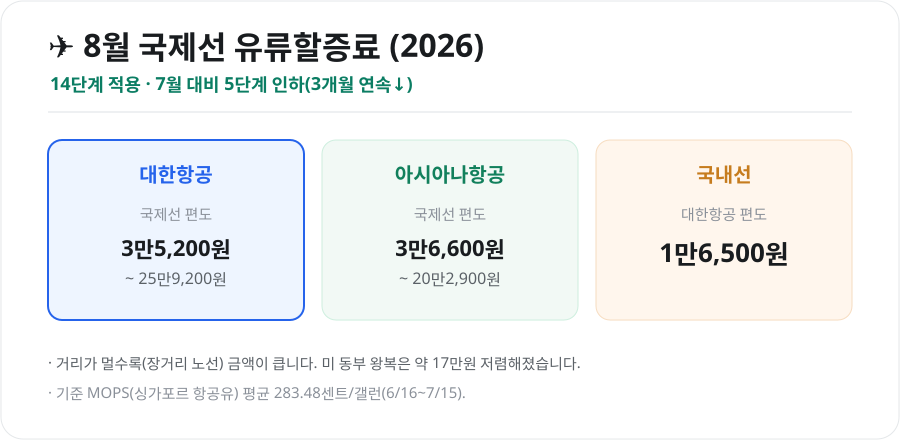
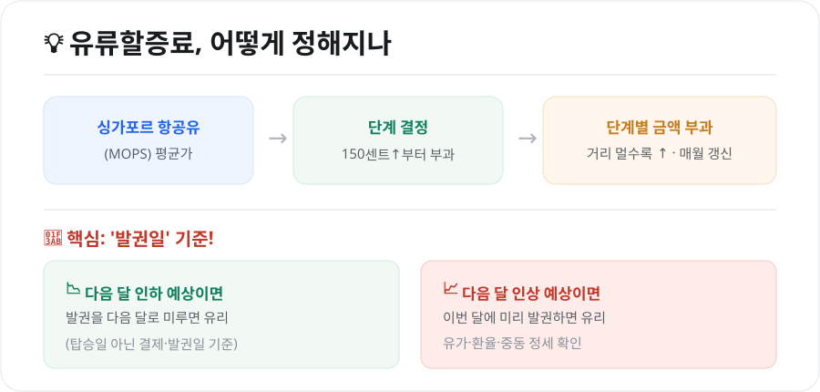

항공권을 끊을 때 항공료 외에 따로 붙는 **유류할증료**. 매달 바뀌는 데다 장거리는 수십만 원에 달해 무시할 수 없습니다. 마침 **2026년 8월은 국제선 유류할증료가 또 내렸는데**, 최신 금액과 함께 언제 발권해야 이득인지 정리했습니다.

<figure class="large"><figcaption>2026년 8월 유류할증료 요약 (자료 정리: 키워드픽)</figcaption></figure>

## 1. 2026년 8월 최신 — 3개월 연속 인하

8월 발권분 국제선 유류할증료는 **14단계**로, 7월 대비 **5단계 인하**되며 전월보다 약 **25%** 낮아졌습니다. **3개월 연속 하락**으로, 휴가철 항공권 부담이 한결 가벼워졌습니다.

| 구분 | 8월 편도 유류할증료 |
|---|---|
| **대한항공(국제선)** | 3만5,200원 ~ 25만9,200원 |
| **아시아나항공(국제선)** | 3만6,600원 ~ 20만2,900원 |
| **국내선(대한항공)** | 1만6,500원 |

- 금액은 **거리(노선)에 비례**해, 가까운 일본·중국 노선은 낮고 미주·유럽 장거리는 높습니다.
- 예를 들어 미국 동부 왕복은 전월보다 약 **17만원** 저렴해졌습니다.

## 2. 유류할증료는 어떻게 정해질까

<figure class="large"><figcaption>유류할증료 산정 원리 & 발권 타이밍 팁 (자료 정리: 키워드픽)</figcaption></figure>

- **기준 지표**: **싱가포르 항공유(MOPS)** 평균가로 정해집니다. 8월분은 6월 16일~7월 15일 평균인 **283.48센트/갤런**을 기준으로 산정됐습니다.
- **부과 방식**: 평균가가 **갤런당 150센트 이상**일 때부터 부과되고, 가격이 오를수록 **단계(구간)**가 높아져 금액이 커집니다.
- **갱신 주기**: **매월** 새로 산정·고지됩니다. 그래서 같은 노선이라도 달마다 요금이 달라집니다.

## 3. 핵심 절약 포인트 — '발권일' 기준

가장 중요한 사실입니다. 유류할증료는 **탑승일이 아니라 항공권을 발권(결제)한 날**을 기준으로 적용됩니다.

- **다음 달 인하가 예상되면** → 발권을 **다음 달로 미루면** 더 싸게 살 수 있습니다.
- **다음 달 인상이 예상되면** → **이번 달에 미리 발권**하는 게 유리합니다.
- 즉, 같은 8월 출발 항공권이라도 **7월에 사면 7월 요금**, **8월에 사면 인하된 8월 요금**이 붙습니다.

## 4. 9월 전망은?

3개월 연속 내렸지만, 안심하긴 이릅니다. **중동 정세(호르무즈 해협 긴장 등)와 국제 유가·환율**에 따라 **9월에는 반등할 가능성**도 거론됩니다. 유류할증료는 유가에 한두 달 시차를 두고 반영되므로, 가을 여행을 계획 중이라면 **유가 흐름과 각 항공사 공지를 함께 확인**하는 것이 좋습니다.

## 5. 알아두면 좋은 점

- **왕복은 편도의 2배**가 대략적인 기준입니다(경유 포함 구간 수에 따라 달라질 수 있음).
- **환불·재발권**: 항공권을 취소하면 유류할증료도 함께 환불됩니다. 다만 재발권 시점의 요금이 다시 적용됩니다.
- **항공사·노선별 차이**: 같은 노선이라도 항공사마다 단계·금액이 다르니, 비교 후 발권하세요.

## 마무리

2026년 8월 국제선 유류할증료는 **14단계로 3개월 연속 인하**돼 여행객에게 반가운 소식입니다. 핵심은 **"발권일 기준"**이라는 점 — 인하 흐름일 땐 서두르지 말고, 인상 조짐이 보이면 미리 끊는 것이 절약의 요령입니다. 9월은 중동 변수로 방향이 갈릴 수 있으니 항공사 공지를 체크하세요.

---

*본 글은 공개된 항공사·언론 발표를 바탕으로 정리한 참고용 정보입니다. 유류할증료는 매월 항공사·노선별로 바뀌므로, 실제 발권 전 대한항공·아시아나 등 항공사 공지의 최신 금액을 확인하시기 바랍니다.*

**참고 자료**
- 대한항공·아시아나항공 유류할증료 공지(2026년 8월)
- 항공업계 유류할증료 산정 기준(싱가포르 항공유 MOPS)
