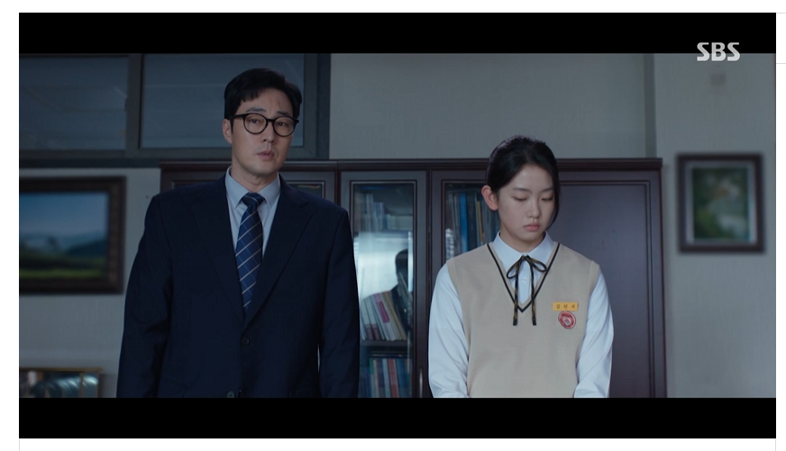

> **연예인 인물탐구** — 화제의 인물을 공개된 사실 위주로 들여다보는 코너입니다.

SBS 드라마 **'김부장'** 에서 소지섭의 딸로 등장해 강렬한 인상을 남긴 신예 배우 **서수민**. 첫 드라마 출연임에도 '괴물 신예'라는 수식어가 붙을 만큼 화제를 모으고 있는데요. 그가 어떤 배우인지, 공개된 정보를 중심으로 정리했습니다.

## '김부장'에서 맡은 역할

서수민은 '김부장'에서 **소지섭(김부장)의 딸** 역할을 맡았습니다. 첩보·액션이 중심인 이 작품에서 그는 **부녀 서사**의 한 축을 담당하며, 소지섭과 함께 눈물의 감정 연기를 완성했다는 평가를 받았습니다. 극 중 최대훈·윤경호가 연기하는 '삼촌'들과의 케미도 시청자들에게 소소한 재미를 안겼습니다.

<figure class="large"><figcaption>출처: SBS 김부장</figcaption></figure>

## 데뷔 전 이미 화제 — '300만뷰'의 주인공

흥미로운 점은, 서수민이 '김부장'으로 정식 데뷔하기 **이전부터 이미 온라인에서 화제**였다는 사실입니다. 여러 매체에 따르면 그는 데뷔 전 **짧은 영상(약 40~60초)이 300만 뷰를 기록**하며 주목받았던 인물로 소개됐습니다. 대중이 '어디서 봤더라?' 하고 떠올릴 만큼, 데뷔 전부터 잠재력을 인정받은 셈입니다.

## '첫 드라마'라는 게 믿기지 않는 존재감

'김부장'은 서수민의 **첫 드라마 작품**입니다. 그럼에도 여러 리뷰에서 "기대를 확신으로 바꿨다", "괴물 신예" 같은 호평이 이어졌습니다. 베테랑 배우들 사이에서도 위축되지 않고 자기 몫을 해냈다는 점에서, 신인답지 않은 안정감을 보여줬다는 평가입니다.

## 촬영 현장 비하인드

인터뷰에서 서수민은 촬영장 분위기를 유쾌하게 전하기도 했습니다. 극 중 관계를 빗대 "윤경호=큰이모, 최대훈=아빠, 소지섭=할아버지"라고 표현하며 웃음을 자아냈고, "아빠(소지섭)가 안 와서 삼촌들이랑만 찍었다"는 촬영 에피소드로 현장의 화기애애함을 드러냈습니다. 선배 배우들과 스스럼없이 어울리는 모습이 신예의 매력을 더했습니다.

## 앞으로의 행보

'김부장'이라는 화제작으로 눈도장을 찍은 만큼, 서수민의 차기 행보에 대한 관심도 커지고 있습니다. 데뷔작에서 보여준 감정 연기와 존재감을 다음 작품에서 어떻게 이어갈지가 관전 포인트입니다.

## 정리

서수민은 ① '김부장'에서 소지섭의 딸로 데뷔해 ② 부녀 서사로 호평을 받았고 ③ 데뷔 전 300만 뷰 영상으로 이미 화제였던 **주목할 신예**입니다. 첫 드라마에서 '괴물 신예'라는 평가를 받은 배우인 만큼, 앞으로의 활동이 기대됩니다.

> 함께 보면 좋은 글: ['김부장' 마지막회 앞두고 — 소지섭 '융단폭격' 액션과 결말 관전 포인트](/realtime-keyword/blog/김부장-마지막회-액션-결말.html)

---

### 참고 자료 (2026.6~7 보도)
- [WHO ARE YOU] 배우 서수민 — 씨네21
- '김부장' 서수민, 기대를 확신으로 바꾼 데뷔 — 더팩트
- '괴물 신예' 소지섭과 눈물의 부녀 서사 — OSEN
- '소지섭 딸' 서수민, 59초 300만뷰 소녀 — 다음/매일경제/위키트리
