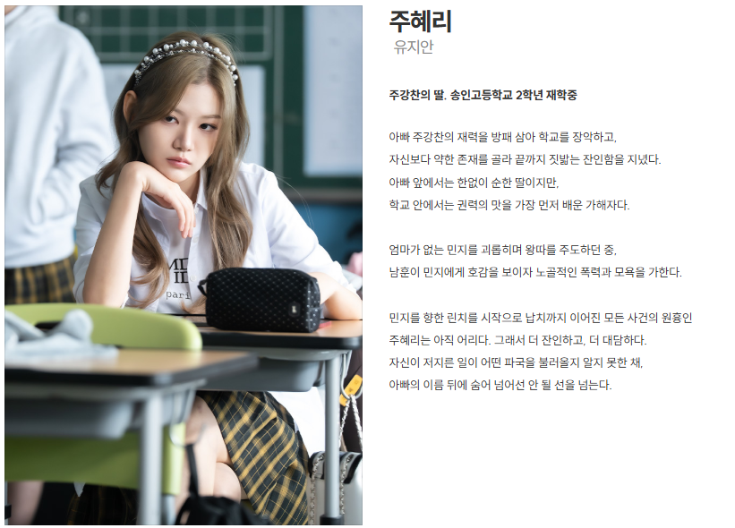

> **연예인 인물탐구** — 화제의 인물을 공개된 사실 위주로 들여다보는 코너입니다.

SBS 드라마 **'김부장'** 에서 강렬한 빌런 캐릭터로 눈도장을 찍은 신예 배우 **유지안**. 이 작품이 **데뷔작**임에도 "연기력 합격점"이라는 평가를 받으며 존재감을 남겼는데요. 어떤 배우인지 공개된 정보를 중심으로 정리했습니다.

## '김부장'에서 맡은 역할 — 빌런 '주혜리'

유지안은 '김부장'에서 **주상욱이 연기한 인물의 딸 '주혜리'** 역을 맡았습니다. 극 중에서는 소지섭의 딸 캐릭터를 괴롭히는 **여고생 빌런**으로, '만악의 근원', '역대급 빌런' 등으로 불릴 만큼 강한 인상을 남겼습니다. 시청자의 '분노를 유발'했다는 것은, 그만큼 악역 연기가 설득력 있었다는 방증이기도 합니다.

<figure class="medium"><figcaption>사진출처: SBS 김부장</figcaption></figure>

## 데뷔작인데 '연기력 합격점'

'김부장'은 유지안의 **첫 작품**입니다. 그럼에도 여러 매체는 "꽂아주기 캐스팅이 아니었다", "데뷔작부터 터졌다", "연기력도 합격점"이라며 그의 연기를 호평했습니다. 신인이 베테랑 배우들 사이에서 미움받는 악역을 소화하며 극의 긴장감을 끌어올렸다는 점에서, **성공적인 데뷔**라는 평가가 이어졌습니다.

## 겸손한 종영 소감

작품을 마무리하며 유지안은 진솔한 소감을 전했습니다. "**데뷔작이라 많이 떨렸다**", "**행복했고 많이 배웠다**", "**소중한 첫걸음 같은 작품**"이라는 말로 첫 작품에 대한 애정과 감사를 드러냈습니다. 강렬한 악역과 달리, 소감에서는 신인다운 진지함과 겸손함이 묻어났습니다.

## 앞으로의 행보

데뷔작에서 '미움받는 캐릭터'를 인상 깊게 소화한 만큼, 유지안이 다음 작품에서 어떤 얼굴을 보여줄지에도 관심이 모입니다. 악역으로 강한 눈도장을 찍은 신예가 어떤 스펙트럼을 펼칠지가 관전 포인트입니다.

## 정리

유지안은 ① '김부장'에서 빌런 '주혜리'로 ② **데뷔작부터 연기력 호평**을 받았고 ③ "소중한 첫걸음"이라는 겸손한 소감을 남긴 **주목할 신예**입니다. 미움받는 악역을 설득력 있게 그려낸 그의 다음 행보가 기대됩니다.

> 함께 보면 좋은 글:
> - [[인물탐구] '김부장' 소지섭 딸 役 신예 서수민은 누구?](/realtime-keyword/blog/인물탐구-서수민-김부장-소지섭-딸.html)
> - ['김부장' 마지막회 앞두고 — 소지섭 '융단폭격' 액션과 결말 관전 포인트](/realtime-keyword/blog/김부장-마지막회-액션-결말.html)

---

### 참고 자료 (2026.6~7 보도)
- 유지안, '김부장' 빌런 주혜리로 눈도장…"행복했고 많이 배웠다" — 뉴스핌
- '김부장' 데뷔작부터 터진 유지안, 연기력도 합격점 [TEN피플] — 다음
- 유지안, 데뷔작부터 '분노 유발 빌런' 눈도장 — JTBC
- '김부장' 유지안, 데뷔작 종영 소감 "소중한 첫걸음" — 스타뉴스·톱스타뉴스
