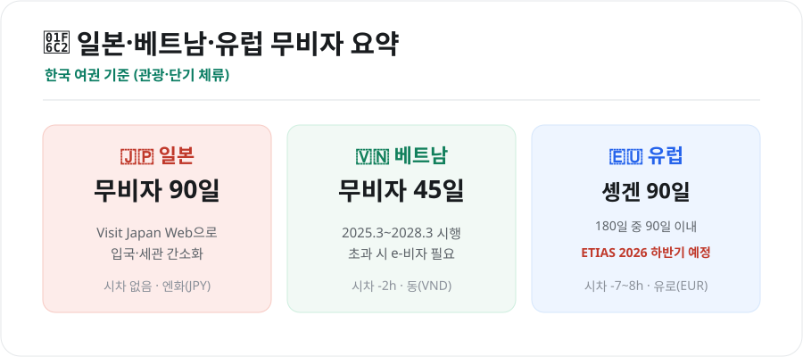
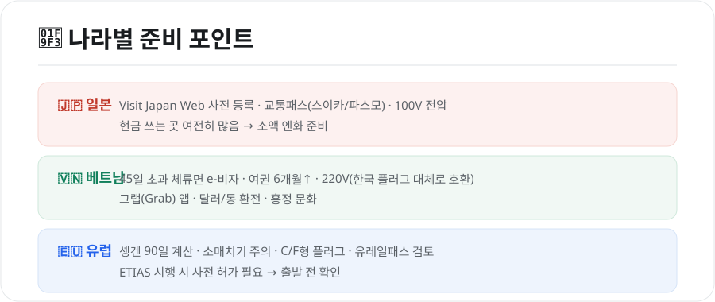

같은 해외여행이라도 나라마다 준비가 다릅니다. 무비자 기간, 전자여행허가, 통화·시차·전압까지. 한국인이 많이 찾는 **일본·베트남·유럽**을 기준으로, 출발 전 꼭 확인할 것을 한 번에 비교했습니다.

<figure class="large"><figcaption>일본·베트남·유럽 무비자 요약 (자료 정리: 키워드픽)</figcaption></figure>

## 1. 무비자·전자여행허가 한눈에

| 구분 | 일본 🇯🇵 | 베트남 🇻🇳 | 유럽(솅겐) 🇪🇺 |
|---|---|---|---|
| **무비자 기간** | 90일 | 45일 | 180일 중 90일 |
| **전자허가** | Visit Japan Web(권장) | 45일 초과 시 e-비자 | ETIAS(2026 하반기 예정) |
| **통화** | 엔(JPY) | 동(VND) | 유로(EUR) 등 |
| **시차(한국 대비)** | 없음 | -2시간 | -7~-8시간 |
| **전압** | 100V | 220V | 220~230V |

- **베트남 무비자 45일**은 **2025년 3월 15일부터 2028년 3월 14일까지** 시행되는 정책입니다. 45일을 넘겨 머물 계획이면 **e-비자**를 준비하세요.
- **유럽 솅겐 90일**은 "180일 중 실제 체류 90일"을 의미합니다. 여러 솅겐 국가를 오가도 **합산**되니 일정 관리에 주의하세요.

## 2. 나라별 준비 포인트

<figure class="large"><figcaption>나라별 여행 준비 포인트 (자료 정리: 키워드픽)</figcaption></figure>

### 🇯🇵 일본
- **Visit Japan Web**에 입국·세관 정보를 미리 등록하면 공항 통과가 빠릅니다.
- 교통은 **스이카/파스모** 같은 교통카드가 편리합니다.
- 아직 **현금을 받는 곳이 많아** 소액 엔화를 준비하는 게 좋습니다. 전압은 100V.

### 🇻🇳 베트남
- **45일 초과** 체류면 e-비자가 필요하고, 여권 유효기간 6개월 이상을 확인하세요.
- **그랩(Grab)** 앱으로 택시·오토바이·음식 배달을 저렴하게 이용할 수 있습니다.
- 시장·택시는 **흥정 문화**가 있으니 대략적인 시세를 알아두면 좋습니다. 전압 220V로 한국 플러그가 대체로 호환됩니다.

### 🇪🇺 유럽
- **솅겐 90일** 규정을 일정에 맞춰 계산하세요.
- 관광지·지하철에서 **소매치기**가 잦으니 가방·지갑 관리에 유의합니다.
- 플러그는 **C/F형**(유럽형)이라 어댑터가 필요합니다. 여러 도시를 기차로 이동하면 **유레일패스**를 검토하세요.
- **ETIAS 시행 시** 방문 전 사전 허가가 필요해지니 출발 전 도입 여부를 확인하세요.

## 3. 세 여행지 공통 준비

- **여권 유효기간 6개월 이상** 확인
- **여행자보험** 가입(치료비·휴대품·항공지연 대비)
- **통신**: eSIM/로밍/포켓와이파이 중 선택
- **환전·결제**: 해외 특화 트래블카드 + 소액 현지 현금
- **영사콜센터 +82-2-3210-0404** 저장

## 마무리

일본은 **가깝고 시차 없이** 가볍게, 베트남은 **45일 무비자·저렴한 물가**로 길게, 유럽은 **솅겐 90일·ETIAS**를 챙겨서. 나라별 특성만 알고 준비하면 훨씬 수월합니다. 통신·환전·보험 같은 공통 준비는 [해외여행 꿀팁](해외여행-꿀팁-2026.html) 글에서 더 자세히 확인하세요.

---

*본 글은 공개된 자료를 바탕으로 정리한 참고용 정보입니다. 무비자 기간·전자여행허가·입국 요건은 시점에 따라 바뀌므로, 출발 전 방문국 공관·외교부 해외안전여행의 최신 안내를 반드시 확인하시기 바랍니다.*

**참고 자료**
- 외교부 해외안전여행(국가별 입국정보)
- 각국 전자여행허가(Visit Japan Web·베트남 e-비자·유럽 ETIAS) 안내
