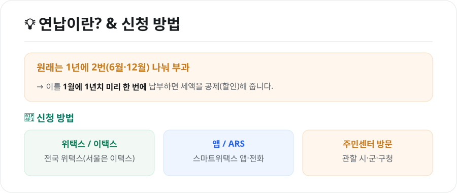
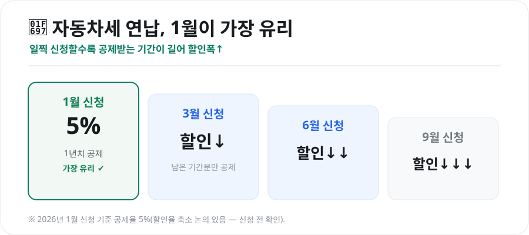

자동차세는 별거 아닌 것 같아도 매년 나가는 고정비입니다. 그런데 **1년치를 미리 한 번에 내면 세금을 깎아주는** 제도가 있습니다. 바로 **연납(연세액 일시납)**입니다. 2026년 기준으로 얼마를 아끼는지, 어떻게 신청하는지 정리했습니다.

<figure class="large"><figcaption>연납이란? & 신청 방법 (자료 정리: 키워드픽)</figcaption></figure>

## 1. 연납이 뭔가요?

자동차세는 원래 **1년에 두 번(6월·12월)** 나눠 부과됩니다. 이를 **연초에 1년치 미리 한 번에 납부**하면 세액의 일부를 **공제(할인)**해 줍니다. 미리 낸 만큼 할인해 주는 것이라, 여윳돈이 있다면 이득입니다.

## 2. 언제 신청하느냐가 핵심 — 1월이 가장 유리

연납은 **1월뿐 아니라 3월·6월·9월**에도 신청할 수 있습니다. 하지만 공제는 **남은 기간분에만** 적용되기 때문에, 늦게 신청할수록 할인 폭이 줄어듭니다.

<figure class="large"><figcaption>신청 시기별 할인율 차이 (자료 정리: 키워드픽)</figcaption></figure>

| 신청 시기 | 공제 대상 기간 | 할인 |
|---|---|---|
| **1월** | 1년 전체 | 가장 큼(2026년 기준 세액의 약 5%) |
| **3월** | 남은 약 10개월 | 줄어듦 |
| **6월** | 남은 약 7개월 | 더 줄어듦 |
| **9월** | 남은 약 4개월 | 가장 작음 |

> **2026년 1월 연납 공제율은 5%**입니다. 다만 연납 할인율은 매년 축소되는 추세로, **3%로 낮아질 수 있다는 논의**가 있으니 신청 전 최신 공고를 확인하세요. 1월 신청 기간은 보통 **1월 16일~31일**경입니다.

## 3. 신청 방법

- **위택스(wetax)**: 전국 지방세 납부 사이트 (서울은 **이택스 etax**)
- **스마트위택스 앱 / ARS 전화**
- **관할 시·군·구청·주민센터 방문**

위택스·이택스에 로그인해 '자동차세 연납'을 신청하고 납부하면 끝입니다. 한 번 연납을 신청하면 **다음 해부터는 별도 신청 없이 1월에 자동으로 연납 고지**되는 경우가 많습니다(지자체별 상이).

## 4. 알아두면 좋은 점

- **중도 매각·폐차 시 환급**: 연납 후 연도 중간에 차를 팔거나 폐차하면, **남은 기간분 세액은 돌려받습니다.** 미리 냈다고 손해 보지 않습니다.
- **카드 납부 가능**: 신용카드로도 납부할 수 있어, 카드 실적·무이자 할부를 활용하면 추가 이득을 볼 수 있습니다.
- **할인폭이 크지 않아도**: 배기량이 큰 차일수록 세액이 커서 5% 할인 금액도 커집니다. 세금이 큰 차라면 연납 효과가 더 큽니다.

## 마무리

자동차세 연납은 **여윳돈이 있다면 1월에 신청해 세금을 5% 아끼는** 간단한 절세 방법입니다. 늦어질수록 할인폭이 줄어드니, **연초 1월**에 위택스로 처리하는 것이 가장 이득입니다. 할인율이 바뀔 수 있으니 신청 전 공제율만 한 번 확인하세요.

---

*본 글은 공개된 제도 자료를 바탕으로 정리한 참고용 정보입니다. 연납 공제율·신청 기간은 매년 바뀔 수 있으므로, 실제 신청 전 위택스(wetax)·관할 지자체의 최신 공고를 확인하시기 바랍니다.*

**참고 자료**
- 위택스(wetax) 자동차세 연납 안내
- 지방세법(자동차세 연세액 일시납 공제)
