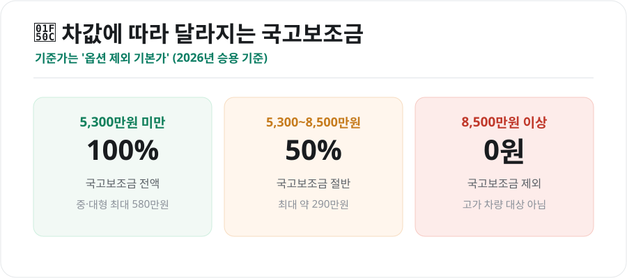
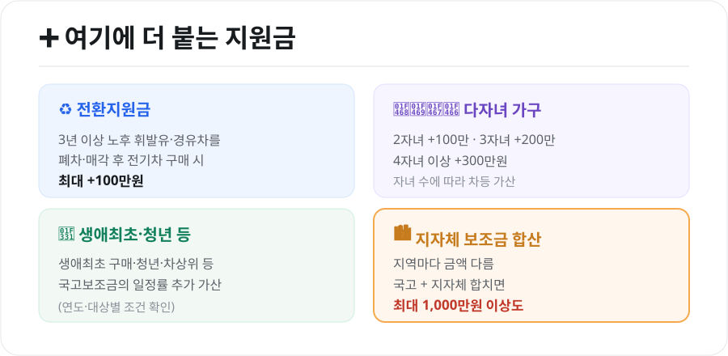

전기차를 살 때 실제 부담을 크게 좌우하는 것이 **보조금**입니다. 그런데 "차값에 따라, 지역에 따라, 조건에 따라" 금액이 달라져 헷갈리기 쉽습니다. 2026년 기준으로 국고보조금부터 추가지원, 신청 방법까지 정리했습니다.

<figure class="large"><figcaption>차량 가격 구간별 국고보조금 (자료 정리: 키워드픽)</figcaption></figure>

## 1. 차값에 따라 달라지는 국고보조금

국고보조금은 차량 **기본가격(옵션 제외)** 구간에 따라 지급 비율이 달라집니다.

| 차량 가격(옵션 제외) | 국고보조금 |
|---|---|
| **5,300만원 미만** | 100% 지급 (중·대형 승용 최대 580만원) |
| **5,300만원 ~ 8,500만원 미만** | 50% 지급 (최대 약 290만원) |
| **8,500만원 이상** | 지급 제외 |

- **승용 국고보조금 최대**: 중·대형 **580만원**, 소형 이하 **530만원** 수준
- 보조금은 차종의 **주행거리·성능·안전** 등 평가에 따라 차량마다 조금씩 다릅니다.

## 2. 여기에 더 붙는 지원금

국고보조금 외에도 조건에 따라 금액이 더 얹어집니다.

<figure class="large"><figcaption>전기차 추가 지원금 & 지자체 합산 (자료 정리: 키워드픽)</figcaption></figure>

- **전환지원금**: 출고 3년 이상 된 휘발유·경유차를 폐차·매각하고 전기차를 새로 사면 **최대 100만원** 추가
- **다자녀 가구**: 2자녀 +100만원, 3자녀 +200만원, 4자녀 이상 +300만원
- **생애최초·청년·차상위 등**: 국고보조금의 일정률이 추가 가산(연도·대상별 조건 확인)
- **지자체 보조금**: 지역마다 금액이 달라, **국고 + 지자체**를 합치면 **최대 1,000만원 이상**도 가능

내가 사는 지역의 지자체 보조금은 **무공해차 통합누리집(ev.or.kr)**에서 지역별로 확인할 수 있습니다.

## 3. 신청 방법

전기차 보조금은 개인이 직접 관공서에 가는 방식이 아니라, **자동차 판매사(제조사·딜러)를 통해** 신청하는 것이 일반적입니다.

1. 매년 초 **무공해차 통합누리집**에 해당 연도·지자체 공고 게시
2. 전기차 **계약** → 제조사·딜러가 지자체에 **보조금 신청서 접수**
3. 지자체 **승인** 후 출고·등록
4. 보조금은 **제조사에 지급**되어 소비자는 **보조금만큼 차감된 금액**으로 구매

## 4. 꼭 알아둘 주의점

- **선착순·예산 소진 마감**: 지자체별 보조금 예산이 정해져 있어, **소진되면 그해 지원이 끝납니다.** 인기 지역은 상반기에 마감되기도 하니 서두르는 것이 유리합니다.
- **의무운행기간**: 보조금을 받은 전기차는 일정 기간(보통 2년) 내에 팔거나 폐차하면 보조금을 일부 반환해야 할 수 있습니다.
- **차값 기준은 옵션 제외**: 5,300만원 기준은 옵션을 뺀 기본가입니다. 옵션을 많이 넣어도 기본가로 판단합니다.
- **지역 요건**: 대부분 해당 지자체에 주소를 둔 사람이 대상입니다.

## 마무리

정리하면, 2026년 전기차 보조금은 **차값 5,300만원 미만이면 국고 최대 580만원**을 받고, 여기에 **전환지원금·다자녀·지자체 보조금**이 더해져 지역에 따라 총액이 크게 달라집니다. 핵심은 **내 지역 보조금을 미리 확인하고, 예산 소진 전에 서둘러 신청**하는 것입니다.

---

*본 글은 공개된 정책 자료를 바탕으로 정리한 참고용 정보입니다. 보조금 금액·가격 기준·지자체별 지원액은 매년, 지역마다 다르므로, 실제 구매 전 무공해차 통합누리집(ev.or.kr)과 해당 지자체 공고를 반드시 확인하시기 바랍니다.*

**참고 자료**
- 무공해차 통합누리집(ev.or.kr) 보조금 공고
- 환경부 전기차 보급사업 보조금 업무처리지침
