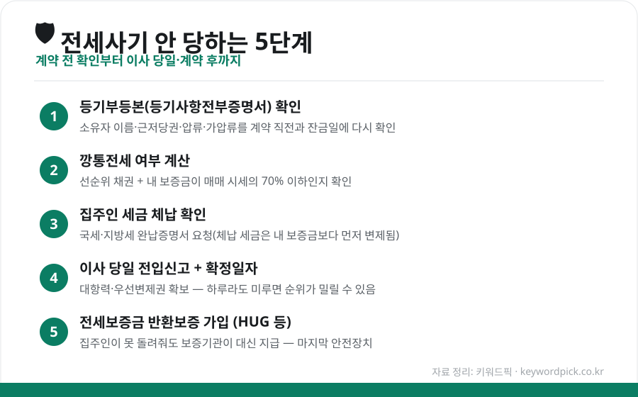
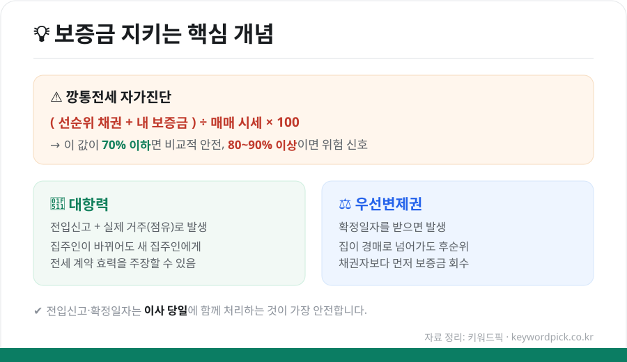

전세는 목돈이 오가는 계약입니다. 한 번 잘못되면 수천만 원에서 수억 원이 묶이기 때문에, "계약 전에 무엇을 확인하고, 이사 당일 무엇을 하고, 혹시 당했을 때 어떻게 움직여야 하는지"를 미리 아는 것이 최선의 방어입니다. 복잡해 보이지만 핵심은 몇 가지로 정리됩니다.

<figure class="large"><figcaption>전세사기 예방 5단계 요약 (자료 정리: 키워드픽)</figcaption></figure>

## 1. 계약 전 — 서류로 확인할 것

### ① 등기부등본(등기사항전부증명서)
가장 먼저 볼 서류입니다. 대법원 인터넷등기소에서 누구나 700원에 열람할 수 있습니다.

- **소유자**가 계약 상대방과 같은 사람인지
- **근저당권**(집을 담보로 잡힌 대출)이 얼마나 있는지
- **압류·가압류·경매개시** 같은 위험 표시가 없는지

특히 근저당이 많은 집은 경매로 넘어갔을 때 내 보증금 순위가 뒤로 밀립니다. 등기부는 **계약 직전과 잔금 치르는 날 각각 다시** 확인하세요. 계약 후 잔금 사이에 집주인이 몰래 대출을 더 받는 경우가 있기 때문입니다.

### ② 깡통전세인지 계산
집을 팔아도 보증금을 다 못 돌려주는 상태를 '깡통전세'라고 합니다. 간단한 공식으로 자가진단할 수 있습니다.

<figure class="large"><figcaption>보증금을 지키는 핵심 개념 — 깡통전세 계산·대항력·우선변제권 (자료 정리: 키워드픽)</figcaption></figure>

**(선순위 채권 + 내 보증금) ÷ 매매 시세 × 100**

이 값이 **70% 이하**면 비교적 안전한 편이고, **80~90%를 넘으면** 위험 신호로 봅니다. 신축 빌라처럼 정확한 시세가 없는 경우, 매매가를 부풀려 보증금을 시세만큼 받는 수법이 많으니 국토교통부 실거래가·주변 매물과 꼭 비교하세요.

### ③ 집주인 세금 체납 확인
집주인이 세금을 오래 안 냈다면, 체납 세금이 내 보증금보다 **먼저** 변제됩니다. 계약 전 집주인에게 **국세·지방세 완납증명서**를 요청하고, 임대인 동의 없이도 열람할 수 있는 '미납국세 열람' 제도를 활용하세요.

## 2. 이사 당일 — 대항력·우선변제권 확보

계약을 잘했어도 이 단계를 놓치면 소용없습니다.

- **전입신고**: 주민센터 또는 정부24에서 이사 당일 바로
- **확정일자**: 전입신고와 함께 받기 (계약서에 도장)

이 둘을 갖추면 **대항력**(집주인이 바뀌어도 계약 효력 주장)과 **우선변제권**(경매 시 후순위 채권자보다 먼저 보증금 회수)이 생깁니다. 하루라도 미루면 그사이 설정된 다른 권리에 순위가 밀릴 수 있으니 **반드시 이사 당일** 처리하세요.

## 3. 마지막 안전장치 — 전세보증금 반환보증

집주인이 보증금을 못 돌려줘도 보증기관이 대신 지급해 주는 상품입니다. 이제는 선택이 아니라 필수로 보는 분위기입니다.

| 구분 | 내용 |
|---|---|
| **운영 기관** | HUG(주택도시보증공사), SGI서울보증, HF(한국주택금융공사) |
| **보장 내용** | 집주인이 보증금 미반환 시 보증기관이 대신 지급 |
| **가입 시점** | 계약 후 잔금·전입 단계에서 가입(상품별 가입 가능 기간 확인) |
| **가입 조건** | 보증금·주택 유형·선순위 채권 비율 등 기준 충족 필요 |
| **보증료** | 보증금·기간에 따라 산정(청년·신혼 등 일부 지원 제도 있음) |

가입 조건과 보증료, 지원 대상은 매년 바뀌므로 **가입 전 HUG 등 공식 창구에서 최신 기준을 반드시 확인**하세요.

## 4. 이미 당했다면 — 대처 순서

1. **내용증명 발송** — 집주인에게 보증금 반환을 공식 요구(증거 확보)
2. **임차권등기명령 신청** — 이사를 나가야 할 때도 대항력·우선변제권을 유지
3. **보증보험 가입자라면** — 보증기관에 이행 청구
4. **전세사기 피해자 지원 신청** — 정부·지자체의 피해자 결정 및 지원 제도 활용
5. **전세보증금반환소송·경매 대응** — 필요 시 법률 전문가(대한법률구조공단 등) 상담

혼자 판단하기 어려운 상황이 대부분입니다. 초기에 **주택도시보증공사·지자체 전세피해지원센터·대한법률구조공단** 등 공적 창구에 상담하는 것이 손해를 줄이는 길입니다.

## 마무리

전세사기 예방의 핵심은 딱 세 문장입니다. **계약 전 등기부와 시세로 위험을 걸러내고, 이사 당일 전입신고·확정일자로 권리를 확보하고, 반환보증으로 최후의 안전장치를 마련한다.** 번거롭더라도 이 순서만 지키면 대부분의 피해는 미리 막을 수 있습니다.

---

*본 글은 공개된 제도·자료를 바탕으로 정리한 참고용 정보입니다. 보증 조건·지원 제도·세부 절차는 수시로 바뀌므로, 실제 계약 전 HUG·정부24·해당 기관의 최신 안내를 확인하시기 바랍니다.*

**참고 자료**
- 대법원 인터넷등기소(등기부등본 열람)
- 주택도시보증공사(HUG) 전세보증금반환보증 안내
- 국토교통부 실거래가 공개시스템
