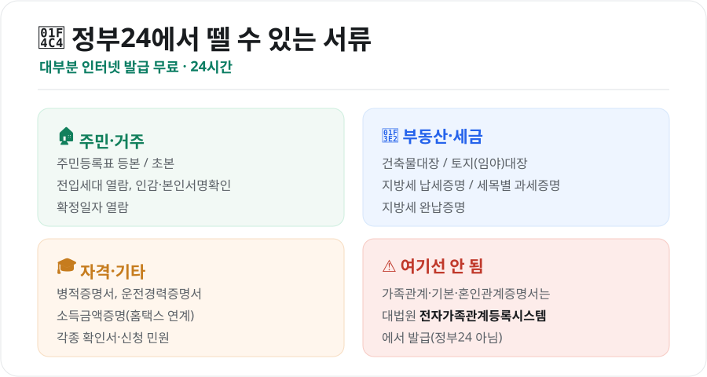
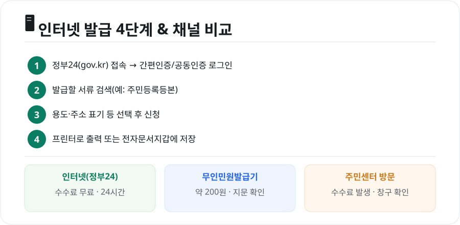

관공서에 직접 가지 않아도 대부분의 민원서류는 **정부24(gov.kr)**에서 집에서 뗄 수 있습니다. 게다가 인터넷 발급은 **수수료가 무료**인 경우가 많습니다. 어떤 서류를 어떻게 발급하는지, 헷갈리는 부분까지 한 번에 정리했습니다.

<figure class="large"><figcaption>정부24에서 뗄 수 있는 주요 서류 (자료 정리: 키워드픽)</figcaption></figure>

## 1. 정부24에서 발급 가능한 대표 서류

- **주민·거주**: 주민등록표 등본/초본, 전입세대 열람, 본인서명사실확인서 등
- **부동산·세금**: 건축물대장, 토지(임야)대장, 지방세 납세증명, 세목별 과세증명, 지방세 완납증명
- **자격·기타**: 병적증명서, 운전경력증명서, 소득금액증명(홈택스 연계), 각종 확인·신청 민원

대부분 **인터넷 발급 시 수수료가 무료**이고 24시간 이용할 수 있습니다.

### ⚠️ 가족관계증명서는 정부24가 아닙니다
많이 헷갈리는 부분입니다. **가족관계증명서·기본증명서·혼인관계증명서·입양관계증명서**는 정부24가 아니라 **대법원 전자가족관계등록시스템**에서 발급합니다. 정부24에서는 안내만 연결되니 참고하세요.

## 2. 인터넷 발급 방법 — 4단계

<figure class="large"><figcaption>정부24 인터넷 발급 4단계 & 발급 채널 비교 (자료 정리: 키워드픽)</figcaption></figure>

1. **정부24(gov.kr) 접속** 후 로그인
2. 발급할 **서류 검색**(예: 주민등록등본)
3. 용도·주소 표기 여부 등 **옵션 선택 후 신청**
4. **프린터로 출력**하거나 **전자문서지갑**에 저장

### 로그인은 어떻게?
- **간편인증**: 카카오·네이버·PASS·토스 등(공동인증서 없이도 가능해 가장 편리)
- **공동인증서·금융인증서**: 기존 인증서 이용

프린터가 없다면 발급받은 전자문서를 **전자문서지갑**에 저장해 두었다가, 기관에 온라인으로 제출하거나 필요할 때 출력할 수 있습니다.

## 3. 인터넷·무인발급기·방문, 어디가 좋을까

| 방법 | 수수료 | 시간 | 특징 |
|---|---|---|---|
| **인터넷(정부24)** | 대체로 무료 | 24시간 | 집에서 발급·출력, 가장 편리 |
| **무인민원발급기** | 약 200원 | 기기별 상이 | 지문/주민번호 확인, 즉시 출력 |
| **주민센터 방문** | 수수료 발생 | 근무시간 | 상담·특수 민원에 유리 |

- **무인민원발급기**는 구청·주민센터·지하철역 등에 있으며, 주민등록등본·초본, 병적증명서, 가족관계증명서 등 다양한 서류를 즉시 뽑을 수 있습니다. 야간·주말에 쓰려면 **24시간 운영 기기인지** 미리 확인하세요.
- 인터넷 발급이 안 되는 일부 서류나 **본인 방문이 필요한 민원**은 주민센터를 이용해야 합니다.

## 4. 알아두면 편한 팁

- **정부24 앱**으로도 발급이 가능해 스마트폰만으로 처리할 수 있습니다.
- 회사·은행 제출용은 **주소 뒷자리 표기 여부**를 요구하는 경우가 있으니, 신청 시 옵션을 확인하세요.
- 진위확인이 필요한 기관은 서류의 **문서확인번호**로 위·변조 여부를 확인합니다. 출력본을 함부로 수정하면 안 됩니다.

## 마무리

정부24는 **주민등록등본·건축물대장·납세증명** 같은 서류를 무료로, 24시간, 집에서 발급할 수 있는 가장 편리한 창구입니다. 다만 **가족관계증명서 계열은 대법원 시스템**이라는 점만 기억하면, 웬만한 서류는 관공서에 갈 일 없이 해결할 수 있습니다.

---

*본 글은 공개된 전자정부 서비스 안내를 바탕으로 정리한 참고용 정보입니다. 발급 가능 서류·수수료·절차는 바뀔 수 있으므로, 실제 발급 전 정부24(gov.kr)의 최신 안내를 확인하시기 바랍니다.*

**참고 자료**
- 정부24(gov.kr) 민원 발급 안내
- 대법원 전자가족관계등록시스템(가족관계증명서 발급)
