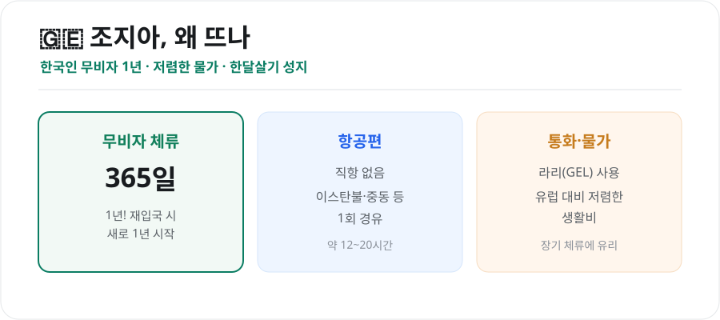
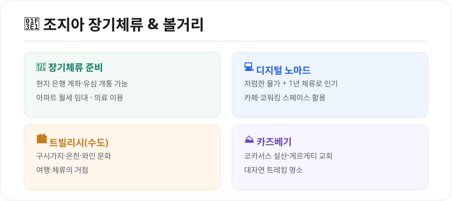

요즘 '한달살기'와 디지털 노마드 사이에서 뜨는 나라가 **조지아(Georgia)**입니다. 흑해와 코카서스 산맥을 낀 이 나라는 **한국인이 무비자로 무려 1년을 머물 수 있어** 장기 체류지로 인기입니다. 어떻게 가고, 어떻게 지낼 수 있는지 정리했습니다.

<figure class="large"><figcaption>조지아 기본 정보 (자료 정리: 키워드픽)</figcaption></figure>

## 1. 무비자 1년 — 가장 큰 매력

조지아는 **한국 여권 소지자에게 365일(1년) 무비자 체류**를 허용합니다. 대부분의 나라가 30~90일인 것과 비교하면 파격적입니다.

- 예를 들어 1월 1일에 입국하면 **다음 해 1월 1일까지** 머물 수 있습니다.
- 체류 기간이 끝나갈 때 **잠시 출국했다 재입국**하면 새로 1년이 시작되는 방식으로 장기 체류하는 사람도 많습니다.

> 무비자 조건·기간은 정책에 따라 바뀔 수 있으니, 장기 계획이라면 출발 전 **외교부 해외안전여행**에서 최신 정보를 확인하세요.

## 2. 어떻게 가나 — 직항은 없다

2026년 현재 **한국~조지아(트빌리시) 정기 직항은 없습니다.** 보통 아래처럼 1회 경유합니다.

- **이스탄불(튀르키예), 중동(도하·두바이 등), 중앙아시아** 등을 경유
- 환승 대기를 포함해 총 **약 12~20시간**
- 항공권은 경유지·시즌에 따라 가격 차이가 큽니다

경유편이라 **유류할증료·환승 시간**을 함께 비교해 예약하는 것이 좋습니다.

## 3. 장기체류·한달살기 준비

<figure class="large"><figcaption>조지아 장기체류 & 볼거리 (자료 정리: 키워드픽)</figcaption></figure>

물가가 저렴하고 체류 기간이 길어, 조지아는 **한달살기·디지털 노마드**에 적합합니다.

- **현지 은행 계좌 개설**과 **유심 개통**이 가능합니다.
- **아파트 월세 임대**로 장기 거주할 수 있고, 의료 서비스도 이용할 수 있습니다.
- 트빌리시에는 **카페·코워킹 스페이스**가 많아 원격근무에 무난합니다.

> 다만 **무비자 체류 ≠ 취업 허가**입니다. 현지 취업·사업을 하려면 별도의 허가·절차가 필요하니 목적에 맞게 확인하세요.

## 4. 어디를 가볼까

- **트빌리시(수도)**: 구시가지, 유황 온천, 와인 문화의 중심. 여행·체류의 거점입니다.
- **카즈베기**: 코카서스 설산과 게르게티 삼위일체 교회로 유명한 대자연 트레킹 명소.
- 조지아는 **와인의 발상지** 중 하나로, 전통 와인(크베브리)과 음식도 큰 즐거움입니다.

## 5. 알아두면 좋은 점

- **통화**: 라리(GEL)를 사용합니다. 카드 사용도 되지만 소액 현금을 준비하면 편합니다.
- **언어**: 조지아어가 공용어이며 관광지에선 영어가 어느 정도 통합니다.
- **여행자보험**: 장기 체류라면 의료비까지 보장되는 보험을 챙기세요.
- **연결편 짐**: 경유 시 수하물 연결 여부를 항공사에 확인하세요.

## 마무리

조지아는 **무비자 1년 + 저렴한 물가 + 대자연**이라는 삼박자로 여행자와 장기 체류자 모두에게 매력적인 나라입니다. 직항이 없어 경유가 필요하지만, 그만큼 아직 덜 알려진 여유로운 여행지입니다. 한달살기를 꿈꾼다면 후보로 올려볼 만합니다.

---

*본 글은 공개된 자료를 바탕으로 정리한 참고용 정보입니다. 무비자 조건·항공편·현지 제도는 바뀔 수 있으므로, 출발 전 외교부 해외안전여행과 항공사 안내의 최신 정보를 확인하시기 바랍니다.*

**참고 자료**
- 외교부 해외안전여행(조지아 입국·체류 정보)
- 조지아 관광청·현지 여행 정보
