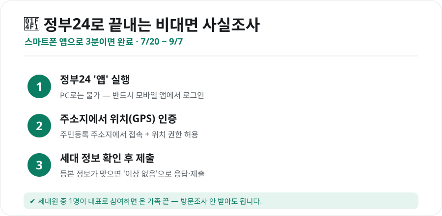
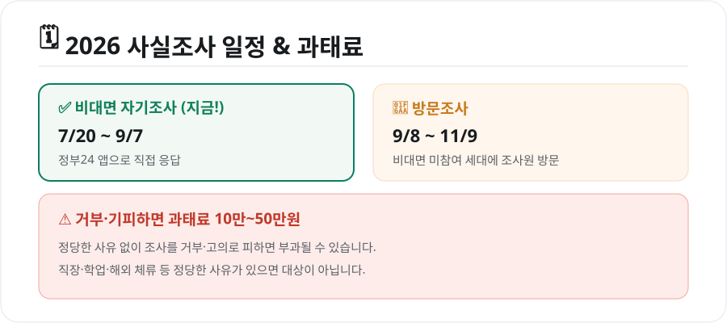

매년 여름이면 오는 **주민등록 사실조사** 안내, "이거 꼭 해야 하나?" 싶으시죠. 결론부터 말하면 **하는 게 이득**입니다. 안 하면 조사원이 집으로 방문하고, 거부·기피하면 과태료까지 나올 수 있거든요. 다행히 **정부24 앱으로 집에서 3분이면** 끝납니다.

<figure class="large"><figcaption>정부24 비대면 사실조사 3단계 (자료 정리: 키워드픽)</figcaption></figure>

## 사실조사가 뭔가요?

주민등록상 주소지와 **실제 사는 곳이 일치하는지** 국가가 매년 확인하는 절차입니다. 위장전입·유령세대를 막고 행정 데이터를 정확하게 유지하려는 거예요. 대상은 **전 세대**이며, 세대별로 **한 명만 대표로** 응답하면 됩니다.

## 정부24 앱으로 참여하는 법 (비대면)

가장 편한 방법입니다. **PC로는 안 되고, 스마트폰 '정부24' 앱**으로만 가능해요(위치 확인이 필요하기 때문).

1. **정부24 앱 실행** 후 로그인(간편인증·공동인증)
2. **주민등록 주소지에서** 앱을 열고 **위치(GPS) 권한 허용** → 위치 인증
3. 화면에 뜬 **세대 정보를 확인**하고 이상 없으면 그대로 **제출**

세대원(가족)이나 동거인도 세대 대표로 대리 응답할 수 있어, 세대주가 바빠도 괜찮습니다.

<a href="https://www.gov.kr" target="_blank" rel="noopener" style="display:inline-block;background:#0b7d63;color:#fff;padding:13px 26px;border-radius:10px;font-weight:800;font-size:16px;text-decoration:none;">🔗 정부24 바로가기 (앱에서 참여)</a>

> 위 버튼은 정부24(gov.kr)로 연결됩니다. 실제 사실조사 응답은 **모바일 '정부24' 앱**에서, **주소지에서** 위치 인증을 받아 진행하세요. (앱스토어·플레이스토어에서 '정부24' 설치)

## 기간과 과태료 — 9월 7일까지가 중요

<figure class="large"><figcaption>2026 사실조사 일정 & 과태료 (자료 정리: 키워드픽)</figcaption></figure>

| 구분 | 기간 | 내용 |
|---|---|---|
| **비대면 자기조사** | 7/20 ~ **9/7** | 정부24 앱으로 직접 응답 (가장 편함) |
| **방문조사** | 9/8 ~ 11/9 | 비대면 미참여 세대에 조사원이 방문 |

- **9월 7일 24시까지** 비대면으로 끝내면, 조사원이 집에 오는 **방문조사를 안 받아도** 됩니다.
- **정당한 사유 없이 거부·고의로 기피**하면 **10만~50만원 과태료**가 부과될 수 있습니다.
- 다만 **직장 업무·학업·해외 체류** 등 정당한 사유가 있으면 과태료 대상이 아닙니다.

## 이런 점만 주의하세요

- **반드시 주소지에서**: 위치 인증이 안 되면 참여가 막힙니다. 회사·외출 중에는 안 돼요.
- **앱 전용**: PC·모바일 웹으로는 참여 불가. '정부24' 앱을 미리 설치해두세요.
- **정보가 실제와 다르면**: 전입신고가 안 된 상태라면 이번 기회에 [전입신고](정부24-민원-발급-방법.html)부터 정리하세요.
- **1세대 1응답**: 가족 중 한 명만 하면 됩니다. 중복으로 안 해도 돼요.

## 마무리

주민등록 사실조사는 **"9월 7일 전에 정부24 앱으로 3분 투자"**가 핵심입니다. 미루면 조사원 방문에 응해야 하고, 놓치면 과태료 부담도 생깁니다. 지금 스마트폰으로 '정부24' 앱을 열어 간단히 끝내세요.

*자료: 행정안전부·정부24 주민등록 사실조사 안내(2026년 기준). 세부 일정·방법은 정부24(gov.kr)와 관할 주민센터 안내로 확인하세요.*
