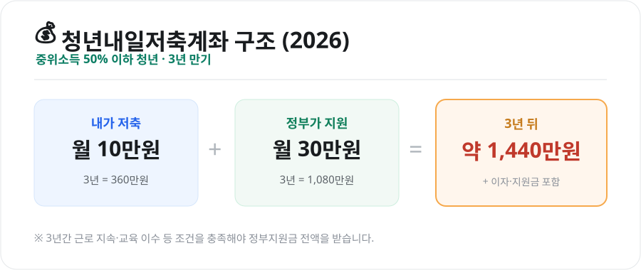
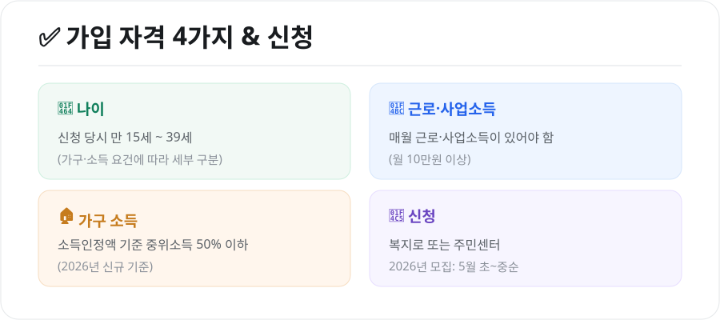

저소득 근로 청년이 목돈을 마련할 수 있도록 정부가 저축액을 매칭해주는 제도가 **청년내일저축계좌**입니다. 내가 월 10만원을 넣으면 정부가 최대 30만원을 얹어주는 구조라, 조건만 맞으면 놓치기 아까운 사업입니다. 2026년 기준으로 정리했습니다.

<figure class="large"><figcaption>청년내일저축계좌 구조 (자료 정리: 키워드픽)</figcaption></figure>

## 1. 얼마를 얼마나 받나

- **본인 저축**: 매월 **10만원** (3년간 360만원)
- **정부 지원**: 기준 중위소득 50% 이하인 경우 매월 **30만원** 매칭 (3년간 1,080만원)
- **3년 만기 시**: 본인 저축 + 정부지원금 + 이자를 합쳐 **약 1,440만원**

> 예전에는 중위소득 50~100% 구간(차상위 초과)도 월 10만원 매칭으로 가입할 수 있었지만, **2026년부터 이 구간의 신규 모집은 중단**되었습니다. 2026년 신규 가입은 **중위소득 50% 이하**가 대상입니다.

## 2. 가입 자격 4가지

<figure class="large"><figcaption>가입 자격 4가지 & 신청 (자료 정리: 키워드픽)</figcaption></figure>

| 요건 | 내용 |
|---|---|
| **나이** | 신청 당시 만 15세 ~ 39세 |
| **근로·사업소득** | 매월 근로·사업소득 발생(월 10만원 이상) |
| **가구 소득** | 소득인정액 기준 중위소득 50% 이하(2026년 신규) |
| **가구 재산** | 대도시·중소도시·농어촌별 재산 기준 이하 |

소득·재산 기준은 가구원 수와 지역에 따라 달라지므로, 본인 해당 여부는 **복지로 모의계산**이나 주민센터에서 확인하는 것이 정확합니다.

## 3. 3년 동안 지켜야 할 것

정부지원금 전액을 받으려면 만기까지 몇 가지 조건을 유지해야 합니다.

- **근로 지속**: 가입 기간 동안 근로·사업 활동을 이어가야 합니다.
- **자립역량 교육 이수** 및 **자금사용계획서 제출**
- 매월 **본인 적립금 납입**(연속 미납 시 중도해지될 수 있음)

중간에 조건을 어기면 정부지원금이 일부만 지급되거나 환수될 수 있으니, 가입 전 유지 조건을 꼭 확인하세요.

## 4. 신청 방법·시기

- **신청처**: 복지로 또는 주소지 읍·면·동 주민센터
- **모집 시기**: 2026년 신규 모집은 **5월 초~중순**(연 1회 집중 모집)에 진행되었습니다.

모집 기간이 짧고 연중 상시가 아니므로, 관심 있다면 **복지로 공고**를 미리 확인해 신청 시기를 놓치지 않는 것이 중요합니다.

## 마무리

청년내일저축계좌는 **월 10만원으로 3년 뒤 1,440만원**을 만들 수 있는, 매칭률이 매우 높은 제도입니다. 다만 소득·근로 요건이 있고 모집 기간이 한정적이라, 본인이 대상인지 미리 확인하고 **모집 공고 시기에 맞춰 신청**하는 것이 핵심입니다.

---

*본 글은 공개된 제도 자료를 바탕으로 정리한 참고용 정보입니다. 지원 대상·금액·모집 일정은 매년 바뀌므로, 실제 신청 전 복지로·보건복지부의 최신 공고를 반드시 확인하시기 바랍니다.*

**참고 자료**
- 복지로(청년내일저축계좌 안내)
- 보건복지부 자산형성지원사업 공고
