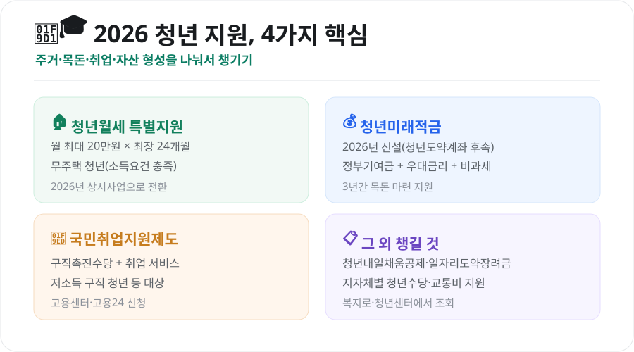
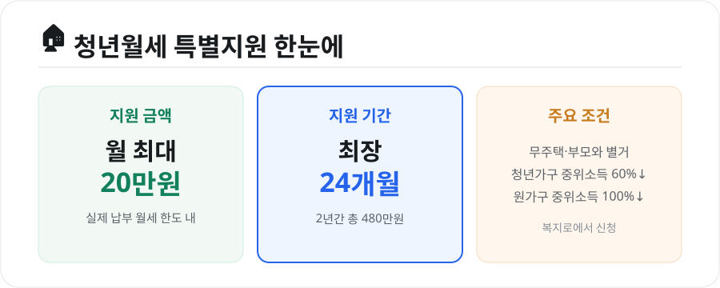

청년을 위한 정부·지자체 지원 제도는 종류가 많아 "나한테 해당되는 게 뭔지" 파악하기가 어렵습니다. 2026년 기준으로 **주거·목돈·취업**의 세 축으로 나눠, 놓치면 아까운 핵심 제도만 정리했습니다.

<figure class="large"><figcaption>2026 청년 지원 4가지 핵심 (자료 정리: 키워드픽)</figcaption></figure>

## 1. 주거 — 청년월세 특별지원

무주택 청년의 월세 부담을 덜어주는 대표 제도입니다. **2026년부터 상시(계속) 사업으로 전환**되어 더 안정적으로 운영됩니다.

<figure class="large"><figcaption>청년월세 특별지원 요약 (자료 정리: 키워드픽)</figcaption></figure>

| 항목 | 내용 |
|---|---|
| **지원 금액** | 매월 실제 납부 월세 중 **최대 20만원** |
| **지원 기간** | 최장 **24개월**(2년간 총 480만원) 분할 지원 |
| **대상** | 부모와 따로 사는 무주택 청년 |
| **소득 요건** | 청년가구 중위소득 60% 이하 + 원가구 중위소득 100% 이하 |
| **신청처** | 복지로 또는 주소지 주민센터 |

소득·재산 기준과 신청 기간은 매년 조금씩 달라지므로, 신청 전 **복지로 공고**를 확인하세요.

## 2. 목돈 — 청년미래적금

기존 **청년도약계좌는 2025년 12월로 신규 가입이 종료**되었고, 2026년부터는 후속으로 **청년미래적금**이 새로 나옵니다.

- **구조**: 본인 납입금 + **정부 기여금** + 은행 우대금리 + **비과세** 혜택
- **특징**: 정부 기여금 매칭 비율이 이전보다 상향되어, 3년 동안 목돈을 모으는 데 유리
- **신청**: 취급 은행 앱·창구(출시 일정·세부 조건은 공식 안내 확인)

이미 청년도약계좌에 가입해 유지 중인 경우는 만기까지 기존 조건이 적용됩니다.

## 3. 취업 — 국민취업지원제도

일자리를 찾는 청년에게 **구직촉진수당과 취업지원 서비스**를 함께 제공합니다.

- **1유형**: 저소득 구직자 등에게 **구직촉진수당**(구직활동을 조건으로 일정액 지급) + 취업지원
- **2유형**: 취업활동비용·직업훈련 등 지원
- **신청**: 고용24 또는 거주지 고용센터

대상 요건(소득·재산·연령)이 유형별로 다르니, 본인 상황에 맞는 유형을 고용센터에서 확인하는 것이 좋습니다.

## 4. 그 외 챙길 만한 것

- **청년내일채움공제 / 일자리도약장려금**: 중소기업 취업 청년의 자산 형성·고용 지원(연도별 운영 조건 확인)
- **지자체 청년수당·교통비 지원**: 서울·경기 등 지역마다 별도 제도 운영
- **조회 팁**: **복지로**(중앙정부)와 **온통청년(청년정책 포털)**, 각 **지자체 청년센터**에서 내 조건에 맞는 제도를 한 번에 검색할 수 있습니다.

## 마무리

청년 지원금은 "몰라서 못 받는" 경우가 가장 많습니다. **주거는 청년월세, 목돈은 청년미래적금, 취업은 국민취업지원제도**를 기본으로 두고, 여기에 **지자체 제도**를 더해 확인해보세요. 신청 기간이 정해진 제도가 많으니, 관심 있는 것은 미리 공고 일정을 체크해두는 것이 좋습니다.

---

*본 글은 공개된 정책 자료를 바탕으로 정리한 참고용 정보입니다. 지원 금액·소득 요건·신청 기간은 수시로 바뀌므로, 실제 신청 전 복지로·온통청년·해당 기관의 최신 공고를 반드시 확인하시기 바랍니다.*

**참고 자료**
- 복지로(청년월세 특별지원 안내)
- 온통청년(청년정책 통합 포털)
- 고용노동부 국민취업지원제도 안내
