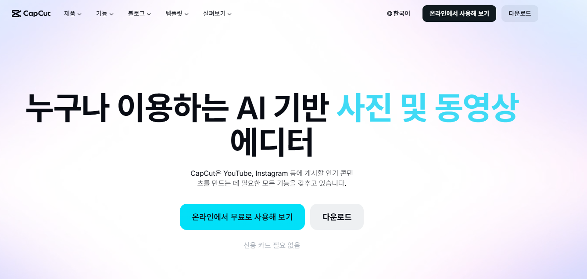

최근 숏폼 콘텐츠의 유행과 함께 누구나 쉽게 고품질의 영상과 사진을 편집할 수 있는 도구에 대한 관심이 높아지고 있습니다. 캡컷(CapCut)은 직관적인 사용법과 다양한 효과를 제공하여 초보자부터 크리에이터까지 널리 사용하는 대표적인 사진 및 동영상 에디터 앱입니다. 이 글에서는 캡컷의 주요 활용방안과 요금제 정보, 그리고 이용 방법에 대해 알아보겠습니다.

<figure class="medium"></figure>

## 1. 캡컷(CapCut) 주요 활용방안
캡컷은 직관적인 인터페이스를 제공하여 초보자도 쉽게 동영상과 사진을 편집할 수 있는 도구입니다. 컷 편집, 자막 추가, 배경음악 삽입은 물론, 다양한 필터와 전환 효과, 템플릿을 활용해 틱톡, 릴스, 쇼츠 등 숏폼 콘텐츠를 빠르게 제작할 수 있습니다. 특히 AI 기반의 자동 자막 생성 기능과 배경을 지워주는 스마트 컷아웃 기능을 통해 편집 시간을 크게 단축할 수 있습니다.

## 2. 캡컷 요금제 및 무료/유료 기능 안내
캡컷은 기본적으로 무료로 다운로드하여 대부분의 필수 편집 기능을 제한 없이 사용할 수 있습니다. 그러나 더 다양하고 전문적인 효과, 고급 필터, 확장된 클라우드 저장 공간을 이용하기 위해서는 유료 구독 서비스인 'CapCut Pro' 요금제를 선택해야 합니다. 구체적인 월간 및 연간 요금제의 금액과 프로 버전 전용 기능의 상세 범위는 사용 기기나 국가별로 상이할 수 있으므로 공식적인 확인이 필요합니다.

## 3. 캡컷 다운로드 및 바로가기 링크
캡컷은 모바일 앱(Android, iOS)뿐만 아니라 PC 버전(Windows, macOS) 및 웹 브라우저용 온라인 에디터로도 제공되어 다양한 작업 환경에서 편리하게 편집할 수 있습니다. 사용자는 공식 홈페이지나 각 운영체제의 앱 마켓을 통해 안전하게 프로그램을 다운로드할 수 있습니다. 다만, 공식 웹사이트의 최신 바로가기 링크와 다운로드 경로에 대해서는 접속 시점에 따른 확인이 필요하다.

캡컷 사이트 바로가기(다운로드 필수)
https://www.capcut.com/download-guidance
