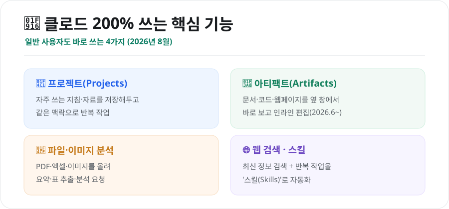
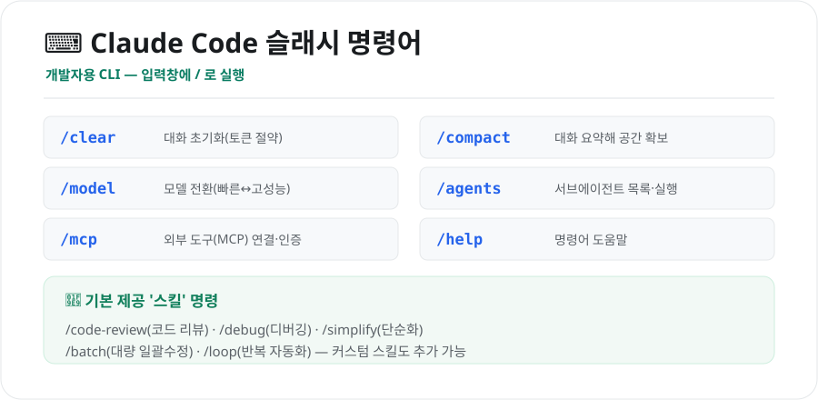

클로드(Claude)를 그냥 '질문하고 답 받는 챗봇'으로만 쓰면 절반만 쓰는 겁니다. 알아두면 시간을 크게 아끼는 **기능·프롬프트·명령어**가 많거든요. 2026년 8월 기준으로, 일반 사용자용부터 개발자용까지 유용한 것들을 정리했습니다.

<figure class="large"><figcaption>클로드 200% 쓰는 핵심 기능 (자료 정리: 키워드픽)</figcaption></figure>

## 1. 일반 사용자용 — 꼭 아는 핵심 기능

일반 웹/앱 클로드에서 '명령어'는 대부분 **기능**과 **프롬프트(지시문)** 형태입니다.

- **프로젝트(Projects)**: 자주 쓰는 지침·참고 자료를 저장해두면, 매번 설명하지 않아도 **같은 맥락**으로 대화할 수 있습니다. (예: "내 블로그 말투 규칙"을 저장)
- **아티팩트(Artifacts)**: 문서·코드·웹페이지 같은 결과물을 대화창 **옆 패널**에서 바로 보고 수정합니다. **2026년 6월부터는 고치고 싶은 부분만 하이라이트해 인라인 편집**이 가능합니다.
- **파일·이미지 분석**: PDF·엑셀·이미지를 올려 **요약·표 추출·오류 찾기**를 시킬 수 있습니다.
- **웹 검색·스킬**: 최신 정보가 필요하면 웹 검색을, 반복 작업은 **스킬(Skills)**로 자동화할 수 있습니다.

## 2. 유용한 프롬프트 '명령' 모음

정해진 슬래시 명령이 아니어도, 아래처럼 요청하면 결과가 확 좋아집니다.

| 이렇게 말하면 | 이런 효과 |
|---|---|
| **"표로 정리해줘"** | 복잡한 내용을 한눈에 |
| **"3줄로 요약해줘"** | 핵심만 빠르게 |
| **"초등학생도 이해하게 쉽게"** | 눈높이 설명 |
| **"단계별(1,2,3)로 알려줘"** | 따라 하기 쉬운 절차 |
| **"너는 ○○ 전문가야"** | 역할 부여로 답변 품질↑ |
| **"이어서 계속 써줘"** | 길이 제한 이어쓰기 |
| **"이 문서 내용만 근거로 답해"** | 지어내기(환각) 줄이기 |
| **"표/코드/이메일 형식으로 출력"** | 원하는 형식 지정 |

> 팁: **"먼저 계획을 세우고, 확인받은 뒤 진행해줘"**라고 하면 엉뚱한 방향으로 길게 쓰는 걸 막을 수 있습니다.

## 3. 개발자용 — Claude Code 슬래시 명령어

진짜 '명령어(슬래시 커맨드)'는 개발자용 **Claude Code(터미널 도구)**에 많습니다. 입력창에 **`/`**를 치면 실행됩니다.

<figure class="large"><figcaption>Claude Code 슬래시 명령어 치트시트 (자료 정리: 키워드픽)</figcaption></figure>

| 명령어 | 기능 |
|---|---|
| **/clear** | 대화 기록 초기화 — 토큰 절약에 가장 효과적 |
| **/compact** | 대화를 요약해 컨텍스트 공간 확보(맥락 유지) |
| **/model** | 사용 모델 전환(빠른 모델 ↔ 고성능 모델) |
| **/agents** | 서브에이전트 목록·실행(Explore·Plan 등) |
| **/mcp** | 외부 도구(MCP 서버) 연결·인증 관리 |
| **/help** | 사용 가능한 명령어 도움말 |

### 기본 제공 '스킬' 명령
예전엔 커스텀 명령을 따로 만들었지만, 지금은 **스킬(Skills)로 통합**되어 아래가 기본 제공됩니다.

- **/code-review**: 최근 바뀐 파일을 여러 에이전트가 병렬로 리뷰
- **/debug**: 버그 원인 추적·수정
- **/simplify**: 복잡한 코드를 단순화
- **/batch**: 여러 파일에 같은 수정을 대량 적용
- **/loop**: 반복 작업 자동화

직접 만든 명령은 `.claude/skills/`에 넣어 **나만의 슬래시 명령**으로 쓸 수 있고, MCP·플러그인을 연결하면 `/mcp__[서버]__[기능]` 형태의 명령이 추가됩니다.

## 4. 이렇게 조합하면 좋아요

- **글쓰기·기획**: 프로젝트에 말투·규칙 저장 → 아티팩트로 초안 만들고 인라인 편집
- **자료 정리**: PDF·엑셀 업로드 → "표로 요약" → 아티팩트로 내보내기
- **개발**: Claude Code에서 `/clear`로 시작 → 작업 → `/code-review`로 점검 → `/compact`로 이어가기

## 마무리

클로드를 잘 쓰는 핵심은 **"기능을 알고, 원하는 형식을 분명히 요청하는 것"**입니다. 일반 사용자는 **프로젝트·아티팩트·파일 분석 + 좋은 프롬프트**만 익혀도 충분하고, 개발자는 **Claude Code 슬래시 명령어**로 생산성을 크게 높일 수 있습니다. 오늘 소개한 것 중 두세 개만 습관으로 만들어보세요.

---

*본 글은 2026년 8월 공개된 자료를 바탕으로 정리한 참고용 정보입니다. 클로드의 기능·명령어·모델 구성은 업데이트에 따라 바뀔 수 있으므로, 최신 사항은 Claude 공식 문서(docs.claude.com)를 확인하시기 바랍니다.*

**참고 자료**
- Claude 공식 문서(기능·슬래시 명령어)
- Claude Code Docs(Skills·슬래시 명령어)
