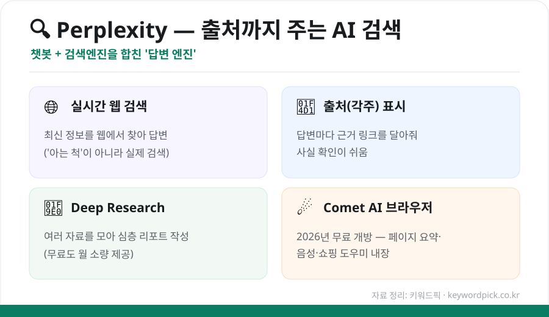
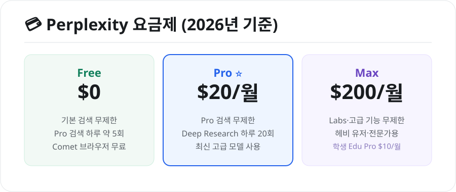

구글 검색과 챗봇의 장점을 합친 AI, **퍼플렉시티(Perplexity)** 가 화제입니다. 그냥 답만 주는 게 아니라 **출처(근거)까지 함께** 보여줘서, 사실 확인이 필요한 검색에 특히 유용한데요. 무엇이 다르고 어떻게 쓰는지 정리했습니다.

## 퍼플렉시티가 뭔가요?

퍼플렉시티는 스스로를 **'답변 엔진(Answer Engine)'** 이라고 부릅니다. 질문을 하면 **실시간으로 웹을 검색**해 답을 정리해주고, **각 문장에 출처 링크**를 달아줍니다. "그럴듯하게 지어내는" 일반 챗봇의 약점을 보완한 셈입니다.

<figure class="large"><figcaption>퍼플렉시티의 4가지 특징 (자료 정리: 키워드픽)</figcaption></figure>

## 일반 검색·챗봇과 뭐가 다를까

| 구분 | 일반 검색(구글) | 일반 챗봇 | 퍼플렉시티 |
|---|---|---|---|
| 결과 형태 | 링크 목록 | 정리된 답변 | **정리된 답변 + 출처** |
| 최신 정보 | O | △(모델에 따라) | **O (실시간 검색)** |
| 출처 확인 | 직접 클릭 | 대체로 없음 | **각주로 바로 표시** |

## 무료로 어디까지 되나

퍼플렉시티는 **무료 플랜이 계속 유지**됩니다. 기본 검색은 사실상 자유롭게 쓸 수 있고, 고급 'Pro 검색'도 하루 소량 제공됩니다. 게다가 2026년부터는 AI 브라우저 **Comet**도 무료로 개방됐습니다.

## 요금제 한눈에

<figure class="large"><figcaption>퍼플렉시티 요금제 (2026년 기준, 자료 정리: 키워드픽)</figcaption></figure>

- **Free($0)**: 기본 검색 + Pro 검색 하루 약 5회 + Comet 브라우저
- **Pro($20/월)**: Pro 검색 무제한 + Deep Research 하루 20회
- **Max($200/월)**: Labs 등 고급 기능 무제한 (헤비 유저용)
- **학생 Edu Pro($10/월)**: Pro 기능 + 학술 기능 (프로모션 시 일부 무료)

## 시작하는 법

1. **[perplexity.ai](https://www.perplexity.ai)** 접속 (또는 앱 설치)
2. 검색창에 질문 입력 — "○○가 뭐야?", "최신 ○○ 정리해줘"
3. 답변 아래·문장 옆의 **출처 링크**로 사실 확인

## 이렇게 활용해요

- **리서치·공부**: 출처가 있어 리포트·자료조사에 유용
- **최신 정보 확인**: 뉴스·트렌드를 실시간으로 정리
- **쇼핑·비교**: 제품·서비스 비교 요약

## ⚠️ 주의점

- 출처가 있어도 **원문을 한 번 더 확인**하는 습관이 안전합니다.
- 민감한 개인정보는 입력하지 마세요.

## 정리

퍼플렉시티는 ① **실시간 검색 + 출처**로 신뢰도를 높인 AI 검색이고, ② **무료로도 충분히** 쓸 수 있으며, ③ 더 많이 쓰면 Pro($20)가 유용합니다. '사실 확인이 중요한 검색'에는 특히 강한 도구입니다.

---

### 참고
- [Perplexity 요금제 2026 — Fello AI](https://felloai.com/perplexity-pricing/)
- [Perplexity Pricing 2026 — Finout](https://www.finout.io/blog/perplexity-pricing-in-2026)
